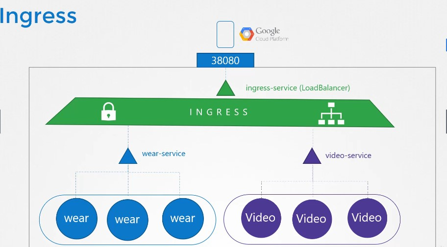

# Table of Contents
- [Table of Contents](#table-of-contents)
- [Core Concepts](#core-concepts)
  - [Cluster Architecture](#cluster-architecture)
  - [ETCD](#etcd)
    - [ETCD For Beginners](#etcd-for-beginners)
    - [ETCD in Kubernetes](#etcd-in-kubernetes)
  - [Kube-API Server](#kube-api-server)
  - [Kube Controller Manager](#kube-controller-manager)
  - [Kube Scheduler](#kube-scheduler)
  - [Kubelet](#kubelet)
  - [Kube Proxy](#kube-proxy)
  - [PODs](#pods)
    - [Recap](#recap)
    - [How to deploy Pods](#how-to-deploy-pods)
    - [PODs with YAML](#pods-with-yaml)
  - [ReplicaSets](#replicasets)
    - [Creating a Replication Controller](#creating-a-replication-controller)
    - [Creating a ReplicaSet](#creating-a-replicaset)
    - [Labels and Selectors](#labels-and-selectors)
  - [Deployments](#deployments)
    - [What is a Deployment](#what-is-a-deployment)
    - [Definition](#definition)
  - [Helpful Pod Commands](#helpful-pod-commands)
  - [Namespaces](#namespaces)
    - [Basics](#basics)
    - [Resource Limits](#resource-limits)
    - [DNS](#dns)
    - [Commands](#commands)
      - [Create Namespace Like](#create-namespace-like)
      - [Create a Resource Quota](#create-a-resource-quota)
  - [Services](#services)
    - [Services Use Case](#services-use-case)
    - [Service Types - Basics](#service-types---basics)
    - [NodePort](#nodeport)
    - [Cluster IP](#cluster-ip)
      - [Creation](#creation)
  - [Imperative Commands](#imperative-commands)
    - [POD](#pod)
    - [Deployment](#deployment)
    - [Service](#service)
    - [Misc.](#misc)
- [Scheduling](#scheduling)
  - [Manual Scheduling](#manual-scheduling)
    - [Labels and Selectors](#labels-and-selectors-1)
    - [Creating Labels](#creating-labels)
    - [Selectors](#selectors)
    - [Annotations](#annotations)
  - [Taints and Tolerations](#taints-and-tolerations)
    - [Commands](#commands-1)
    - [Master Nodes](#master-nodes)
  - [Node Selectors](#node-selectors)
    - [Limitations](#limitations)
  - [Node Affinity](#node-affinity)
    - [Node Affinity Types](#node-affinity-types)
  - [Node Affinity Vs Taints and Tolerations](#node-affinity-vs-taints-and-tolerations)
  - [Resource Requirements and Limits](#resource-requirements-and-limits)
    - [Resource Limits](#resource-limits-1)
  - [Daemon Sets](#daemon-sets)
    - [Use Case](#use-case)
    - [Creation](#creation-1)
    - [How it works](#how-it-works)
  - [Static Pods](#static-pods)
    - [Why Use These?](#why-use-these)
    - [Static PODs vs DaemonSets](#static-pods-vs-daemonsets)
    - [Delete Static Pods on other nodes](#delete-static-pods-on-other-nodes)
  - [Multiple Schedulers](#multiple-schedulers)
    - [Deploy Additional Scheduler](#deploy-additional-scheduler)
      - [Deploy Additional Scheduler - Kubeadm](#deploy-additional-scheduler---kubeadm)
      - [View Schedulers](#view-schedulers)
      - [Use Custom Scheduler](#use-custom-scheduler)
    - [View Scheduler Logs and Events](#view-scheduler-logs-and-events)
  - [Configuring Kubernetes Scheduler](#configuring-kubernetes-scheduler)
- [Logging and Monitoring](#logging-and-monitoring)
  - [Monitor Cluster Components](#monitor-cluster-components)
    - [Heapster vs Metrics Server](#heapster-vs-metrics-server)
    - [Metrics Server -- Getting Started](#metrics-server----getting-started)
  - [Managing Application Logs](#managing-application-logs)
    - [Logs - Docker](#logs---docker)
    - [Logs - Kubernetes](#logs---kubernetes)
- [Application Lifecycle Management](#application-lifecycle-management)
  - [Rolling Updates and Rollbacks](#rolling-updates-and-rollbacks)
    - [Deployment Strategies](#deployment-strategies)
    - [Kubectl apply](#kubectl-apply)
    - [Upgrades](#upgrades)
    - [Rollback](#rollback)
    - [Kubectl run](#kubectl-run)
    - [Summarize-Commands](#summarize-commands)
  - [Configure Applications](#configure-applications)
  - [Application Commands - Docker](#application-commands---docker)
  - [Application Commands & Arguments](#application-commands--arguments)
  - [Configure Environment Variables in Applications](#configure-environment-variables-in-applications)
    - [Config Maps](#config-maps)
      - [Create the ConfigMaps](#create-the-configmaps)
      - [Inject them into the pod.](#inject-them-into-the-pod)
    - [Secrets](#secrets)
      - [Creating a Secret](#creating-a-secret)
      - [Configuring Secrets With Pod](#configuring-secrets-with-pod)
      - [Secrets Notes](#secrets-notes)
  - [Multi Container PODs](#multi-container-pods)
    - [Create Multi Container Pod](#create-multi-container-pod)
    - [Multi Container PODs Design Patterns](#multi-container-pods-design-patterns)
  - [InitContainers](#initcontainers)
- [Cluster Maintenance](#cluster-maintenance)
  - [OS Upgrades](#os-upgrades)
  - [Kubernetes Software Versions](#kubernetes-software-versions)
  - [Cluster Upgrade Process](#cluster-upgrade-process)
    - [When should you upgrade](#when-should-you-upgrade)
    - [Upgrade Process](#upgrade-process)
    - [Kubeadm - upgrade](#kubeadm---upgrade)
  - [Backup and Restore Methods](#backup-and-restore-methods)
    - [Resource Configuration Backup](#resource-configuration-backup)
    - [Backup - ETCD](#backup---etcd)
- [Security](#security)
  - [Kubernetes Security Primitives](#kubernetes-security-primitives)
  - [Authentication](#authentication)
    - [User Authentication](#user-authentication)
      - [Basic Auth Mechanisms](#basic-auth-mechanisms)
  - [TLS](#tls)
    - [TLS Basics](#tls-basics)
      - [Asymmetric Encryption](#asymmetric-encryption)
      - [Back to Certs](#back-to-certs)
    - [TLS In Kubernetes](#tls-in-kubernetes)
      - [Server Certificates for Servers](#server-certificates-for-servers)
      - [Server Certificates for Servers](#server-certificates-for-servers-1)
      - [Server Certificates for Servers](#server-certificates-for-servers-2)
      - [Client Certificates for Clients](#client-certificates-for-clients)
    - [TLS Certificate Creation](#tls-certificate-creation)
      - [Certificate Authority Cert Creation](#certificate-authority-cert-creation)
      - [Generating Client's Certificates](#generating-clients-certificates)
      - [What to Do](#what-to-do)
      - [Server Certificate Creation](#server-certificate-creation)
  - [View Certificate Details](#view-certificate-details)
    - [Health Check](#health-check)
  - [Certificates API](#certificates-api)
  - [KubeConfig](#kubeconfig)
    - [File Format](#file-format)
    - [Certificates in KubeConfig](#certificates-in-kubeconfig)
  - [API Groups](#api-groups)
  - [Role Based Access Controls](#role-based-access-controls)
  - [Cluster Roles and Role Bindings](#cluster-roles-and-role-bindings)
  - [Image Security](#image-security)
  - [Security Context](#security-context)
  - [Network Policy](#network-policy)
    - [Traffic Basics](#traffic-basics)
    - [Network Security in Kubernetes](#network-security-in-kubernetes)
- [Storage](#storage)
  - [Storage In Docker](#storage-in-docker)
    - [Docker Layered Architecture](#docker-layered-architecture)
    - [Volumes](#volumes)
  - [Container Storage Interface](#container-storage-interface)
    - [What CSI Looks Like](#what-csi-looks-like)
  - [Volumes](#volumes-1)
  - [Persistent Volumes](#persistent-volumes)
  - [Persistent Volume Claims](#persistent-volume-claims)
  - [Using Persistent Volume Claims in PODS](#using-persistent-volume-claims-in-pods)
- [Networking](#networking)
  - [Switching Routing](#switching-routing)
    - [Switching](#switching)
    - [Routing](#routing)
    - [Gateway](#gateway)
      - [Default Gateway](#default-gateway)
    - [Key Networking Commands](#key-networking-commands)
  - [DNS](#dns-1)
    - [Private Domain Names](#private-domain-names)
    - [Record Types](#record-types)
    - [Other Tools to Communicate with Hosts](#other-tools-to-communicate-with-hosts)
  - [CoreDNS](#coredns)
  - [Network Namespaces](#network-namespaces)
    - [Connect Networks](#connect-networks)
    - [Network Commands Summary](#network-commands-summary)
  - [Docker Networking](#docker-networking)
    - [Docker Bridge Networks](#docker-bridge-networks)
  - [Container Networking Interface (CNI)](#container-networking-interface-cni)
  - [CLuster Networking](#cluster-networking)
  - [Pod Networking](#pod-networking)
  - [CNI in Kubernetes](#cni-in-kubernetes)
  - [CNI Weave](#cni-weave)
  - [IP Address Management - Weave](#ip-address-management---weave)
    - [How Weave Does It](#how-weave-does-it)
  - [Service Networking](#service-networking)
  - [DNS In Kubernetes](#dns-in-kubernetes)
  - [CoreDNS in Kubernetes](#coredns-in-kubernetes)
  - [Ingress](#ingress)
    - [Services vs Ingress](#services-vs-ingress)
  - [Ingress Comes in](#ingress-comes-in)
    - [Ingress Controller](#ingress-controller)
    - [Ingress Resources](#ingress-resources)
  - [Ingress - Annotations and rewrite-target](#ingress---annotations-and-rewrite-target)
- [Kubernetes the Hard Way](#kubernetes-the-hard-way)
  - [Configure High Availability](#configure-high-availability)
    - [Example High Availability](#example-high-availability)
    - [ETCD High Availability](#etcd-high-availability)
    - [Our Design](#our-design)
  - [ETCD in HA](#etcd-in-ha)
- [End to End Tests on a Kubernetes Cluster](#end-to-end-tests-on-a-kubernetes-cluster)
  - [End to End Tests](#end-to-end-tests)
    - [Test - Manual](#test---manual)
    - [Test Suites](#test-suites)
  - [End to End Tests - Run and Analyze](#end-to-end-tests---run-and-analyze)
- [Troubleshooting](#troubleshooting)
  - [Application Failure](#application-failure)
    - [Check Accessibility](#check-accessibility)
    - [Check Pods](#check-pods)
  - [Control Plane Failure](#control-plane-failure)
- [Quick Notes](#quick-notes)
  - [Editing Pods and Deployments](#editing-pods-and-deployments)
    - [Edit a POD](#edit-a-pod)
    - [Edit Deployments](#edit-deployments)
  - [Check for Port Clashing](#check-for-port-clashing)
  - [Create all the files in a folder](#create-all-the-files-in-a-folder)
  - [Check Number of Applications](#check-number-of-applications)
  - [Inspect Authorization Types](#inspect-authorization-types)
  - [Check to see which user is used to execute a process](#check-to-see-which-user-is-used-to-execute-a-process)
  - [Network Namespaces Checks](#network-namespaces-checks)
  - [Handy Networking Commands](#handy-networking-commands)
  - [Get the IP of a Pod / nod](#get-the-ip-of-a-pod--nod)
  - [Labs to make sure I know better](#labs-to-make-sure-i-know-better)
- [End Table of Contents](#end-table-of-contents)


# Core Concepts


## Cluster Architecture


* Two kinds of ships
  * Cargo Ships that does the actual work of carrying containers across the sea
  * Control ships that are responsible for monitoring the cargo ships

* Worker Nodes - 
    * Host application as containers

* Master Node - Control Ship
  * Manage, Plan, Schedule, Monitor Nodes
  * Since there is so much info coming all the time, need to maintain info about different "ships", which container is on which "ship" and what time it was loaded, etc.
  * Stored in a highly available key value store known as *Etcd*
    * *Etcd*: A database that stores information in a key-value format
    * *Scheduler*: When ships arrive, you load containers on them using cranes, the cranes identify the containers that need to be placed on ships. 
      * It identifies the right ship based on its size, its capacity, the number of containers already on the ship. and any other conditions such as the destination of the ship
      * *kube-scheduler*

* Different offices in the dock that are assigned to special tasks or departments
  * i.e. Operations team takes care ship handling, traffic control, etc. deal with issues related to damages, the routes take
  * Cargo team takes care of containers. When containers are damaged or destroyed, they make sure new containers are made available
  * Services office that takes care of the I.T and communications between different ships. 

* **Controller Manager**: In Kubernetes we have controllers available that take care of different areas. 
  * **Node-Controller** - takes care of nodes
    * onboarding new nodes to cluster, 
    * handling situations where nodes become unavailable or get destroyed.
  * Replication-Controller - ensures desired number of containers are running at all time.  

* **kube-apiserver** is primary management component of kubernetes. 
  * Responsible for orchestrating all operations within the cluster. 
  * exposes the Kubernetes API which is used by external users to perform management operations on the cluster as well as the various controllers to monitor the various state of the cluster and make the necessary changes as required by the worker nodes to communicate with the server. and by the worker nodes to communicate with the server. 

* Container Runtime Engine
  * Docker is a popular one
  * Not always docker though, could be things like container-d or rocket.

* The captain of the ship. Every ship has one. Responsible for managing all activities on these ships
  * Responsible for liaising with master ships starting with: 
    * letting the master ship know that they are interested in joining the group
    * receiving the appropriate info about the containers to be loaded on the ship
    * and loading the appropriate containers as required
    * Sending reports back to the master about the status of this ship and status of containers on ship
  * captain of the ship is *kubelet* 
* Kubelet is an agent that runs on each node in a cluster
  * Listens for instructions from the kube-api server and deploys or destroys containers on the nodes as required. 
  * Kube-api server periodically fetches status reports from kubelet to monitor the state of the nodes and containers on them

* *Kube-proxy*: Applications on worker nodes need to be able to communicate with each other
  * I.e. you may have a web server running in a container on one node and a db server on the other node. 
  * How would the web server reach the database server on the other node?
  * Kube-proxy service ensures that the necessary rules are in place on the worker nodes to allow the containers running on them to reach each other. 


## ETCD

### ETCD For Beginners
* *ETCD is a distributed, reliable key-value store that is simple, secure, and fast*
* Key value store
  * A dictionary basically
  * Stores info in the form of documents or pages
* Install ETCD
  * Download Binaries
    * `curl -L https://github.com/etcd-io/etcd/releases/download/v3.3.11/etcd-v3.3.11-linux-amd64.tar.gz -o etcd-v3.3.11-linux-amd64.tar.gz`
  * Extract
    * `tar xzvfetcd-v3.3.11-linux-amd64.tar.gz`
  * Run ETCD Service
    * `./etcd`
    * Starts a service that listens on port 2379 by default and can then attach any clients to the ETCD service to store and retrieve info
    * Default client that comes with etcd is the etcdctl client. use it to store and retrieve key value pairs
      * `./etcdctlset key1 value1`
      * `./etctl get key1`
        * returns `value1`

### ETCD in Kubernetes 
* ETCD Cluster stores info such as:
  * Nodes
  * PODs
  * Configs
  * Secrets
  * Accounts
  * Roles
  * Bindings
  * Others
* All the info you see when you run the `kubectl` command is from the ETCD server. 
* every change you make to your cluster, such as adding additional nodes, deploying pods or replica sets are updated are in the ETCD server.
  * Change isn't considered completed until it's updated in the ETCD server

* ETCD is deployed differently depending on how you set up your cluster
  * Manual Deployment: 
    * Download binaries 
      * `wget-q --https-only \"https://github.com/coreos/etcd/releases/download/v3.3.9/etcd-v3.3.9-linux-amd64.tar.gz"`
      * `etcd.service`
        * `--advertise-client-urls https://${INTERNAL_IP}:2379\\`
        * 
  * Setup - Kubeadm
    * `kubectl get pods -n kube-system`
      * 
    * `kubectlexec etcd-master –n kube-systemetcdctlget / --prefix –keys-only`

* ETCD in HA Environment
  * You will have multiple master nodes in your cluster then you will have multiple ETCD instances spread across the master nodes
  * Set the right parameter `--initial-cluster controller-0=https://${CONTROLLER0_IP}:2380,controller-1=https://${CONTROLLER1_IP}:2380 \`

## Kube-API Server

* When you run a kubectl command, the kubectl is reaching to the kube-apiserver
  * kube-api server authenticates the request and validates it
  * then retrieves the data from the etcd cluster and responds back with the requested info

* don't really need to use kubectl. could instead invoke api directly by sending a post request
* IE: Creating a pod with POST
  * `curl –X POST /api/v1/namespaces/default/pods ...[other]`
    1. Authenticate User
    2. Validate Request
    3. Retrieve Data
    4. Update ETCD 
    5. Scheduler
    6. Kubelet
   * Returns `Pod created!`
     * API Server creates a POD object without assigning it to a node
     * Updates the info in the ETCD server
     * Updates the user that the POD has been created
     * The scheduler continuously monitors the API Server and realizes there is a new pod with no node assigned
       * Scheduler identifies the right node to place the new POD on and communicates that back to kube-api server
     * API server then updates the info in the etcd cluster. 
     * The api server then passes that information to the kubelet in appropriate worker node.
     * Kubelet then creates the pod on the node and instructs the container runtime engine(docker) to deploy the application image. 
     * Kubelet updates the status back to the API server and the API server then updates the data back in the ETCD cluster. 
   * Kube-apiserver is at the center of all the different tasks that needs to be performed to make a change in the cluster.

* Kube-api server is the only component that interacts directly with the etcd datastore. 

* Setting up the hard way, kube-apiserver is available as a binary in the kubernetes release
  * `wgethttps://storage.googleapis.com/kubernetes-release/release/v1.13.0/bin/linux/amd64/kube-apiserver`
  * `kube-apiserver.service`
    * `--etcd-servers=https://127.0.0.1:2379 \\`
  * Some of the important 
* View APi-server -kubeadm
  * `kubectl get pods -n kube-system`
    * `kube-apiserver-master`
* View api-server options - kubeadm 
  * `cat /etc/kubernetes/manifests/kube-apiserver.yaml`
  * See running processes with `ps -aux | grep kub-apiserver`

## Kube Controller Manager 

* Kube controller manager manages various controllers in kubernetes
* Controller is like an office or department within the master ship 
  * An office for the ships would be responsible for monitoring and taking necessary actions about the ships whenever a new ship arrives or when a ship leaves/gets destroyed.
  * Another office could be one that manages containers of the ship. 

* Officers are 
  1. Continuously on the lookout for the status of the ships 
  2. takes necessary actions to remediate the situation

* *Controller* 
  * A process that continuously monitors the state of various components within the system and works towards bringing the whole system to the desired functioning state
  * For example - Node Controller is responsible for monitoring the status of the Nodes and taking necessary actions to keep the nodes running.

* Node controller checks the status of the nodes every 5 seconds    
  * That way the node controller can monitor health of nodes. If it stops receiving heartbeat from a node, marked as unreachable.
  * Waits 40 seconds to mark it as unreachable. 
  * If a node is marked unreachable, it gets 5 minutes to come back up
    * if it doesn't, removes the pods assigned to that node and provisions them on the healthy ones if pods are part of a replica set. 

* Replication Controller
  * Responsible for monitoring the status of replica sets and ensuring that the desired number of pods are available at all times within the set
  * If a pod dies, it creates another one. 

* Plenty of types of controllers. Whatever concepts we have seen so far in kubernetes such as deployments, services, namespaces, Persistent volumes, implemented through these controllers

* How do you see these controllers? 
  * In the Kube-Controller-Manager
  * Download the kube-controller-manager and run it as a service
    * `wget https://storage.googleapis.com/kubernetes-release/release/v1.13.0/bin/linux/amd64/kube-controller-manager`
    * `kube-controller-manager.service`
    * Option called controllers to see which one is enabled. by default, they are all enabled. 

  * Or with kubeadm
    * `kubectl get pods -n kube-system`
      * Deploys kube-controller-manager as a pod in the kube-system namespace on the master node. 
      * can view options with `cat /etc/kubernetes/manifests/kube-controller-manager.yaml`
  * Without you can run `cat /etc/systemd/system/kube-controller-manager.service` 

* See running processes with `ps -aux | grep kube-controller-manager`


## Kube Scheduler

* Scheduler is only responsible for deciding which pod goes on which node. It doesn't actually place the pod on the node
  * That's the kubelet.

* Why do you need a scheduler? 
  * want to make sure the right container ends up on the right ship. 
  * Want to make sure containers are placed on right ship so they go to the right place. 

* Scheduler looks at each pod and tries to find the best node for it. 
  * Two Phases:
    * First Phase - Filter Nodes:
      * Filter out nodes that don't fit profile of pods i.e. Nodes that don't have sufficient CPU and memory resources requested by the pod.
    * Second Phase - Rank Nodes: 
      * Uses a priority function to assign a score to the nodes on a scale of 0 to 10. That would be free on the nodes after placing the pod on them 
        * So whichever has more resources would be placed on. 

* Installing Kube-scheduler 
  * download binary and run it as service. 
    * `wget https://storage.googleapis.com/kubernetes-release/release/v1.13.0/bin/linux/amd64/kube-scheduler`
    * `kube-scheduler.service`


## Kubelet
* Kubelet is like the captain on the ship
* Lead all activities on the ship!
* Send reports at regular intervals on the status of the ship and the containers on them.


* Kublet in the kubernetes worker node, registers the node with the kubernetes cluster. 
* When it receives instructions to load a container or a POD on the node, it requests the container run time engine(docker) to pull required image and run an instance. 
* Kubelet then continues to monitor the state of the POD and the containers in it and reports to the kube-api server on a timely basis

1. Register Node
2. Create PODs
3. Monitor Node & PODs

* Install kubelet:
  * Kubeadm does not deploy kubelets.
  * You must always manually install kubelet on the worker nodes.
    * `wget https://storage.googleapis.com/kubernetes-release/release/v1.13.0/bin/linux/amd64/kubele`
    * `kubelet.service`
  * View Kublet options
    * `ps -aux | grep kubelet`

## Kube Proxy

* Every pod can reach every other pod.
* This is accomplished by deploying a POD networking solution to the cluster.
  * POD Network - an internal virtual network that spans across all the nodes in the cluster through which all the pods connect to. 
  * Many solution available to deploying such a network
* Example: In this case, I have a web application deployed on the first node and a database application deployed on the second.
  * Web app can reach the database by using the IP of the db pod. 
  * No guarantee that the ip of the database pod will always remain the same.
  * Better way for web app to access the db is using a service. so we create a service to expose the db application across the cluster. 
  * The service cannot join the pod network because the service is not an actual thing. 
    * Not a container like pod so it doesn't have any interfaces or an actively listening process. virtual component that only lives in the kubernetes memory. 
  * Kube-proxy is a process that runs on each node in the kubernetes cluster
    * Job is to look for new services and every time a new service is created, it creates the appropriate rules on each node to forward traffic to those services to the backend pods
    * One way it does this is by using IPTABLES rules
      * In this case it creates an IP tables rule on each node in the cluster to forward traffic heading to the IP of the service which is 10.96.0.12to the IP of the actual pod which is 10.32.0.15
  * 

* Installing Kube-proxy
  * `wget https://storage.googleapis.com/kubernetes-release/release/v1.13.0/bin/linux/amd64/kube-proxy`
  * or `kubectl get pods -n kubesystem` with kubeadm.
  * `kubectl get daemonset -n kube-system`

## PODs

### Recap

* With kubernetes, ultimate aim is to deploy our application in the form of containers on a set of machines that are configured as worker nodes in a cluster. 
* Kubernetes does not deploy containers directly on worker nodes.
  * Instead the containers are encapsulated into a kubernetes object known as PODs.
  * **Pod:** Single instance of an application
    * Smallest thing you can create in kubernetes
* Simplest of simple instance one  instance of application running in a single docker container encapsulated in a POD
  * As it scales, spin up additional instances by creating a new pod with a new instance of the same application
  * If user base further increases and current node has no sufficient capacity, create a new pod on a new node in the cluster. 
  * PODS usually have a 1 - 1 relationship
  * To scale up, you create new pods
    * Scale down delete pods

* Multi-Container PODs
  * A single pod can have multiple containers except for the fact that they're usually not multiple containers of the same kind
  * If intention was to scale our application, then we would need to create additional pods
  * **Helper Container**
    * supporting task for our web app such as processing a user entered data processing a file uploaded by the user etc. and want helper containers to live alongside application container
      * In that case you can have both of these containers part of the same pod so that when a new application container is created, the helper is also created and when it dies, the helper also dies since they are part of the same pod. 
      * The two containers can also communicate with each other directly by referring to each other as localhost. 
      * Can also share same storage space

### How to deploy Pods
* `Kubectl run nginx` 
  * deploys a docker container by creating a POD. So first creates a POD automatically and deploys an instance of the nginx docker image. 
    * Where does it get app image from? 
      * `--image nginx` command so `kubectl run nginx --image nginx`
      * See pods available with `kubectl get pods`


### PODs with YAML

  * YAML in kubernetes
  * pod-definition.yml
  * ```yaml
      apiVersion:
      kind: 
      metadata:

      spec:
    ```
*  all required fields!!
    * `apiVersion: v1` could also be `apps/v1`
    * kind could be `POD`, `Service`, `ReplicaSet`, `Deployment`
    * **metadata**:
    * ```yaml
        metadata: 
          name: myapp-pod
          labels: 
              app: myapp
              type: front-end   
        ```
      
  * Metadata is a dictionary. number of spaces doesn't matter but they should stay the same since they are siblings
     * cannot add any other property that you want in metadata. 
     * For spec, refer to documentation since there are plenty. With app that has a single container though, not too tough
     * ```yaml
        spec:
          containers:
          - name: nginx-container
            image: nginx
        ```
    * dash(-) indicates that it is a list and first item in the list. 
    * when yaml is made, run `kubectl create -f pod-definition.yml`
    * Delete pod with `kubectl delete myapp-pod`
    * Once pod is created, run `kubectl get pods` to view pods available.
    * to see detailed info about pod run `kubectl describe pod myapp-pod` 
 
## ReplicaSets

   * They are the processes that monitor kubernetes objects and respond accordingly. 
  
   * Why do we need replica set
     * If something happens and pod fails, users will no longer be ale to access our application
     * to prevent users from losing access to our app, we would like to have more than one instance or pod running at the same time. 
     * Replication controller helps us run multiple instances of a single pod in the kubernetes cluster and providing high availability
   * Can you use replication controller if you plan on using a single pod? 
     * **NO** Even if you have a single pod, the replication controller can help by automatically bringing up a new pod when the existing one fails. 
     * Thus the replication controller ensures that the specified number of parts are running at all times. 

   * Also need to create multiple pods to share load across them. 
   * 

   * Two similar terms for when the demand increases both have same purpose but not the same. 
     * **Replication Controller** 
       * The older tech that's being replaced by replica set. 
     * **Replica Set** 
       * New recommended way to set up replication

### Creating a Replication Controller

   * `rc-definition.yml`
   * ```yaml
      apiVersion: v1
      kind: ReplicationController
      metadata:
        name: myapp-rc
        labels:
          app: myapp
          type: front-end

      spec:
        template:
          metadata:
            name: myapp-pod
            labels:
              app: myapp
              type: front-end
          spec:
            containers:
              - name: nginx-container
                image: nginx
        
        replicas: 3


        ```
  * create template section under spec to provide a part template to be used by the replication controller
  * move all the contents of the pod-definition file except for the first few lines and put it in the rc-definition file
  * Replication controller is parent, pod definition is child
  * for replica count, add replicas tag to spec and input the number of replicas you'll need under it. 
  * then run `kubectl create -f rc-definition.yml`
    * when created, it also creates the pods.
  *  to see replicas, run `kubectl get replicationcontroller` command and it will give you number of replicas. 

### Creating a ReplicaSet

`replicaset-definition.yml`
```yaml
apiVersion: apps/v1
kind: ReplicaSet
metadata: 
  name: myapp-replicaset
  labels:
    app: myapp
    type: front-end
  

spec:
  template:
    metadata:
      name: myapp-pod
      labels:
        app: myapp
        type: front-end
    spec:
      containers:
        - name: nginx-container
          image: nginx
  
  replicas: 3
  selector:
    matchLabels:
      type: front-end

```

* Need to have the apps/ or you will get an error: unable to recognize replicaset
* ReplicaSet needs `selector:` 
* Can also manage parts that were not created as part of the replica at creation
  * i.e. The reports created before the creation of the replica set that match labels specified in the selector.
  * Replica set will also take those pods into consideration when creating the replicas. 
* can still use `selector:` in replicacontroller but just assumes it is the same as the labels provided in the part definition file
* Required for ReplicaSet and has to be written in form of matchLabels: 
  * Simply matches the labels specified under it to the labels on the pod. 
  * Replica set selector also provides many other options for matching labels that were not available in the replication controller

* to create run `kubectl create -f replicaset-definition.yml`
  * to see list of pods, run `kubectl get replicaset`

### Labels and Selectors
* How ReplicaSet knows which pods to monitor
* Labeling comes in handy here. 
  * Can provide labels as a filter for replica set
  * under the selector section we use `matchLabels` and provide the same label we used while creating the pod. 

* Scale: 
  * Update the number of replicas in the definition files to 6
    * Run `kubectl replace -f replicaset-definition.yml` to update the replicaset to have 6 replicas
  * run `kubectl scale --replicas=6 -f replicaset-definition.yml` or `kubectl scale --replicas=6 myapp-rep`
    * using file name as input will not result in the number of replicas being updated automatically

* Commands
  * `kubectl create -f replicaset-definition.yml` creates replicaset
  * `kubectl get replicaset` see list of replicasets created
  * `kubectl delete replicaset myapp-replicaset` *also deletes all underlying pods.
  * `kubectl replace -f replicaset-definition.yml` to update it after making changes
  * `kubectl scale --replicas=6 -f replicaset-definition.yml` 
  * `kubectl edit replicaset new-replica-set` modifies the image, you can save out of tmp by running `:w [filename]`

## Deployments

### What is a Deployment

* Things you want in a deployment: 
  * Say you have a web server that needs to be deployed in a production environment
  * You need not one, but many instances running
  * Whenever newer versions or builds become available on the docker registry, you would like to upgrade your builds seamlessly
    * But not all at the same time since it may impact users
    * may want to upgrade one after the other
  * Would like to be able to roll back
  * Would like to make multiple changes to environment, don't want to make changes immediately
    * but apply a pause to your environment, make changes and then resume so that all changes are rolled out at the same time.
* **Kubernetes can do that** 

* Pods -> Replica Set -> Deployment
  * Deployment can update underlying instances seamlessly. 
  * 

### Definition
Same as replica set except kind will now be `Deployment`
`deployment-definition.yml`
```yaml
apiVersion: apps/v1
kind: Deployment
metadata:
  name: myapp-deployment
  labels:
    app: myapp
    type: front-end
spec:
  template:
    metadata:
      name: myapp-pod
      labels:
        app: myapp
        type: front-end
      spec:
        containers:
          - name: nginx-container
            image: nginx
  replicas: 3
  selector:
    matchLabels:
      type: front-end
```
* `kubectl create -f deployment-definition.yml`
* `kubectl get deployments`
* `kubectl get replicaset` will get the replicaset in the deployment
* `kubectl get pods` 
* Basically the same as replicaset except that it created a deployment object.
* `kubectl get all` shows all created objects at once. 

## Helpful Pod Commands
* Create an NGINX Pod
  * `kubectl run --generator=run-pod/v1 nginx --image=nginx`
* Generate POD Manifest YAML file (`-o yaml`) Don't create it(`--dry-run`)
  * `kubectl run --generator=run-pod/v1 nginx --image=nginx --dry-run -o yaml`
* Create a deployment
  * `kubectl run --generator=deployment/apps.v1 nginx --image=nginx`
* Generate Deployment YAML file (`-o yaml`). Don't create it(`--dry-run`)
  * `kubectl run --generator=deployment/apps.v1 nginx --image=nginx --dry-run -o yaml`
* Generate Deployment YAML file (-o yaml). Don't create it(--dry-run) with 4 Replicas (--replicas=4)
  * `kubectl run --generator=deployment/apps.v1 nginx --image=nginx --dry-run --replicas=4 -o yaml`
* Save it to a file - (if you need to modify or add some other details before actually creating it) 
  * `kubectl run --generator=deployment/apps.v1 nginx --image=nginx --dry-run --replicas=4 -o yaml > nginx-deployment.yaml`


## Namespaces


### Basics

* Two boys named Mark, to address each other, they use last names. 
  * In their house though with families, they address by first name because there isn't another mark there. 
  * 

* So far we've been doing everything in the default namespace. 
  * Created automatically when the cluster is first set up
* When cluster is first set up, kubernetes creates a set of pods and services for its internal purpose such as those required by the networking solution, dns service. etc. to isolate them from the user to prevent you from accidentally deleting or modifying the services. 
  * Created under namespace *kube-system* 
* *kube-public*
  * where resources that should be made available to all users are created. 

* If your environment is small you shouldn't really have to worry about namespaces. 
  * As you grow though, the use of namespaces is very important

* Create namespaces too 
  * IE namespace for dev and prod so you don't accidentally modify a resource in production when working in dev. 

### Resource Limits

  * You can also assign a quota of resources to each of these namespaces so it's guaranteed a certain amount and doesn't use more than it's allowed.
  * 

### DNS

* can communicate with the same server easily. But if you want to communicate with something outside of the namespace, you must append the name of the namespace to the name of the service
  * Use the `servicename.namespace.svc.cluster.local` format. In this case it would be `db-service.dev.svc.cluster.local`

* You're able to do this because when the service is created, a DNS entry is added automatically in this format.
* `cluster.local` is the default domain name of the kubernetes cluster. `SVC` is the subdomain. 
  * 

### Commands
  * Get pods in the kube-system namespace
    * `kubectl get pods --namespace=kube-system`
  * Create pod in dev namespace
    *  `kubectl create -f pod-definition.yml --namespace=dev`
    *  Can also move namespace into the pod definition file under metadata section like: 
      ```yaml
      apiVersion: v1
      kind: Pod

      metadata:
        name: myapp-pod
         ### LIKE THIS #######
        namespace: dev
         ##################### 

        labels:
          app: myapp
          type: front-end
      spec:
        containers:
          - name: nginx-container
            image: nginx
      ```
  #### Create Namespace Like


  `namespace-dev.yml`

  ```yaml
  apiVersion: v1
  kind: Namespace
  metadata:
    name: dev
  ```
    * `kubectl create -f namespace-dev.yml`
    * `kubectl create namespace dev`
  * Switch default namespace to dev
    * `kubectl config set-context $(kubectl config current-context) --namespace=dev`
  * get pods from all namespaces
    * `kubectl get pods --all-namespaces`
  

  #### Create a Resource Quota
  ```yaml
  apiVersion: v1
  kind: ResurceQuota
  metadata:
    name: compute-quota
    namespace: dev
  
  spec:
    hard:
      pods: "10"
      requests.cpu: "4"
      requests.memory: 5Gi
      limits.cpu: "10"
      limits.memory: 10Gi
  ```
    
  * `kubectl create -f compute-quota.yaml`

## Services

* enable communication between various components within and outside of the application. 
* Help connect apps together with other apps or users

* IE. App has groups of pods running various sections such as 
  * a group for serving front end load to users 
  * Group for running back end processes
  * Third group connecting to an external data source

* Enable loose coupling between microservices in our application

### Services Use Case

  * External Communication
    * Deployed Pod having web app running on it
    * How do we as an external user access the web page?
      * Kubernetes Node has an IP address that is `192.168.1.2`
      * Laptop is on the same network as well so has IP address `192.168.1.10`
      * The internal POD network is in the range `10.244.0.0` and has an `IP 10.24.0.2`
        * Clearly cannot ping or access the POD at address `10.244.0.2` since it's in a separate network. 
      
      * Things we could do: 
        * SSH into the kubernetes node at `192.168.1.2` and then from the node, we would be able to access the POD's webpage by doing a curl. Or if the node has a GUI, we could fire up a browser and see the webpage from `http://10.244.0.2`
          * 
        * That's not what we want though, we want to be able to access the webpage simply by accessing the IP of the kubernetes node. 
      
      * This is where kubernetes service comes into play. 
        * Kubernetes service is an object just like PODs, ReplicaSet or Deployments that we worked with earlier. 
        * Can listen to a port on the Node and forward requests on that port to a port on the POD running the WebApp.

### Service Types - Basics

1. NodePort
   * Makes an internal POD accessible on a Port on the Node.
2. ClusterIP
   * The service creates a virtual IP inside the cluster to enable communication between different services such as a set of front end servers to a set of back end servers. 
3. LoadBalancer
   * Provisions a load balancer for our service in supported cloud providers.
   * Distribute load across the different web servers in your front end tier. 

  


### NodePort

   * Three ports involved:
    * Port on the POD where the actual web server is running is **80**
      * Also referred to as the **targetPort**
    * Port on the service itself is just called the **Port**
      * Terms are from the viewpoint of the service.
    * Port on the node itself is running on 300008
      * **NodePort** 
      * Port range from `30000 - 32767`
   * 

   * How to create service
    * `service-definition.yml`
    * ```yaml
       apiVersion: v1
       kind: Service
       metadata:
         name: myapp-service
         ### Can Have Label but don't need that
       
       spec:
         type: NodePort
         ports:
           - targetPort: 80 #an array
             port: 80 #Only mandatory field
             nodePort: 30008
         selector:
           #provide a list of labels and pull values
           #from that in pod metadata section
           app: myapp
           type: front-end
      ```

    * When done run `kubectl create -f service-definition.yml` to create
    * `kubectl get services` to get the services that are running. 
      * Will give you a `CLUSTER-IP` IP and you can now access that IP using curl or web browser
        * `curl http://192.168.1.2:30008`

   * What do you do when you have multiple pods? 
     * We have multiple similar pods running our web application. they all have the same labels with a key app and set to value `myapp`
       * same label is used as a selector during the creation of the service. 
     * So when service is created, it looks for a matching pod with the label and finds three of them
     * Service then automatically selects all the three pods as endpoints to forward the external requests. 
     * **NO ADDITIONAL CONFIG REQUIRED** 

   * What about when the web application is on pods in separate nodes in the cluster
     * When we create a service, without any additional config, Kubernetes creates a service that spans across all the nodes in the cluster and maps the target port to the same node port on all the nodes in the cluster. 
     * This way you can access your application using the IP of any node in the cluster and using the same port number which in this case is 30008
     * 

   * No matter what, service is created exactly the same. Making it highly flexible and adaptive. 

### Cluster IP

* May have a number of pods: 
  * You may have a number of pods running a front end web server
  * another set of pods running a back end web server. 
  * Another set of PODs running a key-value store like Redis
  * and another set of PODs running a persistent database like MySQL

* Web front end server needs to communicate to the back end servers and redis server, etc.

* Best way to establish connectivity between these services or tiers of application?
  * Also know that the pods all have an IP address assigned to them as we can see on the screen. 
  * But these IPs aren't static. so can't rely on those IP addresses for internal communication between the application. 
  * A kubernetes service can help us group these PODs together and provide a single interface to access the pods in a group. 

  * For example, a service created for the backend PODs will help group all the backend pods together and provide a single interface for other pods to access the service. 
  * Requests are forwarded to one of the PODs under the service randomly. 
  * Similarly create additional services for Redis and allow the backend parts to access the redis system
  * Each layer can now scale or move as required without impacting communication between the various services. 
  * Each service gets an IP name assigned to it inside the cluster and that is the name that should be used by other pods to access the service. 
    *  

* Type of service is known as **cluster IP**

#### Creation
* `service-definition.yml`
  ```yaml
  apiVersion: v1
  kind: Service
  metadata:
    name: back-end

  spec:
    type: ClusterIP ### The default type anyways
    ports:
      - targetPort: 80
        port: 80 
    
    selector:
      app: myapp
      type: back-end

  ```
* can create service using `kubectl create -f service-definition.yml`
* The service can be accessed by other PODs using the ClusterIP or the service name. 
  * `kubectl get services`  


## Imperative Commands

* `dry-run`: By default as soon as the command is run, the resource will be created. If you simply want to test your command , use the --dry-run option. This will not create the resource, instead, tell you weather the resource can be created and if your command is right.
  
* `-o yaml`: This will output the resource definition in YAML format on screen.

### POD

* **Create an NGINX Pod**
  * `kubectl run --generator=run-pod/v1 nginx --image=nginx`
* **Generate POD Manifest YAML file (`-o yaml`) Don't create it (`--dry-run`)**
  * `kubectl run --generator=run-pod/v1 nginx --image=nginx --dry-run -o yaml`
* **Generate NGINX POD with labels set to tier=db**
  * `kubectl run --generator=run-pod/v1 nginx --image=nginx -l tier=db`

### Deployment

* **Create a deployment**
  * `kubectl create deployment --image=nginx nginx`
* **Generate Deployment YAML file (-o yaml). Don't create it(--dry-run)**
  * `kubectl create deployment --image=nginx nginx --dry-run -o yaml`
* **Generate Deployment YAML file (-o yaml). Don't create it(--dry-run) with 4 Replicas (--replicas=4)**
  * `kubectl run --generator=deployment/apps.v1 nginx --image=nginx --dry-run --replicas=4 -o yaml`
    * The usage --generator=deployment/v1beta1 is deprecated as of Kubernetes 1.16. The recommended way is to use the kubectl create option instead.
  * **NOTE:** kubectl create deployment does not have a `--replicas` option. You could first create it and then scale it using the `kubectl scale` command. 
    * `kubectl create deployment --image=nginx nginx`
    * `kubectl scale deployment.apps/nginx --replicas=x` 
      * This one is a maybe.. will try it out
*  **Save it to a file - (If you need to modify or add some other details)**
   *  `kubectl create deployment --image=nginx nginx --dry-run -o yaml > nginx-deployment.yaml`
      *  You can then update the YAML file with the replicas or any other field before creating the deployment. 

### Service

  * **Create a Service named redis-service of type ClusterIP to expose pod redis on port 6379**
    * `kubectl expose pod redis --port=6379 --name redis-service --dry-run -o yaml`
      * This will auto use the pod's labels as selectors.
    
    OR

    * `kubectl create service clusterip redis --tcp=6379:6379 --dry-run -o yaml` 
      * (This will not use the pods labels as selectors, instead it will assume selectors as app=redis. You cannot pass in selectors as an option. So it does not work very well if your pod has a different label set. So generate the file and modify the selectors before creating the service)
  
  * **Create a Service named nginx of type NodePort to expose pod nginx's port 80 on port 30080 on the nodes:**
    * `kubectl expose pod nginx --port=80 --name nginx-service --dry-run -o yaml`
      *  (This will automatically use the pod's labels as selectors, but you cannot specify the node port. You have to generate a definition file and then add the node port in manually before creating the service with the pod.)

    OR 

    * `kubectl create service nodeport nginx -tcp=80:80 --node-port=30080 --dry-run -o yaml`
      * (This will not use the pods labels as selectors)
    * Both the above commands have their own challenges. While create service cannot accept a selector the other cannot accept a node port. I would recommend going with the `kubectl expose` command. If you need to specify a node port, generate a definition file using the same command and manually input the nodeport before creating the service.


### Misc.

  * Create a service of type ClusterIP with the port 6379, 

  * **Create a deployment named webapp using the image `kodekloud/webapp-color` with 3 replicas**
    * Create Deployment with `kubectl create deployment webapp --image=kodekloud/webapp-color`
      * Scale with `kubectl scale deployment.v1.apps/webapp --replicas=3`
  
  
  * **Expose the webapp as service webapp-service application on port 30082 on the nodes on the cluster** 
    * First run `kubectl expose deployment webapp --type=NodePort --port=8080 --name=webapp-service --dry-run -o yaml > webapp-service.yaml` To create the deployment and set the selector to the deployment "webapp" (This adds the endpoints you need)
      * Then edit the file and add the line `nodePort: 30082` in the ports spec. 
    
    
    * You could also do `kubectl create service nodeport webapp-service --tcp=8080 --node-port=30082 --dry-run -o yaml > create-service.yaml` 
      * Then go and change the `selector: app: webapp-service` to `selector: app: webapp`


# Scheduling


## Manual Scheduling

* What do you do when you don't have a scheduler in your cluster? 
  * don't want to rely on the built in scheduler and want to schedule the pods yourself. 

* How does it work? 
    * start with `pod-definition.yaml`
    * ```yaml
      apiVersion: v1
      kind: Pod
      metadata:
        name: nginx
        labels:
          name: nginx
      spec:
        containers:
          - name: nginx
            image: nginx
            ports:
              - containerPort: 8080
         ### Not set by default
        nodeName:
         ###########
      ```
    * Every pod has a field called `NodeName` that, by default is not set.
    * don't typically specify it since kubernetes does it automatically. 
    * Scheduler goes through all the pods and looks for those that don't have this property set. 
      * Those are the candidates for scheduling
    * Then identifies the right node for the POD by running the scheduling algorithm.
    * Once identified, it schedules the pod on the node by setting the `nodeName` property to the name of the node by creating a binding object.
    * 

* If **No Scheduler**
  * Pods continue to be in pending state
  * So you can manually assign pods to nodes yourself
    * Set `nodeName` field to name of node yourself 
       
    * Can only specify node name at creation time. 

  * **What if Pod is already created and you want to assign the pod to a node?**
    * kubernetes doesn't allow you to edit the nodeName property of a pod
    * So create a `binding object` and send a post request to the pod binding API, thus mimicking what the actual scheduler does. 
    * `pod-bind-definition.yaml`
    * ```yaml
      apiVersion: v1
      kind: Binding
      metadata:
        name: nginx
      target: #NEW STUFF
        apiVersion: v1
        kind: Node
        name: node02
      ```
    * Then send a post request to the pods binding API with the data set to the binding object in a JSON format. 
      * Must convert the YAML file into its equivalent JSON format. 
        * `curl --header "Content-Type:application/json" --request POST --data '{"apiVersion":"v1", "kind": "Binding“ .... }'`
          * returns `http://$SERVER/api/v1/namespaces/default/pods/$PODNAME/binding/`

### Labels and Selectors


  * Best way to group things together and filter them based on your need is with Labels
  * Labels are properties that you can add to each item for their class, kind, and color etc.
    * Selectors help you filter these items.

  * For each object attach labels as per your needs
    * app, function, etc.
  * Then while selecting, specify a condition to filter specific objects.
    * `app = App1`

### Creating Labels

Specify Labels: you can add as many as you like
  
```yaml
apiVersion: v1
kind: Pod
metadata:
  name: simple-webapp
  ### Right Here
  labels:
    app: App1
    function: Front-end
  ####################
spec:
  containers:
    - name: simple-webapp
      image: simple-webapp
      ports:
        - containerPort: 8080

```

### Selectors

* Select Pod(once the pod is created):
  * `kubectl get pods --selector app=App1`
    * If you want to select multiple pods, separate them with a comma but no spaces
    * `kubectl get pods --selector env=prod,bu=finance,tier=frontend`

* Kubernetes objects use labels and selectors internally to connect different objects together. 
  * For example, to create a replicaset consisting of 3 different consisting of three different pods. 
    * First label the pod definition and use selector in a replicaset to group the pods. 
    ```yaml
    apiVersion: apps/v1
    kind: ReplicaSet
    metadata:
      name: simple-webapp
      ### Labels here are labels of replicaset itself
      labels:
        app: App1
        function: Front-end
    spec:
      replicas: 3
      selector:
        # match labels here
        matchLabels:
          app: App1
      template:
        metadata:
          #### Labels defined here are
          #### labels configured on the pods
          labels:
            app: App1
            function: Front-end
        spec:
          containers:
            name: simple-webapp
            image: simple-webapp
    ```
    * Not too concerned with labels of replicaset right now because we are trying to get the replica set to discover the pods
      * labels on replicaset will be used if you were to configure some other object to discover the replica set. 
    
    * In order to connect the replica set to the pod,we configure the `selector` field under the replicaset spec to match the labels defined on the pod.  
      * a single label will do if it matches correctly
      * However, if you feel there could be other pods with same label but different function, then you could specify both the labels to ensure that the right pods are discovered by the replica set
    * On creation, if the labels match, the replica set is created successfully. 

### Annotations

* Used to record other details for informatory purposes  
  * i.e. tool details: name, version, build information etc.
  * contact details, phone numbers, email ids etc. that may be used for some kind of integration purpose. 

`replicaset-definition.yaml`
```yaml
apiVersion: apps/v1
kind: ReplicaSet
metadata:
  name: simple-webapp
  labels:
    app: App1
    function: Front-end
  #New thing here
  annotations:
    buildversion: 1.3
  ################
spec:
  replicas: 3
  selector:
    matchLabels:
      app: App1
  template:
    metadata:
      labels:
        app: App1
        function: Front-end
    spec:
      containers:
        name: simple-webapp
        image: simple-webapp
```

## Taints and Tolerations

* Bug approaching a person analogy
  * To prevent bugs from landing on a person, we spray the person with bug spray(**Taint**).
  * The bug is intolerant to the smell. So when approaching the person, the taint applied on the person throws the bug off.
    * However there could be other bugs that are tolerant to the smell and so the taint doesn't really affect them and end up landing on the person. 
  * Two things that decide if a bug can land on a person:
    1. The Taint of the person
    2. The bug's toleration level to that particular taint

Back to Kubernetes...
* The person is a node and the taints are pods
* Taints and tolerations are used to set restrictions on what parts can be scheduled. 

**Example**
* Start with a cluster with three worker nodes named `one` `two` and `three`
* Also have a set of pods that are to be deployed on these nodes, `A`,`B`,`C`, and `D`
* When the pods are created, kubernetes scheduler tries to place these parts on the available worker nodes.
  * When no restrictions, scheduler balances the pods across all of the nodes to balance them out equally. 
  * 


* Now lets assume that we have dedicated resources on `Node 1` for a particular use case or application.
  * So we would like only pods that belong to application to be placed on `Node 1`
* First we prevent all pods from being placed on the Node by placing a taint on the Node.
  * call it `blue`
* By default pods have no tolerations
  * Unless specified otherwise, none of the parts can tolerate any taint. 
    * Right now, no pods can be placed on `Node 1` because none of them can tolerate the taint, `blue`
* Next we must specify which pods are tolerant to particular taint.
  * We want only pod `D` to be able to be placed in `Node 1`
  * We give Pod `D` a toleration to blue
* Pod `D` is now tolerant to blue so when the scheduler tries to place this part on `Node 1`, it goes through. 
* Here's how it would work now.
  1. Scheduler tries to place `Pod A` on `Node 1`, but because taint, is thrown off and placed on `node 2`
  2. Scheduler tries to place `Pod B` on `Node 1`, thrown off again because taint. placed on next free node, which is `Node 3`
  3. Scheduler tries to place `Pod C` on `Node 1`, thrown off again and placed on `node 2`
  4. Scheduler tires to place `Pod D` on `Node 1`, since it's tolerant it accepts and is placed. 
  

* **Remember:**
  * _Taints_ are set on _Nodes_
  * _Tolerants_ are set on _Pods_

### Commands

* Add Taint - Nodes
  * `kubectl taint nodes node-name key=value:taint-effect`
    * specify name of node to taint 
    * followed by taint itself, which is a key value pair. 
    * Then taint-effect(what happens to pods that do not tolerate this taint)
      * Three effects: 
        1. `NoSchedule`:
           * Pods will not be scheduled on Node
        2. `PreferNoScheduler`:
           * System will try to avoid placing pod on node, but not guaranteed
        3. `NoExecute`:
           * New pods will not be scheduled on node and existing pods will be evicted
    * `kubectl taint nodes node1 app=blue:NoSchedule`
  
* Add Toleration - PODS 
  * `pod-definition.yaml`
    * ```yaml
        apiVersion:
        kind:
        metadata:
          name: myapp-pod
        spec:
          containers:
            - name: nginx-container
              image: nginx
           #Values need to be enclosed with double quotes
          tolerations:
            - key: "app" #The key in key=value
              operator: "Equal" #The = in key=value
              value: "blue" #the value in key=value
              effect: "NoSchedule" # the taint effect
           #########################
      ```
  * `NoExecute` taint effect:
    * When pod is evicted, it's killed. 

* **Taints only Stop pods from coming in, it doesn't force pods to go to certain nodes**
  * Just because `Node 1` has a `blue` taint and `Pod D` has a tolerance for `blue`, doesn't mean that `Pod D` will always be placed in `Node 1`
     
    * That is called [Node Affinity](#node-affinity)


### Master Nodes
* So far we've only been referring to worker nodes. but we also have master nodes in the cluster
  * technically just another node that has all the capabilities of hosting a pod plus runs all the management software.
  * Scheduler doesn't schedule any pod on the master node.
    * Taint is set on the master node automatically that prevents any parts from being scheduled on this node.
    * 
  * Best practice is to not deploy application workloads on a master server. 
    * To see taint: 
      * `kubectl describe node kubemaster | grep Taint`
    * To remove taint from master which has the effect of NoSchedule:
      * `kubectl taint nodes master node-role.kubernetes.io/master:NoSchedule-`


## Node Selectors

* **Example**: 
  * You have three node cluster of which two are smaller nodes with lower hardware resources
    * One is a larger node configured with more resources.
  * Different workloads running in your cluster
    * Would like to dedicate the data processing workloads that require higher horsepower to the larger as that is the only node that will not run out of resources in case the job demands extra. 

  * In the current default setup, any pods can go to any nodes. 
    * So data processing pod, could very well end up on lower-end nodes which is not desired. 

  * To solve, we can set a limitation on the pods so that they only run on particular nodes. 
    * With **Node Selectors**
      * `pod-definition.yml`
        * ```yaml
          apiVersion:
          kind:
          metadata:
            name: myapp-pod
          spec:
            containers:
              - name: data-processor
                image: data-processor
             # New Property to add
            nodeSelector:
              #key value pair of size:large are labels the pod use. 
              #to use labels in nodeSelector, must have first labeled nodes
              #prior to creating pod
              size: Large # need to go and make that. 
          ```
            * `kubectl create -f pod-definition.yml`

      * **Label Nodes**
        * `kubectl label nodes <node-name> <label-key>=<label-value>`
        * i.e. `kubectl label nodes node-1 size=Large`

### Limitations
  * If you want something more complex like
    * Place the pods on Large or Medium
    * Place the pods on any nodes that are not small.
  * Can't do it at all. 

## Node Affinity
  * Primary purpose is to ensure pods are hosted on particular nodes. 
    * like ensure large processing pod ends up on `large node1`
    * Can provide advanced capabilities to limit pod placement on specific nodes.
    * Much more complex though.
  * `pod-definition.yml`
    * ```yaml
      apiVersion:
      kind:
        ## SAME AS PREVIOUS nodeSelector One
      metadata:
        name: myapp-pod
      spec:

        containers:
          - name: data-processor
            image: data-processor
        affinity:
          nodeAffinity:
            requiredDuringSchedulingIgnoredDuringExecution:
              nodeSelectorTerms:
                - matchExpressions:
                  - key: size
                    #For doing the advanced stuff, 
                    operator: In #NotIn will match the node with a size not set to large. 
                    # operator: Exists will just check if label exists and don't need values.
                    # There are more but check docs. 
                    values:
                      - Large
                      # - Medium to add value
      ```
      
  * What if someone changes the label on the node at a future point in time? Will pod continue to stay on Node? 
    * Answered by long `requiredDuringSchedulingIgnoredDuringExecution` which is affinity types

### Node Affinity Types
  * Defines the behavior of the scheduler with respect to node affinity and the stages in the lifecycle of the pod. 
  * Currently two types but plan to offer more. 
    * `requiredDuringSchedulingIgnoredDuringExecution`
    * `preferredDuringSchedulingIgnoredDuringExecution`
    * **Planned Release**: `requiredDuringSchedulingRequiredDuringExecution`


    * There are two states in the lifecycle of a pod when considering node affinity. 
      * `During scheduling`
        * The state where a pod does not exist and is created for the first time
        * No doubt that when a pod is first created, the affinity rules specified are considered to place the pod on the right node.
        
        
         * If you select the required type(`requiredDuringSchedulingIgnoredDuringExecution`), the scheduler will mandate that the pod be placed on a node with the given affinity rules
          * If it can't find one, the pod will not be scheduled.
          * Used where placement of pods is crucial.  
        * If you select the preferred type(`preferredDuringSchedulingIgnoredDuringExecution`), the scheduler will simply ignore node affinity rules and place the pod on any available node
          * Way of telling the scheduler, "try you're best to place the pod on the matching node, but if you can't find one, just place it anywhere."  
  
      * `During Execution`
        * the state where a pod has been running and a change is made in the environment that affects node affinity such as a change in the label of a node.
          * For example, say admin removed the label we said earlier called `size=large` from the node. 
          * What happens to pods running on the node?
            * Currently, both affinity's are set to ignored
              * Pods will continue to run and any changes in node affinity will not impact them once they are scheduled. 
            * Planned new types will allow for `required` during execution
              * pod running on the large node will be evicted or terminated if the label `large` is removed.
 

**Node Affinity Types Chart**

  |         | DuringScheduling | During Execution |
  | ------: | ---------------: | ---------------: |
  |  Type 1 |         Required |          Ignored |
  |  Type 2 |        Preferred |          Ignored |
  | Type 3* |         Required |         Required |

  * *Type 3 is planned but not a thing yet*
 

  **Get Pods and which node they are assigned to command**
    * `kubectl get pod -o=custom-columns=NODE:.spec.nodeName,NAME:.metadata.name | sort`
   

## Node Affinity Vs Taints and Tolerations

* Start with an exercise
  * Three nodes and three pods each in three colors, `blue`,`red`, and `green`
  * Goal is to place the blue pod in blue node, red pod in red node, etc.
  * Sharing the same kubernetes cluster with other teams so there are other pods in the cluster as well as other nodes.
    * We don't want any other pod to be placed on their nodes. 
    * Neither do we want our pods to be placed on their nodes
    * 
  
  
  * **Start by Trying to Solve with Taints and Tolerations**
    *  apply a taint to nodes, marking them with their colors
       *  blue, red, and green. 
    *  Set toleration on the pod to tolerate the respective colors when the parts are now created.
       *  Nodes ensure they only accept the pod with the right toleration. 
       *  Doesn't guarantee that nodes won't land in the other.
       *  
   
  *  **Try Now with Node Affinity**
      * Label Nodes with their respective colors, then set node selectors on the pods to tie the pod to the node.
        * This **doesn't** guarantee that other nodes won't land in our nodes though
        *   
        
    * **Taints/Tolerations and Node Affinity**
      * Can be used together to completely dedicate nodes for specific pods.  
        * First use taints and toleration to prevent other pods from being placed on our nodes.
        * Then node affinity to make sure that our pods get placed in the correct node.
        * 


## Resource Requirements and Limits
  
  
* Look at 3 Node Kubernetes cluster. 
 * Each node has a set of CPU, Memory and Disk resources available. 
 * Every pod consumes a set of resources
   * In this case 2 CPUs, one Memory and some disk space. 
   * Whenever a pod is placed on a Node, it consumes resources available to that node. 
* Kubernetes scheduler that decides which nodes a pod goes to, considers resources required by a POD 
* If scheduler has no sufficient resources, the scheduler avoids placing the POD on that node and instead places the POD on one where sufficient resources are available.
 * If no sufficient resources, kubernetes holds back scheduling the node and you will see the pod in a pending state. 
   * If you look at the events, you will see the reason - like `insufficient cpu`.
* By default, kubernetes assumes that a pod or container with a pod requires `.5 CPU` & `256Mb of memory`
  * Known as the **Resource Request** for a container. 
    * Minimum amount of CPU or memory requested by the container.
      * When the scheduler tries to place the pod on a node, uses these numbers to identify a node that has sufficient amount of resources available.
      * If you know your app will need more, you can specify them in pod or deployment definition file. 
         `pod-defintion.yaml`
         ```yaml
         apiVersion: v1
         kind: Pod
         metadata:
          name: simple-webapp-color
          labels:
            name: simple-webapp-color
        spec:
          containers:
          - name: simple-webapp-color
            image: simple-webapp-color
            ports:
              - containerPort: 8080
            ### Resources Thing 
            resources:
              requests:
                memory: "1Gi" #Gi instead of GB because they are hipsters i guess
                #set to 1gb of memory and 1 count of vCPU
                cpu: 1 
            ##################
         ```
        * What does one count of CPU mean? 
          * Can specify any value as low as `0.1`
            * Can also be expressed as `100m`
            * can go as low as `1m` but not lower than that. 
          * 1 count of CPU is equivalent to 1 vCPU. 
            * 1 AWS vCPU
            * 1 GCP Core
            * 1 Azure Core
            * 1 Hyperthread
        * Can request a higher number of CPUs for the container, provided your nodes are sufficiently funded.
          * 1 G (Gigabyte)  = 1,000,000,000 bytes
          * 1 M (Megabyte)  = 1,000,000 bytes
          * 1 K (Kilobyte)  = 1,000 bytes
          
          * 1 Gi (Gibibyte) = 1,073,741,824 bytes
          * 1 Mi (Mebibyte) = 1,048,576 bytes
          * 1 Ki (Kibibyte) = 1,024 bytes  

### Resource Limits

* Look at container running on a node
  * In the docker world, a docker container has no limit to the amount of resources it can consume.
  * Say a container starts with 1 vCPU on a Node, it can go up and consume as much resources as it requires
    * Suffocates the native processes on the node or other containers
    * Can set a limit for the resource usage on these pods by default. 

* By default, kubernetes sets a limit of 1vCPU to containers. 
  * if you don't specify explicitly, a container will be limited to consume only one vCPU on a node. 
  * Same goes with memory. Kubernetes sets a limit of **512 Mi** on containers
* If you don't like default limits, you can change them by adding a limit section under the resources 
  ```yaml
  resources:
    requests:
      memory: "1Gi"
      cpu: 1
     #set limits here
    limits:
      memory: "2Gi"
      cpu: 2
  ```
  * When pod is created, kubernetes sets new limits for the container
    * **LIMITS ARE SET PER CONTAINER, NOT PER POD**
* What happens when a pod tries to exceed resources beyond specified limit?
  * CPU
    * Kubernetes **throttles CPU** so it doesn't go beyond specified limits
      * A container can't use more CPU than it's limit
  * Memory
    * Container can use more memory resources than its limit. 
    * If a pod tries to consume more memory than it's limit constantly, pod is **Terminated**


## Daemon Sets

* Daemon sets are like replica sets. 
  * helps you deploy multiple instance of your pod. 
  * Runs one copy of your pod on each node in your cluster. 
  * Whenever a new node is added to the cluster, a replica is automatically added to the node. 
    * When a node is removed the pod is automatically removed. 
* **Daemon set ensures that one copy of the pod is always present in all nodes in the cluster.**

### Use Case
  * Say you would like to deploy a monitoring agent or log collector on each of your nodes in the cluster to monitor your cluster better.
    * Daemon set is prefect for that since it can deploy your monitoring agent in the form of a pod in all the nodes in your cluster
    * don't have to worry about adding or removing monitoring nodes in your cluster. 
    * 

  * **Kube-Proxy Use Case** 
    * We know that kube-proxy is required on every node in the cluster. 
    * kube-proxy component can be deployed as the daemon set in cluster
  
  * **Networking**
    * Weave-net is a good use case since it's required on every node in the cluster. 

### Creation
* Similar to replicaset-definition
`daemon-set-definition.yaml`
```yaml
apiVersion: apps/v1
kind: DaemonSet
metadata:
  name: monitoring-daemon
spec:
  selector:
    matchLabels:
      app: monitoring-agent
  template:
    metadata:
      labels:
        app: monitoring-agent
    spec:
      containers:
        - name: monitoring-agent
          image: monitoring-agent

```

* View daemonsets with 
  * `kubectl get daemonsets`
  * `kubectl describe daemonsets`

### How it works
  * How does it schedule each node and how does it ensure that every node has a pod? 
    * Ways to schedule a pod on each node in the cluster. 
      * we could set `nodeName` property on pod to bypass scheduler and get pod placed on node directly 
        * How it used to be until kubernetes version v1.12
      * Now it uses NodeAffinity and default scheduler   


## Static Pods

  * Normally kubelet relies on the kube-apiserver for instructions on what PODs to load on its node
    * Based on a decision made by the scheduler that was stored in the etcd data store. 
  
  * What if there was no kube-apiserver, and no kube-scheduler and no controllers and no etcd cluster? 
    * No master at all
  
  
  * Kubelet(captain of ship) can manage a node independently
    * no kubernetes cluster so there are no Kube API server or anything like that.
    * One thing kubelet know how to do is create pods. 
      * BUT we don't have an api server here to provide pod details. 
    * to create a pod, you need the details of the pod in a pod definition file. 
      * But how do you provide a pod definition file to the kubelet without the kube-api-server? 
        * You can configure the kubelet to read the pod definition files from a directory on the server designated to store information about pods. 
        * kubelet periodically checks this directory (`/etc/kubernetes/manifests` by default)
          * Reads these files and then creates pods on the host. 
          * Ensures the pod stays alive
          * If you make a change to any file within the directory kubelet recreates the pod for those changes to take effect. 
          * If you remove a file from dir, pod is auto deleted. 
          * These are called **static pods**
    * **NOTE:** Can only create pods this way, cannot create replicasets or deployments or services by placing a definition file in the folder. 


    * Folder can be any directory on the host. and the location of that dir is passed in to the kubelet as an option while running the service. 
    * 
    * Can also provide a path to another config yaml file using the `--config` option, then specify the path in there as `staticPodPath: /etc/kubernetes/manifest`
      * Clusters set up by kubeadm tool uses this approach. 

  * once the pods are created, you can view them by using the `docker ps` command. 
    * can't use kubectl because that uses the kube-apiserver which isn't set up yet. 
    * if you run `kubectl get pods` command on master node, the static pods will still show up. 
      * Can't delete them with `kubectl delete`

  ### Why Use These? 

  *  You can use to install control plane components itself as pods on a node.
       *  Start by installing kubelet on all the master nodes
       *  Create pod definition files that use docker image files of the various controllers. 
          *  apiserver.yaml
          *  controller
       *  don't have to worry about them crashing
          *  since static pod, if it crashes, the pod will just be restarted by the kubelet. 
       *  This is how the kubeadm sets things up

  ### Static PODs vs DaemonSets
  
  |                                    Static Pods |                                        DaemonSets |
  | ---------------------------------------------: | ------------------------------------------------: |
  |                         Created by the kubelet | Created by Kube-API server (DaemonSet Controller) |
  | Deploy control Plane components as static pods | Deploy Monitoring agents, logging agents on nodes |
  
  **Both Ignored by the Kube-Scheduler**


* Create a static pod with the command `sleep 1000` using kubectl run commands. 
  * `kubectl run --restart=Never --image=busybox static-busybox --dry-run -o yaml --command -- sleep 1000 > /etc/kubernetes/manifests/static-busybox.yaml` 

### Delete Static Pods on other nodes

* Steps:
  1. identify which node the static pod is created on
     * look at the trailing part of the name in `kubectl get pods` 
  2. SSH into that Node
     * If you don't know the IP of the node, run the `kubectl get nodes -o wide` command
     * `ssh 172.17.0.84`
  3. Delete Definition File
     * static pod manifest path, look at file `/var/lib/kubelet/config.yaml`
     * so `cat /var/lib/kubelet/config.yaml | grep staticPodPath`
       * Then go to the directory there, in this case `/etc/just-to-mess-with-you` 
       * Remove the static pod yaml file. 


## Multiple Schedulers

* What if none of the default schedulers satisfy your needs?
  * Say you have a specific application that requires its components to be placed on nodes after performing some additional checks.
  * Decide to make own scheduling algorithm to place pods on nodes and can add your own custom conditions and checks in it. 
    * You can write your own kubernetes scheduler program, package it and deploy it as the default scheduler
    * or as an additional scheduler in the kubernetes cluster 
      * This way all the other apps can go through default, but one specific app can go through your custom scheduler. 
      * 

  ### Deploy Additional Scheduler
  * Download kube-scheduler binary, then run it as a service with a set of options
    * `wget https://storage.googleapis.com/kubernetes-release/release/v1.12.0/bin/linux/amd64/kube-scheduler`
    * One of the options is `--scheduler-name` if not specified assumed to be `default-scheduler`
  * To deploy additional scheduler, you man use same kube-scheduler binary or use one that you may have built yourself
    * This time set the scheduler name to a custom name. important to differentiate the two schedulers. 

  #### Deploy Additional Scheduler - Kubeadm 

  * Deploys scheduler as a pod, you can find the definition file it uses under the manifests folder.
  * `/etc/kubernetes/manifests/kube-scheduler.yaml`
  ```yaml
  apiVersion: v1
  kind: Pod
  metadata:
    name: kube-scheduler
    namespace: kube-system
  spec:
    containers:
    - command:
      - kube-scheduler
      - --address=127.0.0.1
      - --kubeconfig=/etc/kubernetes/scheduler.conf
      - --leader-elect=true
      image: k8s.gcr.io/kube-scheduler-amd64:v1.11.3
      name: kube-scheduler   
  ``` 

  * **Custom Scheduler:**
  * `my-custom-scheduler.yaml`
  ```yaml
  apiVersion: v1
  kind: Pod
  metadata:
    name: my-custom-scheduler
    namespace: kube-system
  spec:
    containers:
    # Command and associated options to start the scheduler
    - command:
      - kube-scheduler
      - --address=127.0.0.1
      - --kubeconfig=/etc/kubernetes/scheduler.conf
      #used when you have multiple copies of the scheduler running on different master nodes. 
      #picks which will lead scheduling activities when multiple copies of same scheduler are running
      - --leader-elect=true 
      ######################################### 
      #############
      # Can also use - --port= command
      #############
      - --scheduler-name=my-custom-scheduler
      #to differentiate custom scheduler from default during leader election process 
      - --lock-object-name=my-custom-scheduler  

      image: k8s.gcr.io/kube-scheduler-amd64:v1.11.3
      name: kube-scheduler   
  ```  
  * `--leader-elect` flag: Used when you have multiple copies of the scheduler running on different master nodes. 
    * in a high availability setup where you have multiple master nodes with the kube-scheduler process running on both of them
    * If multiple copies of the same scheduler are running on different nodes, only one can be active at a time. 
    * `leader-elect` option helps to choose which will lead scheduling activities
  * To get multiple schedulers working you must either set `--leader-elect=false` if you don't have multiple masters
    * if you do have multiple masters, you can pass in an additional parameter to set a `--lock-object-name`
  
  * create with `kubectl create -f ` command 

  #### View Schedulers
  * View schedulers with
    * `kubectl get pods --namespace=kube-system` and look for new custom scheduler. 
    * 

  #### Use Custom Scheduler
  * Configure pod or deployment to use custom scheduler
  * `pod-deployment.yaml` 
    ```yaml
    apiVersion: v1
    kind: Pod
    metadata:
      name: nginx
    spec:
      containers:
        - image: nginx
          name: nginx
      schedulerName: my-custom-scheduler
    ```
  * This way when pod is created, the right scheduler picks it up to schedule
  * Create pod using `kubectl create` command.
    * If scheduler was **not** configured correctly, pod will continue to remain in `Pending` state.
    * If everything is good, pod will be in `Running` state

### View Scheduler Logs and Events

* How do you know which scheduler picked it up? 
  * View the events using the `kubectl get events` command. 
    * Lists all the events in the current namespace
    * Look for `Scheduled` events(under the `REASON` column) and make sure `SOURCE` is `my-custom-scheduler`
    * 

* **View Logs**
  * To view logs of the pod use `kubectl logs [scheduler-name] --name-space=kube-system`
    * `kubectl logs my-custom-scheduler -n kube-system`
    * 

## Configuring Kubernetes Scheduler

* We saw how to setup scheduler manually and how kubeadm tool does it
* We saw how to create additional schedulers and have PODs pick the new scheduler
* Looked at some of the options
  * Scheduler name and pod name used while configuring the scheduler. 


# Logging and Monitoring

## Monitor Cluster Components

* Like to know node level metrics
  * number of nodes in the cluster
  * how many are healthy
  * performance metrics such as CPU, memory, network and disk utilization
* POD level metrics
  * number of pods
  * performance metrics of each pod such as CPU and memory consumption on them

* Kubernetes does not come with a full featured built-in monitoring solution 
  * number of open-source solutions available
    * `Metrics Server`
    * `Prometheus`
    * `Elastic Stack` 
  * Proprietary
    * `Datadog`
    * `Dynatrace` 

   
  
### Heapster vs Metrics Server
  * Heapster was OG
    * now it's deprecated :(
  * Metrics server is slimmed down version 
    * Retrieves metrics from each of the kubernetes nodes and pods. aggregates them, and stores them in memory. 
    * Only an **In-Memory** monitoring solution. 
      * can not see historical performance data
  * How are metrics generated for the PODs on these nodes? 
    * runs an agent on each node(kubelet) from the kubernetes API master server and running PODs on the nodes. 
    * kubelet also contains a subcomponent known as `cAdvisor` or Container Advisor.
      * responsible for retrieving performance metrics from pods and exposing them through the kubelet API to make the metrics available for the Metrics Server.  
        * if you are using `minikube` for your local cluster. 

### Metrics Server -- Getting Started
  * minikube - `minikube addons enable metrics-server`
  * Others - `git clone https://github.com/kubernetes-incubator/metrics-server.git`
    * `kubectl create -f deploy/1.8+/`
     ```
      clusterrolebinding"metrics-server:system:auth-delegator" created
      rolebinding"metrics-server-auth-reader" created
      apiservice"v1beta1.metrics.k8s.io" created
      serviceaccount"metrics-server" created
      deployment "metrics-server" created
      service "metrics-server" created
      clusterrole"system:metrics-server" created
      clusterrolebinding"system:metrics-server" created
    ```
  * **Metrics View**
    * `kubectl top node`
      * provides the CPU and memory consumption of each of the nodes. 
    * `kubectl top pod`
      * provides view of performance metrics of pods in kubernetes.
    
      

## Managing Application Logs

### Logs - Docker
  * `docker run kodekloud/event-simulator`
    * All event simulator does is generate random events simulating a web server.
      * streamed to standard output by the application
    * 
  *  Run container in background using `-d` option, wouldn't see the logs
     * `docker run -d kodekloud/event-simulator`
     * if you want to view logs, you can use the `docker logs` command, then container id.
        * `-docker logs -f ecf`
        * `-f` option helps us see the live log trail. 

### Logs - Kubernetes

* Create pod `event-simulator.yaml`

```yaml 
apiVersion: v1
kind: Pod
metadata:
  name: event-simulator-pod
spec:
  containers:
    - name: event-simulator
      image: kodekloud/event-simulator
    
    - name: image-processor
      image: some-image-processor
```

* `kubectl create -f event-simulator.yaml`
* `kubectl logs -f event-simulator-pod event-simulator`
  * `-f` option streams events live as if they were from docker. 
  * logs are specific to container running inside the pod. 
  * If multiple containers within a pod, you must specify the name of the container explicitly.


# Application Lifecycle Management

## Rolling Updates and Rollbacks

* Try to understand rollouts and versioning in a deployment when you first create a deployment. 

* When you first create a deployment, it triggers a **rollout**
  * new rollout creates a new deployment revision(we'll call it `revision 1`)
  * When application is upgraded, meaning new container version is updated to a new one a new rollout is triggered and a new deployment revision is created named `revision 2`. 
  * helps us keep track of the changes made to our deployment and enables us to roll back to a previous version of deployment if necessary

* Can see status of rollout by running the command: 
  * `kubectl rollout status deployment/myapp-deployment`
* to see revision history of rollouts
  * `kubectl rollout history deployment/myapp-deployment`

### Deployment Strategies
**Example**
  * you have 5 replicas of your web app instance deployed.
    * One way to upgrade these to a newer version is to destroy all of these and then create newer versions
      * issue is that during the period after the older versions are down and before newer version is up. app is down and inaccessible to users
      * **Recreate Strategy**
  * Second strategy is **Rolling Update**
    * As you bring one down, you create a new app. 

  

### Kubectl apply

* Edit your deployment image with the new version
  * then run `kubectl apply -f deployment-definition.yml`
* You can also use `kubectl set image deployment/myapp-deployment nginx=nginx:1.9.1` to update image.
  *  This won't change the deployment definition file though so be careful if you try to use that again. 

* Difference between `Recreate` and `RollingUpdate` strategies can be seen with the `kubectl describe deployment` command. 
  * With `Recreate` we can see that the old replica set was scaled 5->0->5
  * with `RollingUpdate` we can see that old replicaset was scaled down one at a time. 

### Upgrades
  * When a new deployment is created, to deploy say 5 replicas. 
    * first creates a ReplicaSet automatically, which in turn creates the number of PODs required to meet the number of replicas. 
    * When you upgrade your application, the kubernetes deployment object creates a new replicaset under the hood and starts deploying the containers there 
      * at the same time taking down the pods in the old replica set following a `rollingUpdate` strategy
      * Can be seen when you try to list the replicasets using `kubectl get replicasets` command. 
      * 
  * Also have options:
  ```yaml
  strategy:
    rollingUpdate:
      maxSurge: 25%
      maxUnavailable: 25%
    type: RollingUpdate
  ``` 

### Rollback
  * say you update your application, then realize something is not right. 
  * To undo a change, run `kubectl rollout undo deployment/app-deployment` command. 
    * will destroy the pods in the new replicaset and then bring the older ones up in the old replicaset
      * Then your application is back in the old format. 
      * 

### Kubectl run
* `kubectl run nginx --image=nginx`
  * This command actually creates a deployment and not just a pod. 
  * another way of creating a deployment by only specifying the image name and not using a definition file.
    * required replicaset and pods are auto created in the backend. 
    * You SHOULD still use a definition file though since you can save the file and check it into a code repository.

### Summarize-Commands
  * **CREATE**
    * `kubectl create -f deployment-definition.yml`
  * **GET**
    * `kubectl get deployments`
  * **UPDATE**
    * `kubectl apply -f deployment-definition.yml`
    * `kubectl set image deployment/myapp-deployment nginx=nginx:1.9.1`
  * **STATUS**
    * `kubectl rollout status deployment/myapp-deployment`
    * `kubectl rollout history deployment`
  * **ROLLBACK**
    * `kubectl rollout undo deployment/myapp-deployment`


## Configure Applications

* Comprises of understanding the following concepts:
  * Configuring Command and Arguments on applications
  * Configuring Environment Variables
  * Configuring Secrets


## Application Commands - Docker
  
  * First refresh our memory on commands in containers and docker
    * translate into pods next. 
  
  * Scenario: 
    * say you were to run a docker container from an Ubuntu image
    * When you run the `docker run ubuntu` command, it runs an instance of Ubuntu image and exits immediately. 
      * if you were to list the running containers(`docker ps`), you wouldn't see the container running
      * if you were to list all containers including those that are stopped(`docker ps -a`), you will see the new container you ran, is in an exited state.
      * This is because, unlike VMs, containers aren't meant to host an OS 
      * Meant to run a specific task or process such as to host an instance of a web server or application server or a db or simply to carry out some kind of computation or analysis
      * Once the task is complete, container exits.
        * container only lives as long as the process inside it is alive. 
      * Who defines what process is run within the container? 
        *  if you look at docker file for popular docker images like NGINX, you will see instruction called `CMD ["nginx"]`
        * For MySQL Image, it is the `CMD ["mysqld"]` command
     * What we tried to do earlier was run a container with a plain Ubuntu Operating System.
       * You will see that it uses `CMD ["bash"]` as default command. 
         * `bash` isn't really a process like a web server or database server, it's a shell that listens for inputs from a terminal, and exits if it cannot find a terminal. 
         * by default, Docker does not attach a terminal to a container when it's run. 
           * so bash program does not find the terminal and so it exits.
             * since the process that was started when the container was created, finished. The container exits as well. 
     
     * How do you specify a different command to start the container? 
       * can append a command to the docker run command so it overrides the default command specified within the image. 
         * `docker run ubuntu [COMMAND]`
         * `docker run ubuntu sleep 5`
            * when container starts, runs the sleep command, waits for 5 seconds then exits.
      * How to make permanent? 
         * Make your own image from the base ubuntu image and specify a new command
          ```dockerfile
          FROM Ubuntu
          CMD sleep 5
          ```
          * can specify in a few ways. 
            * either command simply as is in the shell form
               ```dockerfile
               CMD command param1
               CMD ["command", "param1"]
               ```

               
            * JSON array format like this
              ```dockerfile
               CMD sleep 5
               CMD ["sleep", "5"]
              ``` 
        * Build new image using `docker build -t ubuntu-sleepter .`
        * `docker run ubuntu-sleeper` can get same results
          * What if you want to change the length of time it's sleeping for? 
          * where `ENTRYPOINT` instruction comes into play
            ```dockerfile
            FROM Ubuntu

            ENTRYPOINT ["sleep"]
            ``` 
            Whatever you specify on the command line in `docker run ubuntu-sleeper 10` will get appended.
             

        * Can configure default value like this
          ```dockerfile
          FROM Ubuntu

          ENTRYPOINT ["sleep"]

          CMD ["5"]
          ``` 

## Application Commands & Arguments

* Create a pod using `ubuntu-sleeper` image.
  * sleeps for 5 seconds before exiting. 
  
`pod-definition.yml`
```yaml
apiVersion: v1
kind: Pod
metadata:
  name: ubuntu-sleeper-pod

spec:

  containers:
    - name: ubuntu-sleeper
      image: ubuntu-sleeper
      ##Changes entrypoint command
      command: ["sleep2.0"]
      ## Anything that is appended to the docker run command will go into
      ## the "args" property of the pod definition in array form. 
      args: ["10"]
      ###############
``` 

`kubectl create -f pod-definition.yml`

* What if you need to override the entrypoint? Say from sleep to a hypothetical `sleep2.0` command? 
  * In docker world, we would run the `docker run` command with the `entrypoint` option set to the new command 
  * `docker run --name ubuntu-sleeper --entrypoint sleep2.0 ubuntu-sleeper 10`  
 

## Configure Environment Variables in Applications
  
* Docker Environment Variable: 
  * `docker run -e APP_COLOR=pink simple-webapp-color`

* Kubernetes Version
  
  
  * Plain Key Value:
```yaml
apiVersion: v1
kind: Pod
metadata:
  name: simple-webapp-color
spec:
  containers:
  - name: simple-webapp-color
    image: simple-webapp-color
    ports:
      - containerPort: 8080
    ### SET ENV VARIABLE
    env: #array so each thing starts with a dash. 
      - name: APP_COLOR
        value: pink

    ###############
```
* ConfigMap
```yaml
env:
  - name: APP_COLOR
    valueFrom:
      configMapKeyRef:

```

* Secrets

```yaml
env:
  - name: APP_COLOR
    valueFrom: 
      secretKeyRef:
``` 

### Config Maps

* When you have a lot of pod definition files, it will become difficult to manage the environment data stored within the query files. 

* We can take this info out of the pod definition file and manage it centrally using Configuration Maps
  * `ConfigMaps` are used to pass configuration data in the form of key value pairs in kubernetes. 
  * When pod is created, inject config map into the pod so the key value pairs that are available as environment variables for the app hosted inside the pod. 

* Two phases involved in configuring `ConfigMaps`
  
  
  #### Create the ConfigMaps
     * Imperative 
        * `kubectl create configmap <config-name> --from-literal=<key>=<value>`
        * `kubectl create configmap app-config --from-literal=APP_COLOR=blue`
        * `kubectl create configmap app-config --from-literal=APP_COLOR=blue --from-literal=APP_MODE=prod`
        * Gets a little complicated when you have too many config items. 
        * Also can do from file
          * `kubectl create configmap <config-name> --from-file=<path-to-file>`
          * `kubectl create configmap app-config --from-file=app_config.properties`
     * Declarative - `kubectl create -f `
       * `config-map.yaml`
       ```yaml
       apiVersion: v1
       kind: ConfigMap
       metadata:
        name: app-config
       data: #instead of spec
        APP_COLOR: blue
        APP_MODE: prod
       ``` 
       * `kubectl create -f config-map.yaml`
     * Can create as many `configmaps` as you need in the same way for various different purposes so important to name them appropriately.
     * To View Config Maps 
       * `kubectl get configmaps` 
       * `kubectl describe configmaps`
         * lists data.


#### Inject them into the pod.  

```yaml
apiVersion: v1
kind: Pod
metadata:
  name: simple-webapp-color
spec:
  containers:
  - name: simple-webapp-color
    image: simple-webapp-color
    ports:
      - containerPort: 8080
    ### SET Config Map to Pod
    envFrom: 
      - configMapRef:
          name: app-config
          ## The name from the config-map.yaml file
    
```
^^ Using configMaps to inject environment variables. 

* Can inject it as a single environment variable

```yaml
env:
  - name: APP_COLOR
    valueFrom:
      configMapKeyRef:
        name: app-config
        key: APP_COLOR
```

* Can inject whole data as files in a volume.

```yaml
volumes:
- name: app-config-volume
  configMap:
    name: app-config
```


### Secrets
* config map stores data in plaintext so it may be okay to store things like `host` and `username`
  * passwords are a big old no go. 

* Secrets are similar to configMap except that they are stored in an encoded or hashed format. 

#### Creating a Secret
* Imperative `kubectl create secret generic`
  * `kubectl create secret generic <secret-name> --from-literal=<key>=<value>`
  * `kubectl create secret generic app-secret --from-literal=DB_Host=mysql`

  * Can also use from file
    * `kubectl create secret generic app-secret --from-file=secret.properties`
* Declarative `kubectl create -f`
  * `secret-data.yaml`
    ```yaml
    apiVersion: v1
    kind: Secret
    metadata:
      name: app-secret
     #MUST SPECIFY SECRET VALUES IN HASHED FORMAT
    data:
      DB_Host: bXlzcWw=
      DB_User: cm9vdA==
      DB_Password: cGFzd3Jk
     ####
    ```
  * Convert data from plain text to encoded with Linux command: 
    * `echo -n 'mysql' | base64`
    * `echo -n 'root' | base64`
    * `echo -n 'passwrd' | base64`

  * To view secrets run the `kubectl get secrets` command. 
    * lists secret you've created along with another secret by kubernetes for its internal purposes.
  * `kubectl describe secrets` - shows attributes but hides the value themselves. 
    * to view value `kubectl get secret app-secret -o yaml`

  * To decode secrets:
    * `echo -n 'bXlzcWw=' | base64 --decode`
    * `echo -n 'cm9vdA==' | base64 --decode`
    * `echo -n 'cGFzd3Jk' | base64 --decode`

#### Configuring Secrets With Pod

  ```yaml
  apiVersion: v1
  kind: Pod
  metadata:
    name: simple-webapp-color
  spec:
    containers:
    - name: simple-webapp-color
      image: simple-webapp-color
      ports:
        - containerPort: 8080
      ### SET Secretp to Pod
      envFrom: 
        - secretRef:
            name: app-secret
            ## The name from the secret.yaml file
      
  ```

* `kubectl create -f pod-definition.yaml` makes the data in the secret available as env variables
 
* Can inject it as a single environment variable

  ```yaml
  env:
    - name: APP_COLOR
      valueFrom:
        secretKeyRef:
          name: app-secret
          key: DB_Password
  ```

* Can inject whole data as files in a volume.

  ```yaml
  volumes:
  - name: app-secret-volume
    secret:
      secretName: app-secret
  ```
  * Each attribute in the secret is created as a file with the value of the secret as its content
  
  

#### Secrets Notes

Remember that secrets encode data in base64 format. Anyone with the base64 encoded secret can easily decode it. As such the secrets can be considered as not very safe.

The concept of safety of the Secrets is a bit confusing in Kubernetes. The [kubernetes documentation](https://kubernetes.io/docs/concepts/configuration/secret) page and a lot of blogs out there refer to secrets as a "safer option" to store sensitive data. They are safer than storing in plain text as they reduce the risk of accidentally exposing passwords and other sensitive data. In my opinion it's not the secret itself that is safe, it is the practices around it. 

Secrets are not encrypted, so it is not safer in that sense. However, some best practices around using secrets make it safer. As in best practices like:

  * Not checking-in secret object definition files to source code repositories.

  * [Enabling Encryption at Rest](https://kubernetes.io/docs/tasks/administer-cluster/encrypt-data/) for Secrets so they are stored encrypted in ETCD.  


Also the way kubernetes handles secrets. Such as:

  * A secret is only sent to a node if a pod on that node requires it.

  * Kubelet stores the secret into a tmpfs so that the secret is not written to disk storage.

  * Once the Pod that depends on the secret is deleted, kubelet will delete its local copy of the secret data as well.

Read about the [protections](https://kubernetes.io/docs/concepts/configuration/secret/#protections) and [risks](https://kubernetes.io/docs/concepts/configuration/secret/#risks) of using secrets [here](https://kubernetes.io/docs/concepts/configuration/secret/#risks)


Having said that, there are other better ways of handling sensitive data like passwords in Kubernetes, such as using tools like Helm Secrets, [HashiCorp Vault](https://www.vaultproject.io/). I hope to make a lecture on these in the future.


## Multi Container PODs
   
   *  At times you may need two services to work together(i.e. web server and a logging service)
      *  You need one agent instance per web server instance paired together.
      *  Don't want to merge the code of the two together since each of them target different functionalities and still want them to be developed and deployed separately. 
   *  Need one agent per web server instance paired together that can scale up and down together.
   * This is why you have multi-container pods that share the same lifecycle which means they are created together and destroyed together.
   * Also share the same network space and have access to the same storage volumes
     * can refer to each other as "localhost"
     * Don't have to establish volume sharing or services between the pods to enable communication. 


### Create Multi Container Pod
`pod-definition.yaml`
  ```yaml
  apiVersion: v1
  kind: Pod
  metadata:
    name: simple-webapp
    labels:
      name: simple-webapp
  spec:
    containers:
      - name: simple-webapp
        image: simple-webapp
        ports:
          - containerPort: 8080
      ### Since value is an array, you can add another container here
      - name: log-agent
        image: log-agent
      ###########
  ```

### Multi Container PODs Design Patterns

* There are 3 common patterns, when it comes to designing multi-container PODs. The first and what we just saw with the logging service example is known as a side car pattern. The others are the adapter and the ambassador pattern.

* But these fall under the CKAD curriculum and are not required for the CKA exam. So we will be discuss these in more detail in the CKAD course.


## InitContainers

* In a multi-container pod, each container is expected to run a process that stays alive as long as the POD's lifecycle. But at times you may want to run a process that runs to completion in a container. 
  * i.e. A process that pulls a code or binary from a repo that will be used by the main web app. That is a task that will be run only one time when the pod is first created. Or a process that waits for an external service or db to be up before the actual application starts. 

* An `initContainer` is configured in a pod like all other containers except that it is specified inside a `initContainers` section like this:

`initContainer-definition.yaml`
  ```yaml
  apiVersion: v1
  kind: Pod
  metadata:
    name: myapp-pod
    labels:
      app: myapp

  spec:
    containers:
    - name: myapp-container
      image: busybox:1.28
      command: ['sh', '-c', 'echo the app is running! && sleep 3600']
      
    initContainers:
    - name: init-myservice
      image: busybox
      command: ['sh', '-c', 'git clone <some-repository-that-will-be-used-by-application> ; done;']
  ```
* When a POD is first created, the initContainer is run, and the process in the initContainer must run to a completion before the real container hosting the app starts.
* You can configure multiple like how we did for multi-pod containers. 
  * in that case, each initContainer is run one at a time in sequential order.

* If any of the initContainers fail to complete, Kubernetes restarts the pod repeatedly until the initContainer succeeds 

```yaml
apiVersion: v1
kind: Pod
metadata:
  name: myapp-pod
  labels:
    app: myapp
spec:
  containers:
  - name: myapp-container
    image: busybox:1.28
    command: ['sh', '-c', 'echo The app is running! && sleep 3600']
  initContainers:
  - name: init-myservice
    image: busybox:1.28
    command: ['sh', '-c', 'until nslookup myservice; do echo waiting for myservice; sleep 2; done;']
  - name: init-mydb
    image: busybox:1.28
    command: ['sh', '-c', 'until nslookup mydb; do echo waiting for mydb; sleep 2; done;']
```

* More about initContainers [here](https://kubernetes.io/docs/concepts/workloads/pods/init-containers/)


# Cluster Maintenance

## OS Upgrades

  * Have a cluster with a few nodes and pods serving applications. what happens when one of these nodes goes down?
    * pods on them aren't accessible
    * depending on how you deployed those pods, your users may be impacted.
    * For example, since you have multiple replicas of the blue pod, the users accessing the blue application aren't impacted as they are being served through the other blue pod that's online. 
    * However users accessing `green` pod are impacted as that was the only pod running the green application. 
    

  * What does kubernetes do in this case? 
    * If the node came back online immediately, then the kubelet process starts and the pods come back online
    * If the node was down for more than 5 minutes, the pods are terminated from that node and kubernetes considers them as dead. 
      * If the PODs were part of a replicaset, then they are recreated on other nodes
    * **Pod Eviction Timeout:** Time it waits for a pod to come back online 
      * set on the controller manager with a default value of 5 minutes
      * `kube-controller-manager --pod-eviction-timeout=5m0s ...` 
      * When node comes back online after the pod eviction timeout, it comes up blank without any pods scheduled. 
      * Since blue pod was part of a replicaset, it had a new pod created on another node.
        * Since the green pod was not part of the replicaset, it's just gone
       
  
  * Safe way to do an upgrade.
    * Purposefully drain the node of all the workloads so that the workloads are moved to other nodes.
      * `kubectl drain [node-name]` EX: `kubectl drain node-1` 
      * technically aren't moved. gracefully terminated from one node and recreated on another. 
      * node is cordoned aka marked as un-schedulable, meaning no pods can be scheduled on this node until you specifically remove this restriction
        * 
      * Then you can reboot the first node, then you need to uncordon it, so that pods can be scheduled on it again
        * `kubectl uncordon [node-name]` EX: `kubectl uncordon node-1`
        * Pods that were moved to the other nodes, don't automatically fall back. 
    
    * Also another command called `cordon` so `kubectl cordon node-2`
      * just marks a node as unschedulable but doesn't terminate or move pods on existing node. 

## Kubernetes Software Versions
* We know that when we install a kubernetes cluster, we install a specific version of kubernetes that we can see when we run the `kubectl get nodes` 

* Release Versions consist of three parts  
  * Major version - `1`.11.3
  * Minor Version - 1.`11`.3
    * Every few months
    * Features and functionalities
  * Patch Version - 1.11.`3`
    * more often
    * critical bug fixes 
 

* You can download `kubernetes.tar.gz` file and extract it to find executables for all the kubernetes components
  * downloaded package when extracted has all the control plane components in it - same version
  * other components within the control plane, that do not have the same version numbers 
    * ETCD cluster and CoreDNS servers have their own versions as they are separate projects
  * 

## Cluster Upgrade Process
  * Focusing on core control-plane components
  * Not mandatory for all control plane components to have the same version. 
  
  * BUT None of the other components should ever be at a version higher than kube-apiserver 
    * Since the kube-api server is the primary component in the control plane and that is the component that all other components talk to. 
    * Controller manager and scheduler can be at one version lower. 
    * kubelet and kube-proxy components can be at two versions lower.
  * kubectl can be up to one version higher or up to one version lower than kubeapi server
  * 
  
  * Allows us to upgrade component by component if we have to.

### When should you upgrade

* At any time kubernetes only supports the three most recent minor versions. 
* So if most recent version is 1.12, then `1.12`, `1.13`, and `1.14` are supported. 
  * however when `1.13` comes out, `1.10` becomes unsupported. 
* Good time to upgrade is right before `1.13` release

* Recommended upgrade approach is to upgrade one minor version at a time. 
  * So `1.10` -> `1.11`, `1.11`->`1.12`, `1.12`->`1.13`
  * **NOT** `1.10` -> `1.13` 

### Upgrade Process

* If your cluster is a managed kubernetes cluster deployed on cloud service providers, like Google
  * GKE lets you upgrade your cluster easily with just a few clicks. 
* If you deployed your cluster using tools like `kubeadm`, then the tool can help you plan and upgrade the cluster.
  * `kubeadm upgrade plan`
  * `kubeadm upgrade apply`

* If you deployed your cluster from scratch, then you manually upgrade the different components of the cluster yourself.  

* Focusing on the kubeadm way of doing things. 

* EXAMPLE:
  * Have cluster with master and worker nodes running in production hosting pods serving users. 
    * Nodes and components are at version 1.10
  
  * First upgrade master node, then upgrade worker node. 
    * While the master node is being upgraded, control plane components such as apiserver, scheduler, and controller managers go down briefly. 
      * master going down doesn't mean your worker nodes and applications on the cluster are impacted. all workloads hosted on the worker nodes continue to server users as normal. 
      * since master is down, all management functions are down. can't access the cluster using kubectl or other kubernetes api. 
        * cannot deploy new apps or delete/modify existing ones. 
        * controller manager won't function either. if a pod was to fail, new pod won't be automatically created. 
  * once upgraded, cluster should be be back to function normally
  * now time to upgrade worker nodes. 
    * could upgrade all at once, but then your pod is down and users aren't able to access applications. Once the upgrade is complete, the nodes are back up, new pods are scheduled and users can resume access. 
      * Not a great way to go.
    * Other way would be to upgrade one node at a time. 
      * upgrade the first node, where workloads move to the second and third node, then once that's done, move workloads to first and thirds
      * etc.
    * Third strategy would be to add new nodes to the cluster with newer software version. move workload over to new, and remove old node. 

### Kubeadm - upgrade
  * say we want to upgrade a cluster from `1.11` to `1.13`
    * `kubeadm` has an upgrade command to help
    * `kubeadm upgrade plan` will give a lot of good info
      * current cluster version
      * current kubeadm version
      * latest stable version of kubernetes
      * all control plane components and their versions and what version can be upgraded to
      * also tells you that you have to manually update the kubelet version on each node.
        * kubeadm does not install or upgrade kubelets. 
       

  * first upgrade kubeadm to right version(starting on version 1.11)
    * `apt-get upgrade -y kubeadm=1.12.0-00`
  * then upgrade cluster using the command from the upgrade plan output
    * `kubeadm upgrade apply v1.12.0`

  * if you run the `kubectl get nodes` command, you will still see the master node at 1.11 because the output of this command is showing the versions of kubelets on each of the nodes registered with the apiserver and not the apiserver itself. 

  * Next step is to upgrade the kubelet
    * first upgrade kubelet on the master node. 
      * `apt-get upgrade -y kubelet=1.12.0-00`
      * once upgraded, restart kubelet service
      * `systemctl restart kubelet`
    * Then upgrade kubelet on worker nodes, one at a time.
      * `kubectl drain node-1`
      * `apt-get upgrade -y kubeadm=1.12.0-00`
      * `apt-get upgrade -y kubelet=1.12.0-00`
      * `kubeadm upgrade node config --kubelet-version v1.12.0`
      * `systemctl restart kubelet`
      * Node should now be up with new software version. however when we drain the node, we marked it as unschedulable so we need to unmark it. 
        * `kubectl uncordon node-1`
      * 
      * Repeat for nodes 2 and 3. 

*Upgrade Worker Nodes*
  * `kubectl drain node-1`
  * ssh into worker node
  * `ssh node1 apt-get upgrade -y kubeadm=1.12.0-00`
    * if that doesn't work `ssh node1 apt install -y kubeadm=1.12.0-00`
  * `apt-get upgrade -y kubelet=1.12.0-00`
    * if that doesn't work `ssh node1 apt install -y kubelet=1.12.0-00`


## Backup and Restore Methods
  
### Resource Configuration Backup
  * Declaritive approach is preferred way if you want to save your configuration. Because now you have all the objects required for a single application in the form of object definition folders. 
    * Good practice is to store them in code repo. 
    * But not required for everyone to stick to those standards.
  * Bettera approach to backing up resource config is to query the kube-apiserver
    * using `kubectl or by accessing the API server directly and save all resource configurations for all objects created on the cluster 
    * for example one of the commands that can be used in a backup script to get all `pods`, `deployments`, and `services` in all namespaces using `kubectl get all --all-namespaces -o yaml > all-deploy-services.yaml` then save that file.
      * still missing a lot of things. but can use things like VELERO by HeptIO to do the backups.
    
  ### Backup - ETCD
   *  The ETCD cluster stores information about the state of our cluster. So info about the cluster itself, the nodes and every other resource as created within the cluster are stored here.
   * So instead of backing up resources, may choose to backup the ETCD server itself. 
   * hosted on master nodes. 
   * data directory that configured to store all the data can be configured to be backed up by your backup too"l.
   * Also comes with a builtin snapshot tool by using `etcdctl` 
     * `etcdctl snapshot save snapshot.db` snapshot file is created in current directory
     * `etcdctl snapshot status snapshot.db` to view status of the backup. 
   * to restore cluster from backup
     * stop the kube-api server service with `service kube-apiserver stop` since restore process will require you to restart ETCD
     * then run `etcdctl restore` command.
        ```bash
        etcdctl \
        snapshot restore snapshot.db
        --data-dir /var/lib/etcd-from-backup \
        --initial-cluster master-1=https://192.168.5.11:2380,master-2=https://192.168.5.12:2380 \
        --initial-cluster-token etcd-cluster-1 \
        --initial-advertise-peer-urls https://${INTERNAL_IP}:2380
        ``` 
  * Initializes a new cluster config and configures the members of ETCD as new members to a new cluster. 
      * prevents a new member from accidentally joining an existing cluster. 
      * say for example, you use this backup snapshot to provision a new etcd-cluster for testing purposes,
        * don't want members in new test cluster to accidentally join the production cluster. 
      * during restore, you must specify a new cluster token and the same initial cluster configuration
      * then configure etcd service in new data directory wiht new token and updated data dir path. 
      * reload the service daemon and restart etcd service.   
        * `systemctl daemon-reload`
        * `service etcd restart`   
        * `service kube-apiserver start`
      * **Remember to specify certificate files for authentication**
        * specify the endpoint to the ETCD cluster,
        * specify CA Certificate
        * specify the etcd-server certificate. 
  * If you are using a manged kubernetes cluster, backup by querying the kube-apiserver is probably the better way. 
    ```etcdctl --endpoints=https://[127.0.0.1]:2379 --cacert=/etc/kubernetes/pki/etcd/ca.crt --cert=/etc/kubernetes/pki/etcd/server.crt --key=/etc/kubernetes/pki/etcd/server.key snapshot save /tmp/snapshot-pre-boot.db``` 

    ```ETCDCTL_API=3 etcdctl snapshot save /tmp/snapshot-pre-boot.db --cacert=/etc/kubernetes/pki/etcd/ca.crt --cert=/etc/kubernetes/pki/etcd/server.crt --key=/etc/kubernetes/pki/etcd/server.key```

    ```ETCDCTL_API=3 etcdctl --endpoints=https://[127.0.0.1]:2379 --cacert=/etc/kubernetes/pki/etcd/ca.crt  --name=master  --cert=/etc/kubernetes/pki/etcd/server.crt --key=/etc/kubernetes/pki/etcd/server.key --data-dir /var/lib/etcd-from-backup   --initial-cluster=master=https://127.0.0.1:2380  --initial-cluster-token etcd-cluster-1 --initial-advertise-peer-urls=https://127.0.0.1:2380      snapshot restore /tmp/snapshot-pre-boot.db```

* then go into etcd and update `/etc/kubernetes/manifests/etcd.yaml`

* update --data-dir to use new target location
   `--data-dir=/var/lib/etcd-from-backup`

Update new initial-cluster-token to specify new cluster
  `--initial-cluster-token=etcd-cluster-1`

Update volumes and volume mounts to point to new path

  ```yaml
      volumeMounts:
      - mountPath: /var/lib/etcd-from-backup
        name: etcd-data
      - mountPath: /etc/kubernetes/pki/etcd
        name: etcd-certs
    hostNetwork: true
    priorityClassName: system-cluster-critical
    volumes:
    - hostPath:
        path: /var/lib/etcd-from-backup
        type: DirectoryOrCreate
      name: etcd-data
    - hostPath:
        path: /etc/kubernetes/pki/etcd
        type: DirectoryOrCreate
      name: etcd-certs
  ```


# Security

## Kubernetes Security Primitives

* Host that formed the cluster itself. 
  * Focus in this lecture is more on kubernetes related security
  
  
* kube-apiserver is at the center of  all operations within kubernetes.
  * Interact with it through the kubectl utility
  * Or by accessing the API directly. 
  * through this, you can perform almost any action on the cluster

* **First Line of Defense:** Controlling access to the API Server itself
  * Need to make two types of decisions
    * Who can access the cluster?
      * Different ways you can authenticate to the API server
        * Files - user IDs and passwords
        * Files - Username and Tokens
        * Certificates
        * Integration with external authentication providers - LDAP
        * Service Accounts
    * What Can They do? 
      * Role Based Access Control(RBAC) Authorization
        * Users associated to groups with specific permissions. 
      * Acess Based Access Control(ABAC) Authorization
      * Node Authorizers
      * Webhook Mode

  * All communication with the cluster, between the various components such as the ETCD cluster, kube controller manger, scheduler, api server, as well as those running on the running on worker nodes like kubelet and kubeproxy is secured using TLS encryption.
  
  * What about communication between applications within the cluster
    * By default all pods can access all other pods within the cluster.
    * Can restrict access between them using *network policies*. 


## Authentication

* Focus is on users access to the kubernetes cluster for administrative purposes.
* Two types of users
  * Humans: admins and developers
  * Robots
    * other processes/services or applications that require access to the cluster.

* Kubernetes does not manage user accounts natively. Relies on external sources to manage users
  * like a file with user details or certs. 
  * or a third party identity service like LDAP

* Cannot create or view users with kubectl
* Can manage service accounts though
  * `kubectl create serviceaccount sa1`
  * `kubectl list serviceaccount`


### User Authentication

* All user access is managed by the API server
* weather you are accessing through kubectl or api directly. 
  * kube-apiserver authenticates the request before processing it
   

* Different Auth Mechanisms that can be configured
  * Static Password File
    * list of usernames and passwords
  * Static Token File
    * list of usernames and tokens
  * Certificates
  * Identity Services
    * LDAP
    * Kerberos


#### Basic Auth Mechanisms
* can create a list of users and their passwords in a csv file and use that as the source for user information
  * file has three columns
    * password
    * username
    * userid
  * then pass the file name as an option to the kube-api server `--basic-auth-file=user-details.csv`
* If you set up with `kubeadm` tool, then you must modify the kube-apiserver POD definition
`/etc/kubernetes/manifests/kube-apiserver.yaml`
  ```yaml
  apiVersion: v1
  kind: Pod
  metadata:
    creationTimestamp:
    name: kube-apiserver
    namespace: kube-system
  spec:
    containers:
    - command:
      - kube-apiserver
      - --authorization-mode=Node,RBAC
      - --advertise-address=172.17.0.107
      - --allow-privileged=true
      - --enable-admission-plugins=NodeRestriction
      - --enable-bootstrap-token-auth=true
      ############add this new arg
      - --basic-auth-file=user-details.csv
      ###################
      image: k8s.gcr.io/kube-apiserver-amd64:v1.11.3
      name: kube-apiserver
  ```

* to authenticate using basic credentials while accessing the API server, specify the user and password using a curl command 
* This is not recommended since it is insecure. 

## TLS

### TLS Basics

* A certificate is used to guarantee trust between two parties during a transaction.
  * When a user tries to access a web server, TLS certificates ensure that the communication between the user and the server is encrypted and the server is who it says it is. 

**Scenario**
* Without Secure Connectivity, user accessing his online banking application:
  * The credentials he types in would be sent in a plain text format
  * Hacker sniffing network traffic could easily retrieve the credentials and use it to hack into the user account
* Not safe so you must encrypt the data being transferred using encryption keys. 
  * data is encrypted using a key which is basically a set of random numbers 
  * 
  * Then data is sent to server, the hackers only get the encrypted keys though, so it doesn't matter that much.
    * 
  * However, the server cannot decrypt data either unless they have the key
    * copy of key must also be sent so server can decrypt and read the message but since over the same network, attacker can sniff that as well and decrypt data with it. 
  * This is known as **symmetric encryption**
    * secure way of encryption but since it uses the same key to the encrypt and decrypt the data and since the key has to be exchanged between the sender and the receiver, there is a risk of a hacker gaining access to the key and decrypting the data.

#### Asymmetric Encryption
  * instead of using a single key to encrypt and decrypt data, uses a pair of keys
    * Private key
    * Public Key(lock for sake of example)
      * a lock that anyone can access, so it's public. 
  * Trick here is if you encrypt or lock that data with your lock, you can only open it with the associated key. 
  * 
  * key must always be secure with you and not be shared with anyone else
  * Lock is public and may be shared with others but they can only lock something with it. 
    * no matter what is locked with public lock, it can only be unlocked by your private key. 
    * 
**Server Example**
  * Have a server in your environment that you need access to, but don't want to use passwords because they are too risky. 
  * decide to use key pairs and generate public and private key with `ssh-keygen`
    * creates two files, `id_rsa` and `id_rsa.pub`
    * and save public key on server in the `~/.ssh/authorized_keys` file
  * specify where private key is when you ssh with `ssh -i id_rsa user1@server1`

  * If other users need access to your servers, they can do the same thing. Generate their own public and private keys. 
    * then you, the only person with access to the servers can create an additional door for them by adding their public key to the `authorized_keys` file.

**Web Server Example Asymmetric**
* Once the key is safely made available to the server, the server and client can safely continue communication via symmetric encryption
* To securly transfer the symmetric key from the client to the server, we use asymmetric encryption. 
  * we generate a public and private key pair on the server
  * since the ssh-keygen was for ssh purposes and not for sending traffic,
    * you use `openssl genrsa -out my-bank.key 1024` to generate private key(`my-bank.key`)
      * `genrsa` means private key
    * then `openssl rsa -in my-bank.key -pubout > mypank.pem` to generate puplic key(`mybank.pem`)

* When the user first access the web server using https, he gets the public key from the server
* Since the hacker is sniffing all traffic, it's assumed he gets a copy of the public key. 
* The user's browser, then encrypts the symmetric key using the public key provided by the server
* symmetric key is now secure, the user then sends this to the server. 
  * 
  * 
  * 
* Hacker only has public key with which he can only lock or encrypt a message. and not decrypt the message. 
* Symmetric key is now safely available to just the user and the server.
* They can now use the symmetric key to encrypt data and send to each other. 
  * Receiver can use the same symmetric key to decrypt data and retrieve information. 
  * Hacker is left with the encrypted messages adn public keys with which he can't decrypt any data

#### Back to Certs

**Scenario**

  * Hacker now looks for new ways to hack into your account and realizes the only way is by getting you to type it into a form he presents.
  * So he creates a web site that looks exactly like your bank, hosts the website on his own server and generates his own set of public and private key paris and configures them
  * finally, somehow manages to tweak your environment or your network to route your requests going from bank website to his server
  * as soon as you send in your credentials, you see a dashboard that doesn't look very much like your bank's dashboard.


* What if you could look at the key you received from the server and see if it's a legitimate key from the real bank server.
  * Real bank doesn't just send the key alone, it sends the certificate. 

* if you take a closer look at the cert, you will see that it is like an actual certificate. 
  * if bank wants to be known by othe rnames, other names should be specified in the certificate under the `subject alternative name` section.
* 
  
* But anyone can generate a certificate like this.
  * you could generate one for google and that's what the hacker did in this case
  * generated a cert saying he is your bank's website. 
* So how do you look at cert and verify it's legit?  
  * This is where the most important part of a cert will come into play, **Who Signed the Certificate**
  * if you generate the cert, then you will have to sign it by yourself
    * known as a **Self-Signed Certificate**
  * anyone looking at cert you generated will immediately know that it is not a safe certificate. 
  * all browsers are built in with a cert validation mechanism where the browser checks the cert received from the server. 


* How do you make a legitimate cert for your web servers? 
  * Certificate Authorities(CAs come into play)
    * Well known orgs that can sign and validate certificates for you
      * some of the popular ones are 
        * Symantec
        * Digicert
        * Comodo
        * GlobalSign
    * To request a cert from a CA for signing
      * `openssl req -new -key my-bank.key -out my-bank.csr -subj "/C=US/ST=CA/O=MyOrg, Inc./CN=my-bank.com"`
        * Validate information, then sign and send the certificate. 
        * If hacker tried, it would get rejected during the validate stage. 

  * How does browser know Symantc is a valid CA and that the cert was infact signed by Symantec?
    * The CAs themselves have a set of public and private key pairs. 
    * The CAs use their pirvate keys to sign the certs and the public keys of the CAs are built in to all of the browsers. 
    * Browser uses public key of the CA to validate that the cert was actually signed by the CA themselves.

  * However they don't help you validate sites hosted privately say within your organization. 
    * like payroll or internal email apps.
    * For that you can host your own private CAs  
    * Most of the companies there have a private offering of their services: CA server that you can deploy internally within your company. 
    * You can then have the public key of your internal CA server installed on all your employee browsers and estabilish secure connectivity within your organization
  
  * What can the server do to know that the client is who they say they are? Could be a hacker impersonating a user by somehow gaining access to his credentials(not over the network since that's secured over TLS but some other means)
    *  server can request a certificate from the client. 
       *  client must generate a pair of keys and a signed certificate from a valid CA the client then sends the certificate to the server for it to verify that the client is who they say they are. 
       *  TLS client certs aren't normally generated and if they are it's all under the hood. 
  

  * Naming Conventions:
    * Usually certs with Public Keys are named `.crt` or `.pem` files. 
    * Usually certs with private keys are normally `.key` or `-key.pem`
    

### TLS In Kubernetes

* Kubernetes cluster consists of set of master and worker nodes.
  * all communications between these nodes must be encrypted and interactions between all services and their clients need to be secure 
  * For example, administrator interacting with the kubernetes cluster through the kubectl utility or via accessing the kubernetes api directly must establish secure TLS connection.
* Two Requirements: 
  * Have all the various servers within the cluster to use server certs
  * Have all clients to use client certs to verifiy they are who they say they are. 

  #### Server Certificates for Servers 
#### Server Certificates for Servers 
  #### Server Certificates for Servers 

  * Kube-apiserver
    * Exposes an HTTPS service that other components as well as external users use to manage the kubernetes cluster. 
  * Exposes an HTTPS service that other components as well as external users use to manage the kubernetes cluster. 
    * Exposes an HTTPS service that other components as well as external users use to manage the kubernetes cluster. 
      * So it is a server and it requires certs to secure all communication with its clients. 
    * So it is a server and it requires certs to secure all communication with its clients. 
      * So it is a server and it requires certs to secure all communication with its clients. 
        * Generate a certificate and key pair. 
      * Generate a certificate and key pair. 
        * Generate a certificate and key pair. 
        * Call it `APIserver.crt` and `APIserver.key`
  * ETCD Server stotores all the information abou the cluster so it requires a pair of certificate and keys for itself.
    * call it `etcdserver.crt` and `etcdserver.key`
  * Other server component is on the worker nodes.
    * kublet servers but also expose an https api in the point that the Kubeapi server talks to to interact with the worker nodes. 
  * kublet servers but also expose an https api in the point that the Kubeapi server talks to to interact with the worker nodes. 
    * kublet servers but also expose an https api in the point that the Kubeapi server talks to to interact with the worker nodes. 
      * That requires a certificate and keypair. 
    * That requires a certificate and keypair. 
      * That requires a certificate and keypair. 
      * call it `kubelet.crt` and `kubelet.key`
  


  #### Client Certificates for Clients
  * Clients who access the kube-api server
    * US, the admins using `kubectl` or `kube-api`
      * Admin user requires certificate and key pair to authenticate the kube-api server
        * `admin.crt` and `admin.key`
    * Scheduler talks to the kube-api server to look for pods that require scheduling and then get the api server to schedule the pods on the right worker nodes.
      * Scheduler is a client that access the kube-api server. as far as the kube-api server is concerned, scheduler is just another client like the admin user
      * So the scheduler needs to validate its identify using a client TLS certificate. 
        * Needs it's own pair of certificate and keys.(`scheduler.crt` and `scheduler.key`)
    * kube-controller manager is another client that access the kube-api server. so it also requires a certificate for authentication to the kube-api server. (`controller-manager.crt` and `controller-manager.key`)
    * Last client component is the `kube-proxy`
      * requires a client certificate to authenticate to hte kube-api server. 
        * requires its own pair of certificate and keys (`kube-proxy.crt` and `kube-proxy.key`)
  * Servers communicate amongst them as well
    * The kube-api server communicates with the ETCD server.
      * Only server that talks to the ETCD server. so as far as the ETCD server is concerned, the kube-api server is a client. so it needs to authenticate. 
      * kube-api server can use the same keys that it used earlier for serving its own API service.
        * Or can generate a new pair of certs specifically for the kube-api server to authenticate to the etcd server. 
    * Kube-api server also talks to the kubelet server on each of the individual nodes.  
      * how it monitors the worker nodes.
   

  * Grouped certs: 
    * Set of client certificates mostly used by clients to connect to the kube-api server. 
      * 
    * Set of server-side certificates used by the kube-api server, etcd-server, and kubelet to authenticate their clients.
      * 


### TLS Certificate Creation 
  * Generate these certificates 
    * Kubernetes requires you to have at least one certificate authority for your cluster. 
      * you can have more than one. One for all the components in your cluster and another one specifically for ETCD. 
      * 
      * In this case the ETCD server certificates and the ETCD servers client certificates. which in this case is the api-server client certificate will be all signed by the ETCD server CA. 
      * CA as we konw has its own pair of certificate and key(`ca.crt` and `ca.key`)
      * 
  * Look at how to generate certs
    * different tools include 
      * `easyrsa`
      * `openssl`
      * `cfssl`
      * etc.

  #### Certificate Authority Cert Creation
  * First create a private key using the command 
    * `openssl genrsa -out ca.key 2048`
  * Then use openssl request command along with key we just created to generate a certificate signing request
    * `openssl req -new -key ca.key -subj "/CN=KUBERNETES-CA" -out ca.csr`
    * certificate signing request is like a certificate with all of your details but has no signature. 
    * In the certificate signing request, we specify:
      * the name of the component the certificate is for
      * The common name or CN field. 
        * In this case since we are creating a certificate for the kubernetes CA, we name it `KUBERNETES-CA`. 
  * Finally we sign the cert using openssl x509 command
    * `openssl x509 -req -in ca.csr -signkey ca.key -out ca.crt`
  
  * Since this is for the CA itself, it is self-signed by the CA using its own private key that it generated in the first step. 
    * Going forward for all other certificates, we will use this ca key pair to sign them. 


  #### Generating Client's Certificates

  * Start with **Admin User**:
    * Generate Keys
      * `openssl genrsa -out admin.key 2048`
    * CSR(Certificate Signing Request)
      * `openssl req -new -key admin.key -subj "/CN=kube-admin/O=system:masters" -out admin.csr`
      * CN could be anything but remember that this is the name that the kubectl client authenticates with and when you run the kubectl command. 
    * CN could be anything but remember that this is the name that the kubectl client authenticates with and when you run the kubectl command. 
      * CN could be anything but remember that this is the name that the kubectl client authenticates with and when you run the kubectl command. 
      * Provide a relevant name in this field
    * Generate a signed cert
      * `openssl x509 -req -in admin.csr -CA ca.crt -CAkey ca.key -out admin.crt`
      * make sure to specify the CA certificate and the CA key since you are signing the cert with the CA key pair. 
    * make sure to specify the CA certificate and the CA key since you are signing the cert with the CA key pair. 
      * make sure to specify the CA certificate and the CA key since you are signing the cert with the CA key pair. 
      * Signed cert is now outputted to the `admin.crt` file. 
    * Signed cert is now outputted to the `admin.crt` file. 
      * Signed cert is now outputted to the `admin.crt` file. 
      * That is the cert the admin user will use to authenticate to the kubernetes cluster. 
    * That is the cert the admin user will use to authenticate to the kubernetes cluster. 
      * That is the cert the admin user will use to authenticate to the kubernetes cluster. 
  * Whole process of generating a key and a cert pair is similar to creating a user account for a new user. 
* Whole process of generating a key and a cert pair is similar to creating a user account for a new user. 
  * Whole process of generating a key and a cert pair is similar to creating a user account for a new user. 
    * Cert is the validated user id and the key is like the password. 

  * This is for admin user, how do you differentiate this user from any other users? User account needs to be identified as an admin user and not just another basic user
    * Do this by adding the group details for the user in the certificate. In this case a group named `SYSTEM:MASTERS` exists on kubernetes with administrative privileges.
    * Know that you must mention this in certificate signing request.
    * Can do this by adding group details with the `OU parameter` while generating a CSR


  * Follow same process to generate client certificates for all other components that access the kube-api server. 

  * **Kube scheduler** is a system component part of the kubernetes control plan so name must be prefixed with keyword `system`
    * Same with `Kube-controller-manager` and `kube-proxy`
  * Follow the same procedure to create the remaining 3 client certificates for the apiservers and kubelets when we create the server certs for them.
    * set them aside for now. 

#### What to Do
  * Take admin user for example:
    * Can use the cert instead of a user and password in a REST API call you make to the `kube-apiserver`
    * `curl https://kube-apiserver:6443/api/v1/pods --key admin.key --cert admin.crt --cacert ca.crt`
    * Can also move all of these parameters into a configuration file called `kube-config.yaml`
  * `kube-config.yaml`
  * ```yaml
      apiVersion: v1
      clusters:
        - cluster:
            certificate-authority: ca.crt
            server: https://kube-apiserver:6443
        name: kubernetes
        kind: Config
        users:
          - name: kubernetes-admin
            user:
              client-certificate: admin.crt
              client-key: admin.key
    ```
  
* In order for the client to validate the cert sent by the server and vice-versa, they all need a copy of the the CA's public cert(the one that we said is already installed within the user's browsers in case of a web application)
* In Kubernetes, for these components to verify each other, they all need a copy of the CA's root certificate.
  * Whenever you configure a server or a client with certificates, you need to specify the CA root cert as well.
  * 

#### Server Certificate Creation

* Start with the **ETCD Server**:
  * follow same procedure as before to generate a cert for ETCD. 
  * Name it `ETCD-SERVER`
  * ETCD Server can be deployed as a cluster across multiple servers as in a high availability environment. 
    * To secure communication between the different members in the cluster we must generate additional peer certificates. Once the certs are generated, specify them while starting the ETCD server. 
      * `cat etcd.yaml` 
      * There are key and cert file options where you specify the etcdserver keys. 
      * There are other options available for specifying peer certs
        * requires the CA root certificate to verify the clients connecting to the ETCD server are valid. 
      * 

* *Kube-apiserver* now
  * Generate a certificate for the API server like before 
    * But API server is the most popular of all components within the cluster
    * Everyone talks to kube-api server
    * every operation goes through the kube-api server
    * Anything moves within the cluster, the API server knows about it. 
    * The real name is kube-api server but some call it `kubernetes`
      * kube-apiserver _IS_ kubernetes
      * Some like to call it `kubernetes.default`
      * Others call it `kubernetes.default.svc.cluster.local`
      * Finally it is also referred to in some places simply by its IP address, the IP address of the host running the kube-api server or the pod running it. 
    * All of those names must be present in the certificate generated for the kube-api server
    * So we use same sort of commands as ealier to generate a key
      * `openssl genrsa -out apiserver.key 2048`
      * `openssl req -new -key apiserver.key -subj "/CN=kube-apiserver" -out apiserver.csr -confg openssl.cnf`
      * Create an openssl config file and specify the alternate names in the alt name section of the file. 
        * `openssl.cnf`
        * ```conf
           [req]
           req_extensions = v3_req
           [ v3_req ]
           basicConstraints = CA:FALSE
           keyUsage = nonRepudiation
           subjectAltName = @alt_names
           [alt_names]
           DNS.1 = kubernetes
           DNS.2 = kubernetes.default
           DNS.3 = kubernetes.default.svc
           DNS.4 = kubernetes.default.svc.cluster.local
           IP.1 = 10.96.0.1
           IP.2 = 172.17.0.87
          ```
        * Then pass this config file as an option while generating the CSR
        * Finally sign the cert using the CA certificate and key. 
          * `openssl x509 -req -in apiserver.csr -CA ca.crt -CAkey ca.key -out apiserver.crt`

* **Key Location**
  * location fo these certs are passed in to the kube-apiserver's executable or service configuration file.
  * First the CA file needs to be passed in
    * `--client-ca-file=/var/lib/kubernetes/ca.pem \\`
    * Remember every component needs the CA certificate to verify its clients
  * Then we provide the apiserver certificates under the tls-cert options
    * `--tls-cert-file=/var/lib/kubernetes/apiserver.crt \\`
    * `--tls-private-key-file=/var/lib/kubernetes/apiserver.crt \\`
  * We then specify the client certificates used by the kube-api server to connect to the etcd server
    * With the CA File
    * `--etcd-cafile=/var/lib/kubernetes/ca.pem \\`
    * `--etcd-certfile=/var/lib/kubernetes/apiserver-etcd-client.crt \\`
    * `--etcd-keyfile=/var/lib/kubernetes/apiserver-etcd-client.key \\`  
  * 

* **Kubelet Server**
  * HTTPS API server that runs on each node, responsible for managing the node. 
  * Need a key-cert pair foreach node in the cluster. 
    * The certs are named after their nodes, not the kubelet.
      * `node01`, `node02`, `node03`
    * Once the certificates are created, use them in the kubelet-config file
      * specify the root CA certificate. then provide the kubelet node certificates
      * Must do this for each node in the cluster. 
    * `kubelet-config.yaml (node01)`
    * ```yaml
      kind: kubeletConfiguration
      apiVersion: kubelet.config.k8s.io/v1beta1
      authentication:
        x509:
          clientCAFile: "/var/lib/kubernetes/ca.pem"
      authorization:
        mode: Webhook
      clusterDomain: "cluster.local"
      clusterDNS:
        - "10.32.0.10"
      podCIDR: "${POD_CIDR}"
      resolvConf: "/run/systemd/resolve/resolv.conf"
      runtimeRequestTimeout: "15m"
      tlsCertFile: "/var/lib/kubelet/node01.crt"
      tlsPrivateKeyFile: "/var/lib/kubelet/node01.key" 
      ```
  

  * Also talked about a set of client certificates used by the Kube-api server. 
    * Used by the kubelet to authenticate into the kube-api server. Need to be generated as well
    * Name the certs:
      * system + node + nodename: `system:node:node03`
    * Api gives permissions by being added to a group named `system:node`
    * Once the cerst are generated, they go into the kube-config files


## View Certificate Details

* you join a new team to help them manage their kubernetes environment and you're new admin to the team and have been told that there are multiple issues related to certificates in the environment so you're asked to perform a health check of all the certificates in the entire cluster. What do you do? 
  * First you must know how the cluster was set up: 
    * "The Hard Way"
      * You generate all the certificates by yourself like we did in the previous lecture
        * `cat /etc/systemd/system/kube-apiserver.service`
        * you deploy all the components as native services on the nodes.
    * kubeadm
      * Takes care of automatically generating and configuring the cluster for you
      * Kubeadm deploys them as nodes
        * `cat /etc/kubernetes/mainfests/kube-apiserver.yaml`
    *  
* Going to look at a cluster provisioned by kubeadm


### Health Check
* In order to perform a health check start by identifying all the certs used in the system.
  * (view [sample-excel-spreadsheet](/useful-tools/kubernetes-certs-checker.xlsx) for helpful tips)
  * Idea is to create a list of cert files used and their pods.
    * Names configured on them
    * Alternate names configured if any
    * Organization the cert belongs to
    * The issuer of cert
    * Expiration date on the certificate. 
  * Start with the certificate files used: 
    * in an environment set up by kubeadm, look for the kube-apiserver definition file under `/etc/kubernetes/manifests` folder
    * `cat /etc/kubernetes/manifests/kube-apiserver.yaml`
    * identify the cert file used for each purpose and note it down
    * Then take each cert and look inside it for more details about that cert
      * ie start with the apiserver cert file. 
      * run `openssl x509 -in /etc/kubernetes/pki/apiserver.crt -text -noout` to view details
        * Start with the name on the certificate under the subject section, then the alternate names
        * Then check the validity section of the cert to identify the expiriry date. 
        * Then the issuer of the cert.
          * should be the CA who issued the certificate. Kubernetes CA names the CA `kubernetes`
        * 
    * follow same procedure about all the other certificates
    * Things to look for:
      * check to make sure you have the right names
      * check for the right alt names
      * make sure the certs are part of the correct organization 
      * most importantly issued by the right issuer and aren't expired. 
    * Certificate requirements are listed in detail in the kubernetes documenation page. 
      * check the references section for the link
  * When you run into issues, you want to start looking at logs. 
    * If you set up the cluster by your self from scratch and the services are configured as native services in the OS, you want to start looking at the service logs using the operating systems logging functinality 
      * `journalctl -u etcd.service -l`
    * If you set up cluster using kubeadm, various components are deployed as pods.
      * you can look at the logs using the `kubectl logs` + `pod name`
      * Sometimes if the core components(kubernetes api server or the etcd server) are down. the kubectl commands won't function. 
        * then you have to go one level down, to docker 
          * `docker ps -a`, then `docker logs [container id]`

## Certificates API

* What's happened so far 
  * As admin of the cluster in the process of setting up a whole cluster have set up a CA server and a bunch of certificates for various components
  * Then started the services using the right certificates and it's all up and working
  * I'm the only admin and user of the cluster
    * But then new admin comes into my team and needs access to the cluster
    * We need to get her a pair of certificate and key pair for her to access the cluster
    * She creates her own private key, and generates a certificate signing request and sends it to me since i'm the only admin
  * I then take the certificate signing request to my CA server, gets it signed by the CA using the CA servers private key and root certificate, thereby generating a cert. then send it back to her.
  * She now has her own valid pair of certificate and key that she can use to access the cluster.
  * The certs have a validated period and it ends after a period of time. 
    * every time it expires we follow the same process of generating a new CSR and getting it signed by the CA 
    * So we need to keep rotating the cert files. 
* What is CA Server, what is it and where is it located? 
  * CA is just a pair of key and certificate files we have generated and whoever gains access to these pair of files can sign any cert for the kubernetes environment.
    * can create as many users as they want with whatever privileges they want.
    * So these files need to be protected and stored in a safe environment.
    * Say we place them on a server that's fully secure, that server now becomes your CA server. 
      * Certificate key file is safely stored on that server and only on that server
      * Every tiem you want to sign a certificate, you can only do it by logging into that CA server
* As of now, we have the certificates placed on the kubernetes master node itself, so the master node is also our CA server
* kubeadm tool does the same thing
  * creates a CA pair of files and stores them on the master node itself


* So far we've been signing requests manually but as and when the users increase and team grows, you need automated way to manage the certificates signing requests as well as to rotate certificates when they expire. 

* **This is where Kubernetes built-in Certificates API comes into play**
  * With the Certificates API, you now send a CSR directly to kubernetes through an API call.
  * When the admin receives a CSR
    * **No More** onto the master node and singing the cert by himself
    * he creates a Kubernetes API object called CertificateSigningRequest
      * Once object is created, all certificates signing request can be seen by administrators of the cluster. 
      * Request can be reviewed and approved easily using kubectl commands. 
      * Cert can then be extracted and shared with the user. 
       

  * Process of how it's done:
    * A user first creates a key.
      * `openssl genrsa -out jane.key 2048`
    * Then sends the request to the admin
      * `openssl req -new -key jane.key -subj "/CN=jane" -out jane.csr`
    * admin then takes the key and creates a certificatesigningrequest object via manifest(yaml file)
      * `jane-csr.yaml`
      * ```yaml
          apiVersion: certificates.k8s.io/v1beta1
          kind: CertificateSigningRequest
          metadata:
            name: jane
          spec:
              ##List the groups the user should be part of
            groups:
            - system:authenticated
              ## And usages of the account as a list of strings 
            usages:
            - digital signature
            - key encipherment
            - server auth
              # Don't specify request as plain text, instead encode it with 
              # base64 command Then move encoded text into the request 
              # field and submit the request once object is created
              # cat jane.csr | base64
            request:
              # cat jane.csr output
          ``` 
      * Under specs section, list the groups the user should be part of and usages of the account as a list of strings
      * Once the object is created, all certificate signing requests can be seen by administrators
        * `kubectl get csr`
      * Identify new request and approve by running `kubectl certificate approve [name]`
        * `kubectl certificate approve jane`
    * Kubernetes signs the certificate using the CA key pairs and generates a cert for the user.
      * Can be extracted and shared with the user.
    * View the certificate by viewing it in a yaml format
      * `kubectl get csr jane -o yaml`
      * Find certificate in yaml file, but since it's in base64 format, must decode it
        * `echo "LS0..Qo=" | base64 --decode`
      * 


  * All certificate related operations are carried out by the controller manager.
  * If you look closely at the controller or manager you will see controller called `csr-approving`, `csr-signing`, etc.
    * Responsible for carrying out those specific tasks
  * We know that if anyone has to sign certificates, they need the CA servers root certificates and private key. 
    * Controller manager service configuration has two options where you can specify this.
      * 


## KubeConfig

* Can call the kubernetes rest API using curl(cluster named my-kube-playground in this case)
  * `curl https://my-kube-playground:6443/api/v1/pods --key admin.key --cert admin.crt --cacert ca.crt`
    * this is then validated by the API server to authenticate the user
* You can do the same thing use kubectl though too
  * ```conf 
    kubectl get pods
      --server my-kube-playground:6643
      --client-key admin.key
      --client-certificate admin.crt
      --certificate-authority ca.crt
    ```
* Typing that in though each time is a tedious task, so move that info to a config file called kubeconfig.
  * Specify this file as the `--kubeconfig config` option
  * By default the kubectl tool looks for a file named `config` under the directory `$HOME/.kube/`
  * So if you create a file there, you dont have to specify the paths to the file explicity with the kubectl command
    * that's why we haven't been doing that so far. 

### File Format
  * KubeConfig File is in a specific format, 
  * Config file has three sections:
    1. **Clusters**
       * The various kubernetes clusters you need access too 
         * So multiple clusters for dev environment or prod
         * Or for different orgs
         * Or for different cloud providers etc.
    2. **Users**
       * The user accounts with which you have access to these clusters. 
         * admin user, dev user, prod user
         * may have different privileges on different clusters
    3. **Contexts**
       *  Define which user account will be used to access which cluster
          * could create a context  named "admin@production that will use the admin account to access prod cluster
          * want to access the cluster I have setup on Google with the devusers credentials to test deploying the application i built. 
          * You aren't creating any new users or configuring any kind of user access/authorization of the cluster
  
    * Server specification in above command goes into the cluster section
    * Admin users, keys and certs goes into users section
    * Then create a context that specifies to use the MyKubeAdmin user to access the MyKubePlayground cluster.
    * 
  * Kube Config File is in yaml format
   * ```yaml
          apiVersion: v1
          kind: Config
          #Selects the default context to use
          current-context: my-kube-admin@my-kube-playground
          #Each of these things is in an array format 
          #so you can specify multiple clusters
          clusters:
          - name: my-kube-playground
            cluster:
              certificate-authority: ca.crt
              server: https://my-kube-playground:6443


          contexts:
          - name: my-kube-admin@my-kube-playground
            context: 
              cluster: my-kube-playground #name of cluster above
              user: my-kube-admin #name of user below

          users:
          - name: my-kube-admin
            user:
              client-certificate: admin.crt
              client-key: admin.key
     ```
 * Rinse and repeat for other clusters and users that you use. + context
 * 

 * **Don't Have to Do kubectl create**

* How does kubectl know which context to choose from? 
  * You can specify the default context to use by adding a field `current-context` to the kubeconfig file
* To view the config file, `kubectl config view`
  * lists clusters, contexts, and users, as well as the current-context set.
* Can also specify a kubeconfig file by running `kubectl config view --kubeconfig=my-custom-config`
* Update current context:
  * Change context to use prod-user to access the production cluster.
    * run `kubectl config use-context prod-user@production`
    * Changes made by this config command show up in the file also. 
    * You can make other changes in the file, and update or delete items in it using other variations of the kubectl config command. 

**Namespaces**
   * ```yaml
          apiVersion: v1
          kind: Config
          #Selects the default context to use
          current-context: my-kube-admin@my-kube-playground
          #Each of these things is in an array format 
          #so you can specify multiple clusters
          clusters:
          - name: production
            cluster:
              certificate-authority: ca.crt
              server: https://172.17.0.51:6443


          contexts:
          - name: admin@production
            context: 
              cluster: production #name of cluster above
              user: admin #name of user below
              # can add namespace here as well. 
              namespace: finance

          users:
          - name: admin
            user:
              client-certificate: admin.crt
              client-key: admin.key
     ```


### Certificates in KubeConfig
* When using certificates path, it's better to use the full path. 
  * instead of `ca.crt` use `/etc/kubernetes/pki/ca.crt`
  * instead of `admin.crt` for client-cert use `/etc/kubernetes/pki/users/admin.crt`
  * instead of `admin.key` for client-key use `/etc/kubernetes/pki/users/admin.key`

* instead of using `certificate-authority:` with a path you can use `certificate-authority-data:` field
  * convert the contents to a base64 encoded file `cat ca.crt | base64` and then pass that in. 
  * 


## API Groups

* So far we have been interacting with the API server either through kubectl or directly.
* Say we want to check the version.
  * We can access the api server at the master node's address, followed by the version
    * `curl https://kube-master:6443/version`
* If you want to get a list of pods, you would access the url, api/v1/pods
  * `curl https://kube-master:6443/api/v1/pods`

* Focus is about these API paths. The /version and /api. The Kubernetes API is grouped in multiple groups based on their purpose.
  * `/metrics`
    * Monitor the health of the cluster
  * `/healthz`
    * monitor the health of the cluster
  * `/version`
    * for viewing the version of the cluster
  * `/api`
  * `/apis`
  * `/logs`
    * integrating with third party logging utilities
  * etc.

* `/api`(Core Group) vs `/apis`(Named Group)
  * Core Group:
    * /v1
      * namespaces
      * pods
      * rc
      * events
      * bindings
      * configmaps
      * pods
      * endpoints
      * PV
      * PVC
      * secrets
      * nodes
      * services
    * 
  * Named Group:
    * More Organized and going forward all the newer features will be here
    * 

* Kubernetes API v1.16(the current exam version) reference page found here [https://kubernetes.io/docs/reference/generated/kubernetes-api/v1.16](https://kubernetes.io/docs/reference/generated/kubernetes-api/v1.16/)
* Select an object and the first section in the documentation page, shows its group details
  * can also view these on your kubernetes cluster. 
    * `curl http://localhost:6443 -k` will list available groups
    * `curl http://localhost:6443 -k | grep "name"` will list all supported resource groups
    * you have to authenticate for just about everything but version
      * use your cert and pass them in the command line like this:
        * `curl http://localhost:6443 -k --key admin.key --cert admin.crt --cacert ca.crt`
    * Alternate option is to start a kubectl proxy client
      * `kubectl proxy` launches a proxy service locally on port 8001 and uses credentials and certificates from your kubeconfig files so you don't have to specify those in the curl command
        * can access it with `curl http://localhost:8001 -k` and proxy will use the credentials from kube-confg file to forward your request to the kube apiserver
        * will list all available apis at root. 
    * **Kube Proxy != kubectl proxy**
      * kube proxy is used to enable connectivity between pods and services across different nodes in the cluster. 
      * kubectl proxy is an http proxy service created by kubectl utility to access the kubeapi server. 
  
  * All resources in kubernetes are grouped into different API groups
    * in the top level you have `core api group` and `named api group`
      * under the `named api group` you have one for each section 
        * Under these api groups you have the different resources 
          * each resource has a set of associated actions(aka verbs) 


## Role Based Access Controls

* Create a role by creating a "Role object"
* `developer-role.yaml`
    ```yaml
    apiVersion: rbac.authorization.k8s.io/v1
    kind: Role
    metadata:
      name: developer
    rules:
    - apiGroups: [""]
      resources: ["pods"]
      verbs: ["list", "get", "create", "update", "delete"]
     
      #Rule to allow developers to create config maps
    - apiGroups: [""]
      resources: ["ConfigMap"]
      verbs: ["create"]    
    ```
    `kubectl create -f developer-role.yaml`


* Each rule has three sections - apiGroups, resources, and verbs
  * For Core Group, you can leave apiGroups section as blank, For any other group(Named), you speciy the group name
  * The resources that we want to give devs access to
  * The verb list of things that they can do to that resource

* Next step is to link the user to that role.
* Create another object called `Role Binding` 
  * Links a user object to a role
  * `devuser-developer-binding.yaml`
    ```yaml
    apiVersion: rbac.authorization.k8s.io/v1
    kind: RoleBinding
    metadata:
      name: devuser-developer-binding
    subjects:
     #where we specify the user details
    - kind: User
      name: dev-user
      apiGroup: rbac.authorization.k8s.io
    roleRef:
      #where we provide the details of the role we creatd
      kind: Role
      name: developer
      apiGroup: rbac.authorization.k8s.io
    ```

    * Fall in the scope of namespaces so here, the dev-user gets access to pods and configmaps within the default namespace
    * If you want to limit the dev users access within a different nameppace, then specify the namespace within the metadata of definition file

 * To View created roles:
   * `kubectl get roles`
 * To list role bindings:
   * `kubectl get rolebindings`
 * To get more details about the role
   * `kubectl describe role developer`
 * To get more details about rolebindings
   * `kubectl describe rolebinding devuser-developer-binding`

* If you, a user want to see if you have access to a particular resource in the cluster
  * `kubectl auth can-i`
    * `kubectl auth can-i create deployments`
    * `kubectl auth can-i delete nodes`
  * If you are admin and want to see if you have access as a user
    * `kubectl auth can-i create deployments --as dev-user`
    * `kubectl auth can-i create pods --as dev-user`
    * `kubectl auth can-i create pods --as dev-user --namespace test`
   

* Resource Names
  * You can restrict access to specific resources with `resourceNames: ["blue", "orange"]` or whatever resource names are
  *  


## Cluster Roles and Role Bindings

* Can put some resources in a namespace, but you can't put nodes into a namespace
  * Those are cluster-wide resources
  * resources are categorized as either namespaced or cluster scoped. 

* List of **Namespaced** Resources
  * `Pods`
  * `Replicasets`
  * `Jobs`
  * `Deployments`
  * `Services`
  * `Secrets`
  * `Roles`
  * `Rolebindings`
  * `ConfigMaps`
  * `PVC`

* List of **Cluster Scoped** Resources
  * `Nodes`
  * `PV`
  * `Clusterroles`
  * `clusterrolebindings`
  * `certificatesigningrequests`
  * `namespaces`

* Not a comprehensive list of resources. to see full list run 
  * `kubectl api-resources --namespaced=true`
  * `kubectl api-resources --namespaced=false`

* How do we authorize users to cluster wide resources like nodes or persistent volumes?
  * `clusterroles` and `clusterrolebindings`

* Cluster Roles:
  * Just like roles except they are for a cluster scoped resource
  * ie. a cluster admin role can be created to provide a cluster admin permissions to view, created, or delete nodes in a cluster. 
  * Or a storage admin role can be created to authorize a storgae admin to create PVs(Persistent Volumes) and PVCs(Persistent Volume Claims) 
    `cluster-admin-role.yaml`
    ```yaml
    apiVersion: rbac.authorization.k8s.io/v1
    kind: ClusterRole
    metadata:
      name: cluster-administrator
    rules:
    - apiGroups: [""]
      resources: ["nodes"]
      verbs: ["list", "get", "create", "delete"]
    ``` 

    `cluster-admin-role-binding.yaml`
    ```yaml
    apiVersion: rbac.authorization.k8s.io/v1
    kind: ClusterRoleBinding
    metadata:
      name: cluster-admin-role-binding
    subjects:
    - kind: User
      name: cluster-admin
      apiGroup: rbac.authorization.k8s.io
    roleRef:
      kind: ClusterRole
      name: cluster-administrator
      apiGroup: rbac.authorization.k8s.io
    ```

  * NOTE: You can also create a cluster role for namespace resources as well
    * when you do that the user will have access to these resources across all namespaces


## Image Security

* Start with a simple pod definition file, 
    ```yaml
    apiVersion: v1
    kind: Pod
    metadata:
      name: nginx-pod
    spec:
      containers:
      - name: nginx
        image: nginx  
    ```

  * Look at `image: nginx`
    * What is this image and where is it pulled from?
      * Follows Docker's image naming convention:
        * `Nginx` her is the image or the repo name:
          * When you type `nginx` it's actually the same `nginx/nginx`
          * The first part stands for the user or account name, then the image/repository
          * since we haven't specified location, assumed to be from dockerhub aka `docker.io`
          
          * Many other popular registries. 
          * All publically accessible images that anyone can download and access
  * When you have apps built in-house that shouldn't be made available to the public, hosting an internal private registry may be a good idea. 
    * Many cloud providers like AWS, Azure or GCP provide a private registry for your cloud account by default. 
    * On any of these solution, you can make a repo private so that it can be accessed using a set of credentials
    * For docker, run `docker login private-registry.io` to login

    * To run a pod with a private repo, replace the image name with the full path to the one in the private registry
      
    ```yaml
    apiVersion: v1
    kind: Pod
    metadata:
      name: nginx-pod
    spec:
      containers:
      - name: nginx
        #private repo
        image: private-registry.io/apps/internal-app
      imagePullSecrets:
      #Specify the secret here
      - name: regcred
    ```

    * How do you pass the credentials to the docker runtime on the worker node?
      * first create a secret object with the credentials in it
         ```
         kubectl create secret docker-registry regcred \
            --docker-server=private-registry.io \
            --docker-username=registry-user \
            --docker-password=registry-password \
            --docker-email=registry-user@org.com  
          ```
        * Then pod created on the worker node uses the credentials from the secret to pull images
        

## Security Context

* When you run a docker container, you have the option to define a set of security standards 
* such as the ID of the user used to run the container
* Linux capabilities that can be added or removed from the container etc.
  * `docker run --user=1001 ubuntu sleep 3600`
  * `docker run --cap-add MAC_ADMIN ubuntu`
* Can also be configured in kubernetes
  * Can choose to configure the security settings at a container level or at a pod level. 
    *  If you configure it a pod level, settings will carry over to all containers in the pod
    *  Settings on the container will override the settings on the pod. 

      ```yaml
      apiVersion: v1
      kind: Pod
      metadata:
        name: web-pod
      spec:
         ############################
        securityContext:
          #sets the user id for the pod
          runAsUser: 1000
          ###########################
        containers:
          - name: ubuntu
            image: ubuntu
            command: ["sleep", "3600"] 

      ```

      To set the same thing for the container level, move it under the containers option

      ```yaml
      apiVersion: v1
      kind: Pod
      metadata:
        name: web-pod
      spec:
        containers:
          - name: ubuntu
            image: ubuntu
            command: ["sleep", "3600"] 
            ############################
            securityContext:
            #sets the user id for the pod
              runAsUser: 1000
              #CAPABILITIES ARE ONLY SUPPORTED AT CONTAINER LEVEL
              capabilities:
                add: ["MAC_ADMIN"]
            ###########################

      ```

## Network Policy

### Traffic Basics

* Start with an example of traffic flowing through web and app database server
  * Have a web server serving front-end to users and an app server serving back-end API and a db server.
  * The user sent in a request to the web server at `port 80` and the web server then sent a request to the API server at `port 5000`. The API server then fetches data from the db server at `port 3306` and then sends the data back to the user.
   
  * Very simple setup two types of traffic here:
    * ingress - incoming requests
    * Egress -outgoing requests
  * To get it working, would need these rules:
    * 

### Network Security in Kubernetes

  **Example**

  * Have a cluster with a set of nodes hosting a set of pods and services
    * Each node has an IP address and so does each pod as well as service
  * Pre-req for networking in kubernetes: 
    * Whatever solution you implement, the pods should be able to communicate with each other without having to configure any additional settings like routes. 
    * In this network solution, all pods are on a Virtual Private Network that spans across the nodes in the kubernetes cluster. And they can all **by default**  reach each other using the IPs or pod names or services configured for that purpose.
    * [network-vpc](/images/network-vpc.jpg)

Back to Earlier Application Traffic Example

* By default all the Pods(Web Pod, API Pod, and DB pod) can communicate with each other. 
  * What if we don't want the front-end web server to be able to communicate with the datatbase server directly. 
  * Where You would implement a network policy
  * Another Object in the kubernetes namespace
    * just like PODs, ReplicaSets, or Services
    * Can link a network policy to one or more pods
      * In this case, would say only allow ingress Traffic from the API Pod on Port 3306
      * Once created it blocks all other traffic to the Pod and only allows traffic that matches the specified rule
      * Only applicable to the Pod on which the network policy is applied
    * Use Labels and Selectors to link them to pods
      * label the pod and use the same labels on the podSelector filed in the nework policy
          ```yaml
          labels:
            role: db
          ```
          ```yaml
          podSelector:
            matchLabels:
                role: db
          ```

    * Network Policy - Rules:

      ```yaml
          #Rule to allow Ingress Traffic
          #FROM API POD on Port 3306
      policyTypes:
      - Ingress
      ingress:
      - from:
        - podSelector:
            matchLabels:
              name: api-pod
        ports:
        - protocol: TCP
          port: 3306  
      ```

    `policy-definition.yaml`
      ```yaml
      apiVersion: networking.k8s.io/v1
      kind: NetworkPolicy
      metadata:
        name: db-policy

      spec:
        podSelector:
          matchLabels:
            role: db
        #Rule to allow Ingress Traffic
      #FROM API POD on Port 3306
        policyTypes:
        - Ingress
        ingress:
        - from:
          - podSelector:
              matchLabels:
                name: api-pod
          ports:
          - protocol: TCP
            port: 3306  
      ```

    `kubectl create -f policy-definition.yaml`

  * **NOTE**
    * Network Polcies are enforced by the Network Solution implemented on the Kubernetes Cluster and not all solutions support network polcies
      * Support: 
        * Kube-router
        * Calico
        * Romana
        * Weave-net
      * Don't Support:
        * Flannel
    * If something doesn't support it, you can still create the policies, but they will just not be enforced
      * Won't get an error message saying the network solution doesn't support network policies
  
  * Make a Network Policy that accepts Egress Traffic to 3306 for mysql and payroll to 8080
      ```yaml
      apiVersion: networking.k8s.io/v1
      kind: NetworkPolicy
      metadata:
        name: internal-policy
        namespace: default
      spec:
        podSelector:
          matchLabels:
            name: internal
        policyTypes:
        - Egress
        - Ingress
        ingress:
          - {}
        egress:
        - to:
          - podSelector:
              matchLabels:
                name: mysql
          ports:
          - protocol: TCP
            port: 3306

        - to:
          - podSelector:
              matchLabels:
                name: payroll
          ports:
          - protocol: TCP
            port: 8080
      ```


# Storage

## Storage In Docker
* Two concepts
  * Storage Drivers
  * Volume Drivers
* File System:
  * When you install docker on a system, it creates the folder structure at `/var/lib/docker`
    * You have multiple folders under it like 
    * `aufs`
    * `containers`
    * `image`
    * `volumes`
  * This is where docker stores all of it's data
    * data means files related to images and containers running on the docker host for example

### Docker Layered Architecture

* When docker builds images, it builds them in a layered architecture
  * Each line of instruction in the dockerfile creates a new layer in the docker image with just the changes from the previous layer
  * Since Each layer is built one at a time, it can save space and be reused by other, similar images and can rebuild things from the cache much faster.
  * 

* Once build is complete, you cannot modify the contents of those layers so they are Read Only.

* When you run a `docker run` command, docker creates a container based off of these layers and creates a new writeable layer on top of the image layer.
  * used to store data created by the container such as log files by the applications
  * Any temp files generated by the container or just any 
  * Life of this layer is only as long as container is alive


### Volumes
* What if we wished to persist the data
  *  We can create a persistant volume. stored in `/var/lib/docker/volumes/data_volumes`
  *  When you want to attach it run
     *  `docker run -v [volume_name]:[location-inside-container] [image name]`
     *  `docker run -v data_volume:/var/lib/mysql mysql`
  *  Will create a new container and mount the data volume we created into `/var/lib/mysql` folder inside the container
* If you had some external storage already, then you would run
  * `docker run -v [path to folder you want to mount]:[location-inside-container] [image name]`
  * Called `bind mounting`


* **Storage Drivers** are responsible for creating a visible layer moving files across layers to enable copy and write. 
  * Common Storage Drivers:
    * AUFS
    * ZFS
    * BTRFS
    * Device Mapper
    * Overlay
    * Overlay2

  * Docker will choose best storage drivers by OS automatically.

**Volume Driver Plugins in Docker**
* Remember- volumes are not handled by storage drivers
  * Handled by volume driver plugins
    * Local
    * Azure File Storage
    * Convoy
    * DigitalOcean Block Storage
    * Flocker
    * gce-docker
    * GlusterFS
    * NetApp
    * RexRay
    * Portworx
    * VMware vSphere Storage
    * plus more
  * When you run a docker container, you can choose to use a specific volume driver with `--volume-driver [driver-name]`

## Container Storage Interface
* In the past, Kubernetes used docker along as the container runtime engine and all the code to work with Docker was embedded within the kubernetes source code
* With other container runtime coming in such as rocket and cryo, important to open up and work with different container runtimes and not be dependent on kubernetes source code
* That's how Container Runtime Interface came to be
  * Standard that defines how an orchestration solution like kubernetes would communicate with container runtimes like docker
* So if in the future if any container runtime interface is developed, they can just follow the CRI standards and that new container runtime would work with kubernetes without having to work with the kubernetes team or developers or touch the kubernetes source code. 

* Also introduced Container Networking Interface(CNI)
* And Container Storage Interface(CSI)

* 

* Note that CSI is not a kubernetes specific standard. 
  * Meant to be a universal standard and if implementd allows any container orchestration tool to work with any storage vendor with a supported plugin. 
  * Currently, Kubernetes, Cloud Foundry, and Mesos are on board with CSI

### What CSI Looks Like

* Defines a set of Remote Procedure Calls(RPCs) that will be called by the container orchestartor and these must be implemented by the storage drivers.
  * Example: CSI Says that when a pod is created and requires a volume, the container orchestrator, in this case kubernetes, should call the `CreateVolume` RBC 
    * and pass a set of details such as the volume name
    *  the storage driver should implement this RPC and handle the request and provision a new volume on the storage array and return the results of the operation
  * Similarly, the container orchestaror should call the delete volume RPC whenever a volume is to be deleted
    * and the storage drive should implement the code to decommission the volume from the array when that call is made
    * Also specification details exactly what parameters should be sent by the caller. 
    * What should be recieved by the solution
    * what error codes should be made
* More Info on CSI Specs [here](https://github.com/container-storage-interface/spec)

  * 


## Volumes

**Start with Volumes in Docker First**
  * Docker containers are meant to be short lived by nature.
    * called upon when they are required to process data and destroyed once finished.
    * Same is true for the data within the container.
      *  Data is destroyed along with the container to persist data processed by the containers.
  * To persist data processed by the containers, we attach a volume when they are created.
  * Data processed by the container is now placed in this volume thereby retaining it permanently
  * Even if container is deleted, data generated remains

**Bringing it to the Kubernetes World**
  * Just like Docker, the POD's created in Kubernetes are transient in nature.
    * When a POD is created to process data and then deleted, the data processed by it gets deleted as well
  * For this, we attach a volume to the POD. The data generated by the POD is now stored in the volume, and even after the pod is delted, data remains

**Simple Implementation of Volumes**
* Have a simple pod that generates a random number between 1 and 100 and writes that to a file
    ```yaml
    apiVersion: v1
    kind: Pod
    metadata:
      name: random-number-generator
    spec:
      containers:
      - image: alpine
        name: alpine
        command: ["/bin/sh", "-c"]
        args: ["shuf -i 0-100 -n 1 >> /opt/number.out;"] 
        #After volume is created, to access it from a container we 
        #mount the volume to a directory inside the container
        volumeMounts:
          #now random number will be written to /opt
          #inside the container which happens the data volume
          #which is infact the data directory on the host
          #when pod is delete, file still lives on the host
          - mountPath: /opt
            name: data-volume 
      
      #To retain the random number, you need this volume
      volumes:
      - name: data-volume
        #configure storage to use a directory on the host 
        #any files created in the volume would be stored in the 
        #directory dtta on my node
        hostPath:
          path: /data
          type: Directory
      
    ```

  * When you create a volume, you can choose to configure it's storage in different ways.
  

  * Volume Storage Options: 
    * Use a host path option to configure a directory and the host has storage space for the volume
      * works fine on one node, but is not recommended for use in a multi node cluster
        * Because nodes would use `/data` directory on all nodes and expect them to be the same and have the same data since they are on different servers.
        * They aren't the same though unless you configure some kind of external replicated cluster storage solution.
    * Supports several types of standard storage solutions such as 
      * NFS
      * glusterFS
      * Flocker
      * FibreChannel
      * CephFS
      * ScaleIO
      * AWS EBS
      * Azure Disk or File
      * Google's Persistent Disk
    
    * To configure an AWS EBS volume as the storage or the volume, 
      * replace `hostPath:` field of the volume with `awsElasticBlockStore:` along with the `volumeID` and filesystem type(`fsType`
          ```yaml
          volumes:
          - name: data-volume
            awsElasticBlockStore:
              volumeID: <volume-id>
              fsType: ext4
          ```

## Persistent Volumes

When you have alot of users with a lot of pods, the users would have to configure storage every time for each pod. Whatever storage solution is used, the users who deploys the pods would have to configure that on all pod definition files in their own environment every time a change is to be made. 

* Would like it to be configured in a way that an admin can create a large pool of storage
  * This is where persistent volumes can help

* A persistent volume is a cluster wide pool of storage volumes configured by an administrator to be used by users deploying applications on the clusers.
 

* Create a persistent Volume
`pv-definition.yaml`
  ```yaml
  apiVersion: v1
  kind: PersistentVolume
  metadata: 
    name: pv-vol1

  spec:
  #################################
    accessModes:

      - ReadWriteOnce
    #- ReadWriteMany
    #- ReadOnlyMany

    capacity:
      storage: 1Gi

    #don't use this option in a prod environment
    hostPath:
      path: /tmp/data
  ######################################
  ```

* Then run `kubectl create -f pv-definition.yaml`
`kubectl get persistentvolume`

* Replace the hostPath option with one of the supported storage solutions

  ```yaml
  awsElasticBlockStore:
    volumeID: <volume-id>
    fsType: ext4
  ```

## Persistent Volume Claims
* An **Administrator** creates a set of Persistent Volumes
* **User** creates Persistent Volume Claims to use the storage.

* Once the Persistent Volume Claims are created, Kubernetes binds the Persistent Volumes to Claims based on the request and properties set on the volume. 
* Every Persistent Volume Claims is bound to a single Persistent volume
* during the binding process, kubernetes tries to find a persistent volume that has sufficient capacity as requested by the claim and any other request properties such as `access modes`, `volume modes`, `storage class`, etc.
  * If there are multiple possible matches for a single claim and you would like to specifically use a particular volume, use labels and selectors
    * 
* Note that a smaller claim may get bound to a larger volume if all the other criteria matches and there are no better options.
  * There is a one to one relationship between claims and volumes
    * So no other claims can utilize the remaining capacity in the volume.
  * If there are no volumes available, the PVC will remain in a pending state until newer volumes are made available to the cluster
    * once available, the claim would auto be bound to the newly available volume 
    `pvc-definition.yaml`
      ```yaml
      apiVersion: v1
      kind: PersistentVolumeClaim
      metadata:
        name: myclaim
      spec:
        accessModes:
          - ReadWriteOnce

        resources:
          requests:
            storage: 500Mi

      ```

`kubectl create -f pvc-definition.yaml`
`kubectl get persistentvolumeclaim`

* When claim is created it looks at available PVs and since accessModes match but capacity requested is less than capacity
  * since it's only PV available it binds to it. 

* To delete PVC run `kubectl delete persistentvolumeclaim myclaim` command
  * What happens to PV when PVC s deleted? 
    * You can choose what happens when PVC is deleted with `persistentVolumeReclaimPolicy: Retain`
      * By default PV is set to retain(will remain until manually delted by the admin)
        * not available for reuse by any other claims
      * or it can beleted automatically with `persistentVoilumeReclaimPolicy: Delete`
      * Or third option, data can be Recycled with `persistentVolumeClaimReclaimPolicy: Recycle`
        * data in the data volume will be scrubbed before making it available to other claims.


## Using Persistent Volume Claims in PODS
  
* Once you create a PVC, use it in a pod definition file by specifying the PVC Claim name under persistentVolumeClaim Section in the volumes like this: 

    ```yaml
    apiVersion: v1
    kind: Pod
    metadata:
      name: mypod
    spec:
      containers:
        - name: myfrontend
          image: nginx
          volumeMounts:
          - mountPath: "/var/www/html"
            name: mypd
      volumes:
        - name: mypod
          persistentVolumeClaim:
            claimName: myclaim
    ```

    * Same is true for ReplicaSets or Deployments
      * Add this to the pod template section of a Deployment or ReplicaSet
  More Info [here](https://kubernetes.io/docs/concepts/storage/persistent-volumes/#claims-as-volumes)


# Networking

## Switching Routing

### Switching

* Have two computers, `A` and `B`. How does `A` reach `B`? 
  * Connect them to a switch and the switch creates a network containing the two systems. 
  * To connect them to a switch, need an interface on each host(physical or virutal depening on the host)
    * to see interfaces of the host use `ip link` command
  * Assume it's a network with the address `192.168.1.0`
    * Then assign the systems with IP addresses on the same network
      * `ip addr add 192.168.1.10/24 dev eth0`
  * 
  * Switch can only enable communication within a network

### Routing
* Say we have another network containing systems C & D at address 192.168.2.0
  * systems have IP addresses 192.168.2.10 and 192.168.2.11 respectively
  * How does a system B reach system C? that's on a different network? 
  * This is where a Router comes in. 
    * A router helps connect two networks together. it is an intelligent device so think of it as another server with many network ports
      * since it connects the two it gets two IPs assigned. 
      * Assign it an IP address of `192.168.1.1` and `192.168.2.1`
    * Now we have a router connected to the two networks that can enable communication between them.
    * How does it konw where the router is on the network to send the packet through.
      * the router is just another device on the network.
    * 

### Gateway
  * That's where we configure the devices with a gateway or a route. 
  * If the network was a room, the gateway is a door to the outside room. Systems need to know where the door is to go through. 
  * To see the existing routing configuration run the `route` command.
    * displays the kernels routing table and within that there are no routing configurations currently
    * In this condition, system B will not be able to reacvh System C. It can only reach other systems within the same network in the range 192.168.1.0
  * To configure a gateway on system B to reach the systems on network 192.168.2.0 run
    * `ip route add 192.168.2.0/24 via 192.168.1.1` 
    * 
    * running the `route` command again shows that we have a route added to reach the 192.168.2.0 series network through the router.
  * This has to be configured on all the systems 
    * For example if the system C is to send a packet to system B, then you need to add a route on system C's routing table to access network `192.168.1.0` trhough the router configured with the IP address `192.168.2.1`
      * `ip route add 192.168.1.0/24 via 192.168.2.1` 


#### Default Gateway
* Now suppose these systems need access to the internet. Say they need to acceess google at 172.217.194.0 so you connect the router to the internet and then add a new rout in your outing table to route all traffic to the network 172.217.194 through your router
* So many different sites on different networks on the internet.
* intead of adding a routing table entry for these same routers IP address for each of those networks, 
  * you can simply say for any network that you don't know a route to, use this router as the default gateway
    * `ip route add default via 192.168.2.1`
  * So in a simple setup like this, all you need is a single entry in your routing table with the default gateway set to the roluters IP address.
    * instad of the word `default`, you can also say `0.0.0.0` which means any IP address. 


* Say you have multiple routers in your network, one for the internet and another for the internal private network. Then you'll need to have two separate entries for each network. 
  * One entry for the internal private network
  * Another entry with the default gateway for all other networks including public networks
* If you're having issues reaching the internet from your systems, the routing table and default gateway config is agood place to start.


**lets now look at how we can set up a linux host as a router**
  *  Have 3 Hosts, A, B, and C
  *  A & B are connected to a network 192.168.1 and B & C are connected to another on 192.168.2
     * So host B is connected to both the networks using two interfaces: `eth0` and `eth1`
  * How do we get A to talk to C?
    * If i try to ping 192.168.2.5 from A, it would say `Network is Unreachable` and by now we know why that is. 
    * Host A has no idea how to reach a network at 192.168.2
      * Need to tell Host A that the door or gateway to network 2 is through host B.
      * Do that by adding a routing table entry. `ip route add 192.168.2.0/24 via 192.168.1.6`
      * add a route to access network 192.168.2 via the gateway 192.168.1.6
    * If the packert were to get through to host C, C will have to send back responses to host A.
    * When host C tries to reach Host A at 192.168.1 network, it would face the same issue. So we need to let Host C know that it can reach Host A through Host B which is acting as a router. 
      * So we add a similar entry `ip route add 192.168.1.0/24 via 192.168.2.6`
    
      * When we try to ping now, we no longer get network unreachable error - means our routing entries are right.
      * Still don't get any response back.
        * By default packets in linux are not forwared from one interface to the next
        * ie. packets recevied on eth0 on host B are not forwared to elsewhere through eth1 because security.
          * If you had etho0 connected to your private network and eth1 to a public network, we don't want anyone from the public network to easily send messages to the pirvate network unless you explicity allow that. 
        * In this case since we konw that botrh are private networks and its safe to enable communication between them, we can allow host B to forward packets from one network to the other. 
          * The interfaces is governed by a setting in this system at file `/proc/sys/net/ipv4/ip_forward`
            * By default the value in this file is set to `0`, yo ucan change this to `1` and you should see pings go through. 
              * `echo 1 > /proc/sys/net/ipv4/ip_forward`
            * This change doesn't persist across reboots. For that you must modify the same value in the `/etc/sysctl.conf` file
              * `net.ipv4.ip_forward = 1`


### Key Networking Commands

  * `ip link`
    * list and modify interfaces on the host
  * `ip addr`
    * see the ip addresses assigned to those interfaces
  * `ip addr add`
    * set ip addresses on the interfaces
    * `ip addr add 192.168.1.10/24 dev eth0`
    * To Make changes persist must set them in the `/etc/network/interfaces`
  * `route` 
    * used to view the routing table
  * `ip route add`
    * used to add entries to the routing table
    * `ip route add 192.168.1.0/24 via 192.168.2.1`
  * `cat /proc/sys/net/ipv4/ip_forward`
    * check if ip forwarding is enabled on the host


## DNS 

* Have two computers A and B. Both part of the same network and they have been assigned with the IP addresses `192.168.1.10` and `192.168.1.11`. 
  * You are able to ping one computer from the other using the other computer's IP address.
  * Know that system B has database services on them. So instead of having to remember the IP of system B, you decide to give it a name `db`
  * Going forward you would like to `ping db` instead of it's ip address.
    * if you tried that now, you would get error `ping: unknown host db`
  * Basically want to tell system A that System B at ip address `192.168.1.11` has a name `db`
    * can do this by adding an entry into the `/etc/hosts` file on system A
    * `cat >> /etc/hosts` then enter `192.168.1.11    db`
  * Now when you ping db, it will give a response.
  * **NOTE** Host A does not check to see if system B's actual name is db, hostfile is the source of truth. 
    * can even fool system A to believing that system B is Google just an entry into the host file with an IP mapping to www.google.com
    * Then ping google and you will get a response from system B
  * So we have two names pointing to the same system, on as db and one as google but can use either to reach system b
  * Can have as many names as you want. 
   
  * Translating the IP to hostname this way is called **Name Resolution**

  * This works until environments grew too much
    * if one of these entries change, would need to modifiy entries in all of these hosts


* How do we point our host to a DNS server? 
  * Our DNS Server has the IP `192.168.1.100`
  * Every host has a DNS resolution config file at `/etc/resolv.conf`
    * You add an entry into it specifying the address of the DNS server.
    * `cat /etc/resolv.conf` -> `nameserver 192.168.1.100`
    * Once this is configured on all of your host, every time host comes across a hostname that it doesn't know about, it looks it up from the DNS server.
    * If IP of any of the hosts were to change, just update the DNS server.
    * No longer need any of the entries from the etc host files. 
      * But you still can have entries
      * Say you were to provision a test server for your own needs
        * don't think others would need it, so you can enter it in your hosts file
    * If you have something in both, it looks at your `/etc/hosts` file first
      * but order can be changed. 
      * order defined by entry in file `etc/nsswitch.conf` line with host entry. 
    
    * What if you try to ping a file that isn't in either? 
      * will fail.  
      * You can configure it to forward any unknown host names to public name server on the internet.
        * You should not be able to ping extrenal sites such as facebook.com

### Private Domain Names
* Org could have multiple subdomains for each purpose
  * `www` for external facing web sites
  * `mail.mycompany.com` for accessing company's mail.
  * `drive` for accessing storage
  * `pay` for payroll
  * `hr` for hr
* All configured in orgs internal dns server.
* since you've introduced more standard companies domain name, when you ping web, you can no longer get a response.
  * fine for someone outside company to address it as `web.mycompany.com` but within company, you want to just use web server by first name `web`
    * just like family name.
  * Make an entry in your `etc/resolv.conf` file called `search` and specify domain name you want to append.
   

### Record Types
* How are records stored in DNS server?
  * `A`
    * Stores IP to hostnames
  * `AAAA`(Quad A)
    * Storing IPV6 to host names 
  * CNAME
    * Mapping one name to another name
  

### Other Tools to Communicate with Hosts

**nslookup**
* Can use nslookup to query a hostname from a dns server
  * `nslookup www.google.com`
  * doesn't consider entry in local `etc/hosts` file
  * Entry for your web app has to be present in your dns server


**dig**
* returns more detail in a similar form as the one store on the server.


## CoreDNS

We are given a server dedicated as the DNS server, and a set of Ips to configure as entries in the server. There are many DNS server solutions out there, in this lecture we will focus on a particular one – CoreDNS.

So how do you get core dns? CoreDNS binaries can be downloaded from their Github releases page or as a docker image. Let’s go the traditional route. Download the binary using curl or wget. And extract it. You get the coredns executable.

* `wget https://github.com/coredns/coredns/releases/download/v1.4.0/coredns_1.4.0_linux_amd64.tgz`
* `tar -xzvf coredns_1.4.0_linux_amd64.tgz`
* `./coredns`


Run the executable to start a DNS server. It by default listens on port 53, which is the default port for a DNS server.

Now we haven’t specified the IP to hostname mappings. For that you need to provide some configurations. There are multiple ways to do that. We will look at one. First we put all of the entries into the DNS servers /etc/hosts file.

And then we configure CoreDNS to use that file. CoreDNS loads it’s configuration from a file named Corefile. Here is a simple configuration that instructs CoreDNS to fetch the IP to hostname mappings from the file /etc/hosts. When the DNS server is run, it now picks the Ips and names from the /etc/hosts file on the server.


CoreDNS also supports other ways of configuring DNS entries through plugins. We will look at the plugin that it uses for Kubernetes in a later section.

More Info About CoreDNS here:

* [https://github.com/kubernetes/dns/blob/master/docs/specification.md](https://github.com/kubernetes/dns/blob/master/docs/specification.md)

* [https://coredns.io/plugins/kubernetes/](https://coredns.io/plugins/kubernetes/)


## Network Namespaces

* Network namespaces are used by containes like docker to implement network isolation
  * **start with a simple host** 
    * Containers are seperated from the underlying hosts using namespaces
    * What are namespaces?
      * If your host was a house then namespaces are rooms within the house that you assign to each of your children.
      * room helps provide privacy to each child and can only see what's within the room, not outside it. As far as they are concerned, they are the only people living in the house
      * However as parent you have visibility into all the rooms of the house as well as other areas of the house. 
      * If you wish you can establish connectivity between two rooms in the house. 
       

  * When you create a container you want to make sure that it is isolated and that it does not see any other processes on the host or any other containers.
    * We create a special room for it on our host using a namespace.
    * As far as container is concerned, it only sees the processes run by it and thinks that it is on its own host. 
  * Underlying host however has visibility into all of the processes including those running inside the containers. 
    * Can be seen when you list the processes from within the container.
      * `ps aux` shows one process with ID of `1`
    * When you list the same processes as a root user from the underlying host, you see all the other processes along with the processes running inside the container.
      * This time different processes ID.
     

  * When it comes to networking, host has its own interfaces that connect to the local area network.
  * Host has its own routing and ARP table with information about the rest of the network. 
    * We want to seal all of those details from the container.
      * When the container is created, we create a network namespace for it so it has no visibility to any network related information on the host. 
      * Within it's namespace, the container can have its own virtual interfaces routing and ARP tables.
      * Container has its own interface
    * To create a new network namespace On a Linux host run `ip netns add`
      * create two network namespaces `ip netns add red` `ip netns add blue`
    * to list the network namespaces run `ip netns`
    * To list interfaces on host, run `ip link`
      * see the host has the look back interface and the eth0 interface
      * To run same command in network interface run `ip netns exec [interface name] ip link`
      * Can also run `ip -n red link` command
        * only works if you intend to run the ip command in the network interface.
      * 
      * Same for `arp` and `route`
    * As of now, interfaces have no network connectivity.
      * no interfaces of their own and they cannot see the underlying hosts network. 
  
  ### Connect Networks 

* Lets establish connectivity between the namespaces themselves
  * just like how we would connect to physical machines together using a cable to an ethernet interface, you can connect namespaces together using a virtual ethernet pair or a virtual cable
    * often reffered to as a pipe.  
  * To create run `ip link add [name1] type veth peer name [name2]`
    * `ip link add veth-red type veth peer name veth-blue`
  * Then attach each interface to appropriate namespace
    * `ip link set [veth-name] netns [network-namespace-name]`
    * `ip link set veth-red netns red`
    * `ip link set veth-blue netns blue`
  * Assign IP addresses to each of the namespaces
    *  `ip -n [network-namespace-name] addr add [ip] dev [veth-name]`
    *  `ip -n red addr add 192.168.15.1 dev veth-red`
    *  `ip -n blue addr add 192.168.15.2 dev veth-blue`
  * Bring up the interface
    * `ip -n [network-namespace] set [veth-name] up`
    * `ip -n red set veth-red up`
    * `ip -n blue set veth-blue up`
  * Should be up now and can ping from one to other with 
    * `ip netns exec [network-namespace] ping [ip]`
    * `ip netns exec red ping 192.168.15.2`
   

  * If you look at ARP table in red namespace, you can see it's identified it's blue number at `192.168.1.2` with the MAC Address
    * `ip netns exec red arp`
    * Same with blue
  * If you look at this from the host ARP Table, it has no idea about the interfaces we created
  
  * This works when you have two namespaces, what do you do when you have more them? How do you enable all of them to communicate with each other? 
    * You create a virtual network inside your host. 
    * To create a network, you need a switch. So to create a virtual network, you need a virtual switch.
      * Create a virtual switch within our host and connect the namespace to it. 
      * Multiple solutions available:
        * Native solution `Linux Bridge`
        * `Open vSwitch`
        * etc.
    * We'll use Linux Bridge option to create an internal bridge network. 
      * To create internal bridge network, we add a new interface to the host
        * `ip link add [v-net-name] type bridge`
        * `ip link add v-net-0 type bridge`
        * As far as host is concerned, it's just another interface
          * Appears in the output of the ip link command along with other interfaces.
      * Currently down so need to bring it up
        * `ip link set dev [v-net-name] up`
        * `ip link set dev v-net-0 up`
     
    * Now we will be connecting all namespaces to bridge network
      * Need new cables for that purpose and current cable doesn't make sense anymore
      * to remove link run `ip -n [network-namespace] link del [veth-name]`
        * `ip -n red link del veth-red`
          * automatically deletes blue since they are a pair
      * Create new links 
        * `ip link add veth-red type veth peer name veth-red-br`
          * `veth-red-br` because it connects to the bridge network
        * `ip link add veth-blue type veth peer name veth-blue-br`
      * Get interfaces connected to red namespace
        * `ip link set veth-red netns red`
        * `ip link set veth-red-br master v-net-0`

        * `ip link set veth-blue netns blue`
        * `ip link set veth-blue-br master v-net-0`
      * set ip addresses for these links and turn them on
        * `ip -n red addr add 192.168.15.1 dev veth-red`
        * `ip -n blue addr add 192.168.15.2 dev veth-blue`
      * turn them on
        * `ip -n red link set veth-red up`
        * `ip -n blue link set veth-blue up`
       

      * Repeat for other two and now they can all communicate with each other since they have all ip addresses
      * Can't reach interfaces from your host in these namespaces
        * Host is on one network and the namespaces are on another. 
        * If we really wanted to though, you could assign ip address to it since it's just another network interface. 
          * `ip addr add 192.168.15.5/24 dev v-net-0`
        

  * Remember, network is still private and restricted within the host from within the namespaces
    * can't reach the outside world, nor can anyone from the outside world reach services or applications hosted inside
    * only door to the outside world is the ethernet port on the host. 
    * How do we configure this bridge to reach the LAN network through the ethernet port?
      * Say there is another host attached to our LAN network with the address `192.168.1.3`
      * What happens if I try to ping this host from my blue namespace? `ip netns exec blue ping 192.168.1.3`
        * Blue namespace sees that i'm trying to reach a network at 192.168.1 which is different from my current network of `192.168.15`
          * so it looks at its routing table to see how to find that network. 
            * `ip netns exec blue route`
            * The routing table has no information about other network so it comes back saying that the network is unreachable
            * we need to add an entry into the routing table to provide a gateway or door to the outside world. 
              * You can ping the namespaces
              * localhost is the gateway that connects the two networks together. 
              * `ip netns exec blue ip route add 192.168.1.0/24 via 192.168.15.5`
                * Routes all traffic to the 192.168.1 network through the gateway at `192.168.15.5`
            * remember our host has two IP addresses, one on the bridge network at `192.168.15.5` and another on the external network at `192.168.1.2`
            * Can you use any in the route?
              * **NO** because the blue namespace can only reach the gateway in its local network at `192.168.15.5`
              * Default gateway should be reachable from your namespace when you add it to your route.
                * When you try to ping now, no longer get network unreachable message but still don't get any response back.
                * Our home network has our internal private IP addresses that the destination network doesn't know about so they cannot reach back.
            * For this we need `NAT` enabled on our host acting as the gateway here so that it can send the messages to the LAN in its own name with its own address.
              * Add a new rule in the NAT IP table in the POSTROUTING chain to masquerade or replace `from address` on all packets coming from the source network `192.168.15.0` with its own IP address
                * `iptables -t nat -A POSTROUTING -s 192.168.15.0/24 -j MASQUERADE`
              * This way anyone receiving these packets outside network will think that they are coming from the host and not from within the namespace. 
              * When we try to ping now, we see that we are able to reach the outside world.
      * Finally, Say LAN is connected to the internet
        * We want namespaces to reach the internet
        * So we try to ping a server on the internet at 8.8.8.8 from the blue namespace
          * We recieve `Network Unreachable`. 
          * Look at the routing table and see that we have routes to the network `192.168.1` but not to anything else
            * `ip netns exec blue route`
            * Since these namespaces can reach any network our hsot can reach, we can just say that to reach any external network, talk to our host.
            * Add a default gateway specifying our host. 
              * `ip netns exec blue ip route add default via 192.168.15.5`
          * 
        * What about connectivity from the outside world to inside the namespaces?
          * Say for example, the blue namespace hosts a webapp on port 80
            * As of now, namespaces are on an internal private network. Can only access them from host itself. 
            * in order to make communication possible, two option
              *  Give away identify of the private network to the second host. 
              *  Basically add a route entry to the second host telling that host that the network `192.168.15` can be reached through the host at `192.168.1.2` 
                 *  **BUT DON'T WANT TO DO THAT**
              * Other option is to add a port forwarding rule using ip tables to say any traffic coming to `port 80` on the localhost is to be forwarded to port 80 on the IP assigned to the blue namespace
                * `iptables -t nat -A PREROUTING --dport 80 --to-destination 192.168.15.2:80 -j DNAT`

### Network Commands Summary

**Create network namespaces**
`ip netns add red`
`ip netns add blue`

**Create veth pairs**
`ip link add veth-red type veth peer name veth blue`

**Created Add veth to respective namespaces**
`ip link set veth-red netns red`
`ip link set veth-blue netns blue`

**Set IP Addresses**
`ip -n red addr add 192.168.1.1 dev veth-red`
`ip -n blue addr add 192.168.1.2 dev veth-blue`

**Check IP Addresses**
`ip -n red addr`
`ip -n blue addr`

**Bring up Interfaces**
`ip -n red link set veth-red up`
`ip -n blue link set veth-blue up`

**Bring Loopback devices up**
`ip -n red link set lo up`
`ip -n blue link set lo up`

**Add default gateway**
`ip netns exec red ip route add default via 192.168.1.1 dev veth-red`
`ip netns exec blue ip route add default via 192.168.1.1 dev veth-blue`


## Docker Networking

* Start with a single docker host - a server with docker installed on it
  * Has an ethernet interface at `eth0` that connects to the local network with the IP `192.168.1.10`
  * When you run a container you have a different networking options to choose from
    * **None Network**
      * container isn't attached to any network
      * `docker run --network none nginx`
      * If you run multiple containers, they are all created without being part of any network and cannot talk to each other or to the outside world. 
      * 
    * **Host Network**
      * `docker run --network host nginx`
      * The container is attached to the host's network
      * No network isolation between the host and the container
      * If you deploy a web app listening on port 80 in the container, then the web application is available on port 80 on the host without having to do any additional port mapping
        * If you try to run another instance of the same container that listens on the same port, it won't work since they share hosts networking and two processes cannot listen on the same port at the same time. 
      * 
    * **Bridge**
      * An internal private network is created which the docker host and containers attach to. 
      * `docker run nginx`
      * the network has an address `172.17.0.0` by default
        * each device connecting to this network gets their own internal private network address on this network.
      * 
     
### Docker Bridge Networks

* When docker is installed on the host, by default it creates an internal private network called `bridge` by default. 
  * can see this when you run `docker network ls`
* docker calls the network `bridge`, but the host calls the network `docker0`
  * can see this when you run `ip link`

* Note that the interface is currently down.
* Bridge network is not like an interface to the host, but a switch to the namespaces or containers within the host
  * So the interface docker0 on the host is assigned an IP `172.17.0.1` 
  * can see with output of `ip addr` command
* Whenever a container is created, Docker creates a network namespace for it just like how we created network namespaces [before](#network-namespaces)
* run `ip netns` command to list the namespace
  * minor hack to get the `ip netns` command to list the namespaces created by docker. 
* you can see the namespace associated with each container in the output of the `docker inspect [container-id]` command
  * 

* How does docker attach the container or its network namespace to the bridge network? 
  * for rest of section `Container` = `Network Namespace`
  * like before, it creates a virtual cable with two interfaces on each end. 
    * if you run `ip link` command on the docker host, you see one end of the interface which is attached to the local bridge `docker0`
    * If you run same command but with -n option with namespace, then it lists the other lnd of the interface within the container namespace
      * `ip -n [ip netns result] link`
      * 
    * Interface also get an ip assigned an IP within the network. 
      * Can view by running the `ip -n [container-namespace] addr` comand. 
      * Can also view by attaching to the container and look at the IP address assigned to it that wya
* Same procdure is followed every time a new container is created
  * Docker creates a namespace
  * Creates a pair of interfaces
  * Attaches one end to the container and another to the bridge network
* interface pairs can be identified using their numbers
  * Odd and even form a pair
    * `if9` and `if10` are one pair
    * 

**Port Mapping**
* Created a container called nginx - web app serving a web page on port 80
  * since our container is in the same network, only the host itself can access this web page.
  * If you tried to access the web page using curl within the IP of the container from within Docker host on port 80, you'll see the web page. 
  * But can't outside
  
* To allow external users to access the applications hosted on containers, docker provides a port publishing/port mapping option
  * When you run containers, tell docker to map port 8080 on the docker host to port 80 on the container
    * `docker run -p 8080:80 nginx`
    * Then you can access the web app using the IP of the docker host and port 8080
    * Any traffic to port 8080 on the docker host will be forwared to port 80 on the container

* How does docker forward traffic from one port to another?
  * 
  * Do it normally andCreate a NAT rule for that using `iptables`
    ```sh
    iptables \
          -t nat \
          -A PREROUTING \
          -j DNAT \
          --dport 8080 \
          --to-destination 80
    ```
    * Create an entry into the NAT table, to append a rule to the PREROUTING chain to change the destination port from 8080 to 80. 
  * Docker does it pretty much the same way
    ```sh
    iptables \
          -t nat \
          -A DOCKER \
          -j DNAT \
          --dport 8080 \
          --to-destination 172.17.0.3:80
    ```
    * Docker adds the rule to the docker chain and sets the destination to include the containers IP as well
  * You can see the rule docker creates when you list the rule in iptables
    * `iptables -nvL -t nat` ([explain-shell](https://explainshell.com/explain?cmd=iptables+-nvL+-t+nat))

## Container Networking Interface (CNI)
* A lot of of container solutions solve the networking challenges in kind of the same way, like rocket or Mesos Containerizer or any other solutions that work with containers and requires networking configuration between them like kubernetes


* Take all the ideas from the different solutions and move all the networking portions of it into a single program or code
  * since it's for the bridge network, we'll call it `Bridge`
  * So we created a program or script that performs all the required tasks to get the container attached to a bridge network, 
    * you could run this program using it's name `bridge` and speicy you want to add this container to a particular network namespace
    * bridge program takes care of the rest so that container runtime environments are relieved of those tasks 
  * Hard to konw container run times will invoke program correctly, will be made correctly, what arguments and commands it should support. 
    * NEED SOME STANDARDS DEFINED
  * Where Container Network Interface(CNI) comes in.
   
    * Set of standards that define how programs should be developed to solve networking challenges in a container runtime environment
    * The programs are referred to as plugins(the bridge program is a plugin for CNI)
    * defines how the plugin should be developed and how container run times should invoke them. 
    * defines a set of responsibilities for container runtimes and plugins
      * for **container runtimes**, specifies that it is responsible for:
        * Container runtime must create network namespace
        * IDentify network container must attach to
        * Container runtime to invoke Network Plguin (bridge) when container is ADDed
        * Container Runtime to invoke Network Plugin (bridge) when container is DELeted
        * JSON format of the network configuration
      * For **plugins** defines that:
        * Must support command line args `ADD`/`DEL`/`CHECK`
        * Must support parameters container id, network ns, etc.
        * Must manage IP address assignemnt to PODs
        * Must return results in a specific format
      * Any runtime should be able to work with any plugin
      * CNI Comes with set of supported plugins already
        * `Bridge`
        * `VLAN`
        * `IPVLAN`
        * `MACVLAN`
        * `WINDOWS`
      * Also has IPAM plugins
        * `DHCP`
        * `host-local`
      * Other third party plguins available as well
        * `weave`
        * `flannel`
        * `cilium`
        * `VMware NSX`
        * `Calico Infoblox`
        * etc.
      * All of these container runtimes implement CNI standards except for Docker because docker has it's own set of standards known as Container Network Model(CNM) which is another standard that aims at solving container networking challenges similar to CNI
      * Due to differences, plugins don't natively integrate with docker. 
        * Meaning you can't run a docker container and specify the network plugin to use.
        * You can still use Docker with CNI, you just have to work around it yourself. 
          * For example, create a docker container without any network config, then manually invoke the bridge plugin yourself
            * `docker run --network=none nginx`
            * `bridge add [cont-id] /var/run/netns/2e34dcf34`


## CLuster Networking

* kubernetes cluster consists of master and worker nodes
  * each node must have at least 1 interface connected to a network
  * each interface must have an address configured.
  * hosts must have a uniqure hostname set. + unique MAC address
    * Note especially if you create the VMs by cloning existing ones
   
    * Some ports that need to be opened as well. 
      * `master` should accept connections on `6443` for the API server
        * Worker nodes, kubectl tool, external users, and all other control plan components access the kube-api server via this port
      * `kubelets` on `master` and `worker` nodes listen on `10250`
      * `kube-scheduler` requires port `10251`
      * `kube-controller-manger` needs port `10252`
      * `Services` on `worker` nodes opens `30000 - 32767`
      * `ETCD` needs port `2379` open and `2380` also if multiple master nodes.
      * If you have multipel master nodes, ports need to be open on those as well. 

     | Protocol | Direction |      Node       | Purpose                 |    Port     | Used By              |
     | :------- | :-------- | :-------------: | ----------------------- | :---------: | :------------------- |
     | TCP      | Inbound   |     master      | kube-api                |    6443     | All                  |
     | TCP      | Inbound   | master + worker | kubeletes               |    10250    | Self, Control Plane  |
     | TCP      | Inbound   |     master      | kube-scheduler          |    10251    | Self                 |
     | TCP      | Inbound   |     master      | kube-controller-manager |    10252    | Self                 |
     | TCP      | Inbound   |     worker      | Node Port Services      | 30000-32767 | All                  |
     | TCP      | Inbound   |     master      | ETCD                    | 2379, 2380  | kube-apiserver, etcd |

      
      Can also find this on kubernetes documentation page [https://kubernetes.io/docs/setup/production-environment/tools/kubeadm/install-kubeadm/#check-required-ports](https://kubernetes.io/docs/setup/production-environment/tools/kubeadm/install-kubeadm/#check-required-ports)


    

## Pod Networking
* we talked about the network that connects the nodes together, but there is another layer of networking
  * pod layer, because kubernetes cluster is going to have a large number of services and pods running on it.

* How do you access the services running on these PODs internally from within cluster, as well as externally from outside the cluster?
  * problems that kubernetes expects you to solve. - no built in solution for this
  * However they have laid out the requirements for POD networking

**Requirements**
* Every POD should have an IP address
* Every POD should be able to communicate with every other POD in the same node.
* Every Pod should be able to communicate with every other POD on other nodes without NAT.

**Implement It**
* Have a 3 node cluster
  * They all run pods either for management or workload purposes
* Nodes are part of an external network and has an IP addresses in the `192.168.1` series
* Node1 is assigned `11`, node2 is assigned `12`, node3 is assigned `13`
* When containers are created, kubernetes creates network namespaces for them. 
  * attach these namespaces to a network
  * Crate a bridge network on each node and then bring them up.
    * `ip link add v-net-0 type bridge`
      * Do this on each node
    * `ip link set dev v-net-0 up`
      * on each node
      * 
    * Time to assign an IP address to the bridge interfaces
      * Decide that each bridge network will be on it's own subnet 
      * Choose any private IP address range like `10.244.1`, `10.244.2`, `10.244.3`
      * Set IP address for the bridge interface
        * `ip addr add 10.244.1.1/24 dev v-net-0` On each Node
        * `ip addr add 10.244.2.1/24 dev v-net-0`
        * `ip addr add 10.244.3.1/24 dev v-net-0`
    * Built our base, remaining steps are to be performed for each container and every time a new container is created
      * so we write a script for it. - file that has all commands that we will be using
        * can run this multiple times for each container going forward.
      

      ```sh
      # create veth pair
      ip link add ....

      # attach veth pair
      ip link set ....
      ip link set ....

      # Assign IP addresses
      ip -n <namespace> addr add .....
      #add route to default gateway
      ip -n <namespace> route add .....

      # Bring up interface
      ip -n <namespace> link set .....
      ```

    * Copy script to other nodes and run the script on them to assign IP addresses and connect those containers to their own interanl networks 
    * Solved the first part of the challenge, The pods all get their own unique IP address and are able to communicate with each other on their own nodes
    * Next part is to enable them to reach other PODs on other nodes.
      * Say for example, the pod at `10.244.1.2` on `Node1` wants to ping pod `10.244.2.2` on `Node2`
        * Right now, the first has no idea where the address of `10.244.2.2` is because its on a different network than it's own 
        * Add a route to node1's routing table to route traffic to 10.244.2.2 via seconds nodes IP at `192.168.1.12`
          * `node1$ ip route add 10.244.2.2 via 192.168.1.12`
          * `node1$ ip route add 10.244.3.2 via 192.168.1.13`
          * `node2$ ip route add 10.244.1.2 via 192.168.1.11`
          * `node2$ ip route add 10.244.3.2 via 192.168.1.13`
          * `node3$ ip route add 10.244.1.2 via 192.168.1.11`
          * `node3$ ip route add 10.244.2.2 via 192.168.1.12`
        * This is kind of a bad way to do it 
          * better way is to do that on a router.
          * If you have one in your network and point all host to use that as the default gateway, you can easily manage routes to all networks in the routing table on your router.
            * Individual addresses we created with the address 10.244.1.0/24 on each node now form a single large network with the address `10.244.0.0/16`
             
    * Tie it all together, run the script when a pod is created automatically with CNI
      * CNI tells kubernetes "this is how you should call a script" as soon as you create a container. And CNI tells us "this is how your script should look"
      * Modify script a bit to meet CNI standards
        `net-script.sh` 
        ```sh
        ADD)
         # create veth pair
         # attach veth pair
         # assign IP addresses
         # bring up interface
         ip -n <namespace> link set ...

        DEL)
        
          # delete veth pari
          ip link del ....
        
        ``` 

      * Now that script is ready, kubelet on each node is responsible for creating containers.
        * Whenever a container is created, the kubelet looks at the CNI configuration that was passed as a command line arg when it was run (`--cni-conf-dir=/etc/cni/net.d`) and identifies our scripts name.
          * Then looks in the (`--cni-bin-dir=/etc/cni/bin`) to find our script (`./net-script.sh add <container> <namespace>`) 
          * Then script takes care of the rest. 
           

## CNI in Kubernetes

* See how Kubernetes is configured to use CNI plugins. 
  * Kubernetes is responsible for creating container network namespaces
    * identifying and attaching those namespaces to the right network by calling the right network plugin
  * The CNI plugin must be invoked by the component within kubernetes that is responsible for creating containers. 
    * Because that component must then invoke the appropriate network plugin after the container is created.
  * Configured by the kubelet server with 
    * `--network-plugin=cni`
    * `--cni-bin-dir=/opt/cni/bin`
    * `--cni-conf-dir=/etc/cni/net.d`
  

  * View kubelet options
    * `ps -aux | grep kubelet`
    * Can see the network plugins set to CNI and a few other options related to CNI such as `cni-bin` dir and `cni-conf-dir` directory. 
    * `cni-bin-dir` has all supported CNI plugins as executables 
      * ie. bridge, dhcp, flannel etc.
    * `cni-conf-dir` has a set of config files. 
      * Where the kubelet looks to find out which plugin needs to be used.
      * In this case, it finds the bridge config file. 
      * if multiple files, it will choose the one in alphabetical order. 
     

    * `cat /etc/cni/net.d/10-bridge.conf` to see the bridge config file
      * 
      * Format defined by the CNI standard for plugin config file.
        * Name is `mynet`, type is `bridge`
        * Has set of other configurations which can be related to the binding, routing, and masqurading in NAT.
          * The `isGateway` defines whether the bridge network interface should get an IP address assigned so it can act as a gateway
          * `ipMasq` defines if a NAT rule should be added for IP masquerading
          * `ipam` section defines IPAM configuration.
            * where you specify subnet or the range of IP addresses that will be assigned to pods and any necessary routes.
            * The `"type": "host-local"` indicates that the IP addresses are managed locally on this host. 
              * Unlike a dhcp server maintaining it remotely, the `type` can also be set to `DHCP` to configure an external DHCP server.

## CNI Weave

* See how WeaveWorks weave CNI plugin works

* Networking solution manually had a routing table which mapped what networks are on what hosts. 
  * So when a packet is sent from one pod to another, it goes out to the network, to the router and finds its way to the node and hosts that pod. 
  * That works for a small environment and in a simple network. But in a larger environment with 100s of nodes in a cluster and 100s of PODs on each node, that's not practical. 
    * Routing table may not support so many entries and that is where you need to get creative and look for other solutions.


* Think of kubernetes cluster as our company, and the nodes as different offices
  * With each site, we have different departments and within each department, we have different offices. 
  
  * Someone in `office-1` wants to send a packet to `office-3` and hands it over to the office boy. 
    * All he knows is it needs to go to office 3 and he doesn't care who or how it is transported. 
    * Office boy takes the package, gets in his car, looks up the address of the target office in GPS, uses directions on the street and finds his way to the destination site. 
    * Delivers the package to payroll dept who in turn forwards the package to office 3. 
      * This works just find for now. 
  * Soon expan regions and countries and this process doesn't really work anymore. 
    * hard for office boy to keep track of so many routes
  * Decide to outsource all mailing and shipping companies who do it best. 
    * First thing they do is place their agents in each of the companies sites.
    * Know all about each others sites, the departments in them, and the offices in them.
    * So when a package is sent from office 10 to office 3
      * shipping agent in that site intercepts the package and looks at office name, knows exactly in which site and department that office is in through his internal network with his peers on the other sites.
      * Then places this package into his own new package with the destination address set to the target site's location
      * 
      * Once package arrives at destination, it's intercepted by the agent on that site. He opens the package, retrieves the original package and deliver it to the right dept. 


**Back to Weave World**
* Weave CNI plugin deployed on a cluster, 
  * it deploys an agent or service on each node. 
    * They communicate with each other to exchange information regarding the nodes and networks and PODs within them.
  *  Each agent or peer stores a topology of the entire setup.
     * That way they know the pods and their IPs on the other nodes.
* Weave creates its own bridge on the nodes and names it weave. 
  * Then assigns an IP address to each network

* A single pod may be attached to multiple bridge networks 
  * `kubectl exec busybox ip route`
  * Can have a pod attached to the weave bridge as well as the docker bridge created by docker
* path it takes depends on the route configured on the container
* Weave makse sure that PODs get the correct route configured to reach the agent. 
  * Agent then takes care of other PODs
* now when a packet is sent from one pod to another on another node, weave intercepts the packet and identifies that it's on a seperate network
  * then encapsulates this packet into a new one with new source and destination and sends it across the network.
  * Once on the other side, the other weave agent retrieves the packet, decapsulates and routes the packet to the right pod

**How to Deploy**

* Weave and weave peers can be deployed as services or daemons on each node in the cluster manually
  * or if kubernetes is setup already, deploy it as pods in the cluster.
* Once the base kubernetes system is ready with nodes and networking configured between the nodes + basic control plane components are deployed,
  * weave can be deployed in the cluster with a single `kubectl apply` command
    * `kubectl apply -f "https://cloud.weave.works/k8s/net?k8s-version=$(kubectl version | base64 | tr -d '\n')"`
    * 
  * After deployed, you can see the weave peers with `kubectl get pods -n kube-system`
  * Troubleshoot with `kubectl logs weave-net-[pod-ending] weave -n kube-system`
   


## IP Address Management - Weave

* How does IP address management work? 

* How are the virtual bridge networks in the nodes assigned an IP subnet?
  * Where is this information stored and who is responsible for ensureing there is no duplicate IP assigned. 

* Start with **The Who** 
  * Let's ask CNI as they're the ones who define the standards
  * CNI says it's the responsibility of the CNI plugin - the network solutions provider
    * Take care of assigning IP to the containers
  
    * CNI comes with two built in plugins that you can outsource this task to.
    * In this case, the plugin that implements the approach that we followed for managing the IP address locally on each host is the host local plugin but is still our responsiblity to invoke that plugin in our script. 
    * Or we can make our script dynamic to support different kinds of plugins. 
      * CNI configuration file has a section called `ipam` in which we can specify the type of plugin to be used:
        `cat /etc/cni/net.d/net-script.conf`
        ```json
        {
          "ipam": {
            "type": "host-local",
            "subnet": "10.244.0.0/16",
            "routes": [
              { "dst": "0.0.0.0/0" }
            ]
          }
        }

        ``` 
    *  Also specify the subnet and route to be used.
       *  Details can be read from our script to invoke the appropriate plugin instead of hard coding it to use host-local every time
       *  Different host-local providers do it differently every time. 
### How Weave Does It 

  * Weave by default allocates the IP Range `10.32.0.0/12` for the entire network
    * Gives the network IP from range `10.32.0.1 - 10.47.255..254`
    * From this range, the peers decide to split the IP addresses equally between them and assigns one portion to each node. 
    * 
    * Ranges are configurable with additional options past while deploying the weave plugin to a cluster.

## Service Networking

* Rarely configure pods to communicate directly with each other.
  * If you want a pod to access services host on another pod, you would always use a service.

* Different kinds of services:
* **Cluster IP** 
  * To make the oragne pod accessible to the blue pod, create an `orange-service`
    * `orange-service` gets an IP address and a name assigned to it
    * Blue pod can now access the orange pod through the `orange-service` IP or its name
  * What about access from other PODs on other nodes? 
    * When a sercvice is created, it is accessbiel from all parts of the cluster irrespective of what nodes the pods are on. 
      * While a pod is hosted on a node, a service is hosted across the cluster.
        * Not bound to a specific node, but service is only accessible from within the cluster
  
  * If orange pod was hosting a db app that is only to be accessed from within the cluster, then this type of service works just fine. 
  * 

* **NodePort**
  * Say for instance the purple pod was hosting a web app
    * To make the app on the pod accessible outside the cluster, we create another service of type `NodePort`
    * Service also gets an IP address assigned to it and works just like ClusterIP 
      * As in all the other PODs can access this service using it's IP
      * But in addition it also exposes the application on a port on all nodes in the cluster. 
        * That way external users or applications have access to the service. 

* Focus is more on services and less on Nodes

* Have a three node cluster - no pods or services yet
* Know every kubernetes node runs a kubelet process, which is responsible for creating PODs. 
  * Each kubelet service on each node watches the changes in the cluster through the kube-api server,
  * Every time a new pod is to be created, it creates the POD on the nodes
  * Then invokes the CNI plugin to configure networking for that pod. 
  * Each node runs another component `kube-proxy` 
    * Watches for changes through kube-apiserver and every time a new service is to be created kube proxy gets into action
  * Unlike PODs, services are not created on each node or assigned to each node
    * Cluster Wide
    * There is no server or service really listening on the IP of the service. 
    * No processes or namespaces for a service
      * just a virtual object

* How does it get assigned an IP then? 
  * When we create service object in kube, assigned an IP address from a pre-defined range
    * kube-proxy components running on each node, gets taht IP address and creates forwarding rules on each node in the cluster
    * Saying any traffic coming to this IP, the IP of the service should go to the IP of the pod. 
    * 
  * How are rules created? 
    * `userspace`
      * kube-proxy listens on a port for each service and proxies connections to the pods
    * `ipvs` 
      * creates ipvs rules
    * `iptables` 
      * Default option
  * Proxy mode can be set while configuring kube-proxy service
    * `kube-proxy --proxy-mode [userspace | iptables | ipvs ] ...`

* see how kube-tables are configured by kube-proxy and how you can view them on the nodes
  * Have a pod named db deployed on node-1
  * Ip address 10.244.1.2
    * Create a service of type `ClusterIP` to make this pod available within the cluster. 
      * When the service is created Kubernetes assigns an IP address to it. Range is set 
        * `kube-api-server --servicer-cluster-ip-range ipNet`
        * `ps aux | grep kube-api-server`
          * `range=10.96.0.0/12`

* **NOTE** Whatever range is specified for POD Network CIDR Range, should not overlap with this. 

* can see the rules created by kube-proxy in iptables nat output
  * `iptables -L -t net | grep db-service` to show all rules created by kube-proxy
  * All rules created by kube-proxy have a comment with the name of the service on it. 
  * Rules mean any traffic going to IP address 10.103.132.104 on port 3306 should have it's destination address changed to 10.244.1.2 and port 3306 (IP Of the POD)
  * Done by adding a DNAT rule to IP tables
  * 

* Similarly, when you create services of type `NodePort`, kube-proxy creates iptable rules to forward all traffic coming on a port on all nodes to the respective backend PODs. 
  * Kube-proxy creates these entries in the kube-proxy logs itself. In the logs, you will find what proxier it uses. In this case its IP tables 
    
     


## DNS In Kubernetes

* Have a three node kubernetes cluster with some pods and services deployed on them. 
  * Each node has a nodename and IP address assigned to it
* Kubernetes deploys a built-in DNS server by default when you setup a cluster
  * if you set up manually then you do it by yourself. 

* Focus purely on PODs and services within the cluster - As long as cluster networking is set up correctly, and all pods and services can get their own IP address and can reach each other, we should be good

* Start with just two pods and a service. 
  * We assume that all pods and services can reach each otehr using their IP addresses.
  * Being hosted on two different nodes doesn't matter
    * As far as DNS is concerned, we assume that all pods and services can reach each other using their IP addresses.
    * To make web server accessible to the test pod, we create a service.
    * Name it `Web Service`
      * Service gets an IP `10.107.37.188` and whenever a service is created the kubernetes DNS service creates a record for the service. 
        * Maps the service name to the IP address
          * Within the cluster any pod can now reach the service using its service name
            * `curl http://web-service`
        * In this case since all the pods were in the same namespace, you were able to reach the web service using just the service name, `web-service`
          * If you want to reach the web service in a different namespace named `apps`
            * You would have to say `curl http://web-service.apps`
             
            * Web-service is name of the server
            * Apps is the name of the namespace
          * For each namespace the DNS server creates a subdomain.
            * All the services are grouped together into another subdomain called `SVC`
              * So you can reach your application with the name `web-service.apps.svc`
                  * `http://web-service.apps.svc`
            * Finally, all the services and PODS are grouped together into a root domain for the cluster, whichi is set to `cluster.local` by default. 
              * Can access the service using the URL: `web-service.apps.svc.cluster.local` and that's the fully qualified domain name for the service.
                * `curl http://web-service.apps.svc.cluster.local`
             

      * What about Records for PODS? 
        * By default, records are not created for PODS.
          * Can enable that explicity
        * Once enabled, records are created by pods as well
          * Does not use the POD name though.
            * For each pod, Kubernetes generates a name by repalcing the dots `.` in the IP address with dashes `-`
              * `10.244.2.5 -> 10-244-2-5`
            * Namespaces remains the same and the type is set to pod. 
            * Root domain is always `cluster.local`
              * `curl http://10-244-2-5.apps.pod.cluster.local`
            
        * Similarly, test pod in the default namespace gets a record in the DNS server, with its IP converted to a dashed hostname `10.244.1.5`, namespace set to default, type is pod and root is cluster.local. 
        * Resolves to the IP Address in the pod

## CoreDNS in Kubernetes
  * CoreDNS server is deployed as a POD in the kube-system namespace in the kubernetes cluster. 
    * Deployed as two pods for redundancy as part of a replicaset
      * Actually a replicaset within a deployment.

  * Just think of it as a Pod 
  * CoreDNS requires a configuartion file. 
    * `cat /etc/coredns/Corefile`
        ```json

          .:53 {
              errors
              health
              kubernetes cluster.local in addr.arpa ip6.arpa {
                pods insecure
                upstream
                fallthrough in-addr.arpa ip6.arpa
              }
              prometheus :9153
              proxy . /etc/resolv.conf
              cache 30
              reload
          }
        ```
      * Set to use the name server from the kubernetes node. 
      * Core file is passed in to the pod as a configmap
        * `kubectl get configmap -n kube-system`
           ```
            Name            Data      Age
            coredns         1         168d
           ```
      
      * Next step is for the Pod to point to the coreDNS server. 
        * What address do PODs use to reach the DNS server? 
          * When CoreDNS solution is deployed, it also creates a service to make it available to other componentes within a cluster.
          * Service is named `kube-dns` by default. 
            * `kubectl get service -n kube-system` 
          * IP address of services is configured as the `nameserver` on pods
            * `cat /etc/resolv.conf`
            * Don't have to create this yourself, DNS configs on PODs are done by kubernetes automatically when the PODs are created.
            * Kubelet is responsible for that. 
              * If you look at config file of the kubelet, you will see the IP of the DNS server and domain in it. 
                
              * Once the pods are configured with the right nameservers, you can now resolve other pods and services
                * You can access the web-service using just 
                  * `web-service`
                  * `web-service.default`
                  * `web-service.default.svc`
                  * Or `web-service.default.svc.cluster.local`
                * If you try to manually lookup the web-service using `nslookup` or the `host` command, it will return the fully qualified domain name. 
                  * This is because the `resolv.conf` file also has a search entry which is set to `default.svc.cluster.local` as well as `svc.cluster.local` and `cluster.local`
                  * However, it only has entries for service, you won't be able to access the pod the same way. 
                    * for that you need to specify the Fully Qualified Domain Name(FQDN)


## Ingress

### Services vs Ingress
  
  * Start with scenario: 
    * You are deploying an application on kubernetes for a company that has a nonline store selling products. 
    * App would be available at `www.my-online-store.com`
    * Build the application into a Docker Image and deploy it on the kubernetes cluster as a POD in a Deployment. 
    * Your application needs a database so you deploy a MySQL DB as a POD 
    * Create a service of type ClusterIP called `mysql-service` to make it accessible to your application. 

  * App is now working. Still need to make the application accessible to the outside world
    * Create another service, type `NodePort` and make your applicaiton available on a high-port on the nodes in the cluster. 

    * In Image below, port 38080 is allocated for the service. 
    * Users can now acess your application using the URL `http://<node-ip>:38080` 
  * Whenever traffic increases, we increase the number of replicas of the pod to handle the additional traffic 
   
  

  * However, if you've deployed a production grade app before, you know that there are many more things involved in addition simply splitting the traffic between pods.
    * For example, we don't want the users to have to type in the IP address every time. 
    * So you configure your DNS server to point to the IP of the nodes.
      * Users can now access your application using the URL: `my-online-store.com:38080`
    * Also don't want users to have to remember the port number either. 
      * Service node ports can only allocate high numbered ports which are greater than 30000
      * So you then bring in an additional layer between the DNS server and your cluster like a proxy srever that proxies requests on port 80 to port 38080 on your nodes.
      * You then point your DNS to this server, and users can now access your application by simply visiting `my-online-store.com` 
      * **This is if you're app is hosted on prem**
       
    * Let's take a step back and look at what happens if hosted in the cloud(GCP in this case)
      * Instead of creating a service of type `NodePort` for your wear application, you could set it to type load-balancer.
        * When you do that, Kubernetes would still do everything that it has to do for a NodePort, which is to provision a high port of the service
        * also sends a request to GCP to provision a network load balancer for the service
        * On recieving the request, GCP would then automatically deploy a load balancer configured to route traffic to the service ports on all the nodes and return its information o kubernetes. 
        * The LoadBalancer has an external IP that can be provided to users to acces the application. 
          * In this case, we set the DNS to poiont to this IP and access the application using the url: `my-online-store.com`
        

    * Time passes, business grows and now you have new services for your customers. For example
      * A video streamingservice you want your users to be able to access
        * by goijng to `my-online-store.com/watch`
        * You'd like to make your old application accessible `my-online-store.com/wear`
        * Your developers developed the new video streaming application as completely different application as it has nothing to do with the existing one.
          * However in order to share the same cluster resources, you deploy the new application as a separate deployment within the same cluster
          * you create a service called `video-service` of type `LoadBalancer`.
          * Kubernetes provisions `38282` for this service and also provisions a Network LoadBalancer on the cloud.
          * The new load balancer has a new IP
            * Remeber you must pay for each of these load balancers and having many such Load blaancers can negatively affect your cloud build
            * How do you direct traffic between each of these load balancers? 
            * Based on the URL that the users type in, you need yet another proxy or load balancer that can redirect traffic based on URLS to different services.
            * Every time you introduce a new service, you have to reconfigure the load balancer and you need to enable SSL for your applications so your users can access your application using https
              * Where do we configure that? 
              * It can be done at different levels
                * either at the application level itself
                * or at the load balancer or proxy server level
                * but which one? 
                  * you don't want your developers to implement it in their application because they would do it in different ways
                  * Want it to be configured in one place with minimal maintenance.
                  * Lots of configuration, and that becomes a lot to manage when your application scales
                  

                  * requires involving different individuals, different teams, have to do firewall rules etc.
                  * This is where ingress comes in

## Ingress Comes in

* Can do all that configuration as just another kubernetes definition file that lives along with the rest fo your application deployment files.
* Ingress helps your users access your application using a single, externally accessible URL
  * Can configure to route to different services within your cluster based on the url path
  * At the same time, implement SSL security as well. 
* Think of ingress as a layer 7 load balance builtin to the kubernetes cluster that can be configured using native kubernetes primitives just like any other object in kubernetes. 


* Still need to expose it, but that's a one time thing. 

* To configure it, you first deploy a supported solution
  * specify a set of rules to configure ingress
  * Solution you deploy is called an `ingress controller` and the set of rules you configure are called `ingress resources`
    * `Ingress Resources` are created using defintion files like the ones we use to create pods, deployments, and services.
  * A kubernetes cluster does **NOT** Come with an ingress controller by default. 
    * If you setup a cluster following the demos in the course, you won't have an ingress controller built into it. 
  


### Ingress Controller
  * Must deploy one because you don't have one by default.
    * Number of solutions available for ingress
      * GCE - google's layer 7 http load balancer
      * NGINX
      * Countour
      * HAPROXY
      * TRAFIK
      * Istio
    * GCE and NGINX are currently being maintained by the kubernetes project
    * Will use NGINX as an example.
  * Ingress Controllers are not just another load balancer or nginx server. 
    * The load balancer components are just a part of it. 
    * Ingress controllers have additional intelligence built into them to monitor the kubernetes cluster For new definitions or ingress resources and configure the nginx server accordingly
    * An NGINX contoller is deployed as just another deployment in Kubernetes, so we start with a deployment file definiton named `nginx-ingress-controller.yaml` with 1 replica and a simple pod definition 

    ```yaml
    apiVersion: extensions/v1beta1
    kind: Deployment
    metadata:
      name: nginx-ingress-controller
    spec:
      replicas: 1
      selector:
        matchLabels:
          name: nginx-ingress
      template:
        metadata:
          labels:
            name: nginx-ingress
        spec:
          containers:
            - name: nginx-ingress-controller
              image: quay.io/kubernetes-ingress-controller/nginx-ingress-controller:0.21.0
              ##Special build of nginx built specifically to be used as an ingress controller in kubernets

          args: 
            - /nginx-ingress-controller
            - --configmap=$(POD_NAMESPACE)/nginx-configuration
         
          env:
            - name: POD_NAME
              valueFrom:
                fieldRef:
                  fieldPath: metadata.name
            - name: POD_NAMESPACE
              valueFrom:
                fieldRef:
                  fieldPath: metadata.namespace  

          #specify the ports used by the ingress controller(happens to be 80 and 443)
          ports:
            - name: http
              containerPort: 80
            - name: https
              containerPort: 443
    ```

  * If you have worked with nginx before, you know it has a set of congiruation options such as
    * keep-alive threshold
    * SSL settings
    * Session timeout
    * etc.
  * In order to decouple these configuration data from the nginx-controller image, you must create a ConfigMap object and pass that in. 
  * Doesn't need to have any entries at this point. 
    * but creating one makes it easy for you to modify a configuration setting in the future and not have to worry about modifying the nginx configuration files
     
  
    ```yaml
    kind: ConfigMap
    apiVersion: v1
    metadata:
      name: nginx-configuration
    ```

  * Need a service to expose the ingress controller to the external world
    * Create a service of type `NodePort` with the nginx-ingress label selector to link the service to the deployment. 
    
    ```yaml
    apiVersion: v1
    kind: Service
    metadata: 
      name: nginx-ingress
    spec:
      type: NodePort
      ports:
      - port: 80
        targetPort: 80
        protocol: TCP
        name: http
      - port: 443
        targetPort: 443
        protocol: TCP
        name: https
      selector:
        name: nginx-ingress   
    ```
  
  * Ingress controllers have additional intelligence built into them to monitor the kbuernetes cluster for ingress resources and configure the underlying nginx server when something is changed
  * But for the ingress controller to do this, it requires a service account with a right set of permissions
    * For that we create a service account with the correct roles and role bindings
    ```yaml
    apiVersion: v1
    kind: ServiceAccount
    metadata:
      name: nginx-ingress-serviceaccount 
    ```
  *  

### Ingress Resources

* Ingress resource is a set of rules and configurations applied on the ingress controller.
* You can configure rules to say, 
  * forward all incoming traffic to a single application 
  * Or route traffic to different applications based on the URL
  * So if user goes to `my-online-store.com/wear` then route to one app
    * Or if the user visits the `/watch` url, then route to the video app.
  * Or you could route user based on domain name itself.
    * If user visits the `wear.my-online-store.com` route to wear app, else route to video app. 

* Ingress resource is created iwth a kubernetes definition file
* `ingress-wear.yaml`
  
  ```yaml
    apiVersion: extensions/v1beta1
    kind: Ingress
    metadata:
      name: ingress-wear
    spec:
      #application is routed to applicaion services and not pods directly
      backend: #defines where traffic will be routed to
        serviceName: wear-service
        servicePort: 80
  ```

  * Create resource by running the `kubectl create -f ingress-wear.yaml` command
  * view by running `kubectl get ingress`

* You use rules when you want to route traffic based on different conditions
  * You create one rule for traffic originating from each domain or hostname
  * That means when users reach your cluster using the domain name, `my-online-store.com`, you can handle the traffic using rule1. 
  * When users reach your cluster using domain `wear.my-online-store.com`, you can reach your cluster using rule 2. 
  * rule 3 to handle `watch.my-online-store.com`
  * rule 4 to handle everything else
* Within each rule, you can handle different paths. 
  * For example, within rule 1 you can handle the wear path to route that traffic to the clothes application
  * And a watch path to route traffic to the video streaming appliciation
  * and a third path that routes anything other than the first two to a 404 not found page. 

 

* Configure Ingress Resources in Kubernetes: 
  `ingress-wear-watch.yaml`

  ```yaml
    apiVersion: extensions/v1beta1
    kind: Ingress
    metadata:
      name: ingress-wear-watch
    spec:
      # requirement is to handle all traffic coming to `my-online-store.com`
      # route them based on the URL path
      # just need a single url path. 
      rules:
      - http:
          paths:

          - path: /wear
            backend:
              serviceName: wear-service
              servicePort: 80 

          - path: /watch
            backend: 
              serviceName: watch-service
              servicePort: 80 
  ``` 

  * create ingress resource using `kubectl create -f ingress-wear-watch.yaml` command
  * View additional details by running `kubectl describe ingress ingress-wear-watch` command.  
  * If user tries to accesss a URL that does not match any of these rules, then the user is directed to the service specified as default by the backend. 
    * Happens to be a service named `default-http-backend`
    * Must remember to deploy that service.
  
  * Can configure a default backend service to display a 404 not found error page. 

* Third type of configuration is using domain names or host names. 

* Start by creating a similar definition file to ingress. 
  * Now that we have two domain names, we create two rules - one for each domain. 
  * Display traffic by domain name. 
  `Ingress-wear-watch.yaml`
  ```yaml
    apiVersion: extensions/v1beta1
    kind: Ingress
    metadata:
      name: ingress-wear-watch
    spec:
      
      rules:

      - host: wear.my-online-store.com
        http:
          paths:
            - backend:
                serviceName: wear-service
                servicePort: 80
        #if you odn't specify the host field, it will consider it as a star.         
      - host: watch.my-online-store.com
        http:
          paths:
            - backend:
                serviceName: watch-service
                servicePort: 80  

  ```


  ## Ingress - Annotations and rewrite-target
  
  Different ingress controllers have different options that can be used to customise the way it works. NGINX Ingress controller has many options that can be seen here. I would like to explain one such option that we will use in our labs. The [Rewrite](https://kubernetes.github.io/ingress-nginx/examples/rewrite/) target option.

  our `watch` app displays the video streaming webpage at `http://<watch-service>:<port>/`

  our `wear` app displays the apparel webpage at `http://<wear-service>:<port>/

  we must configure ingress to achieve the below. When user visits the URL on the left, his request  hsould be forwared internally to the URL on the right. Note that the /watch and /wear URL path are what we configure on the ingress contorller so we can forward users to the appropriate application in the backend. The applications don't have this URL/Path configured on them: 

  `http://<ingress-service>:<ingress-port>/watch` --> `http://<watch-service>:<port>/`
  `http://<ingress-service>:<ingress-port>/wear` --> `http://<wear-service>:<port>/`

  Notice that `watch` and `wear` at the end of the target URLs. The target applications are not configured with /watch or /wear paths. They are different applications built specifically for their purpose, so they don't expect `/watch` or `/wear` in the URLs. And as such the requests would fail and throw a `404` not found error.

  To fix that, we want to "rewrite" the URL when the request is passed on to the watch or wear applications. We don't want to pass in the same path that user typed in. So we specify the `rewrite-target` option. This rewrites the URL by replacing whatever is under `rules->http->paths->path` which happens to be `/pay` in this case with the value in `rewrite-target` This works just like a search and replace function.

  For example: `replace(path, rewrite-target)`
  In our case: `replace("/path","/")`

  ```yaml
  apiVersion: extensions/v1beta1
  kind: Ingress
  metadata:
    name: test-ingress
    namespace: critical-space
    annotations:
      nginx.ingress.kubernetes.io/rewrite-target: /
  spec:
    rules:
      - http:
          paths:
          - path: /pay
            backend:
              serviceName: pay-service
              servicePort: 8282  
  ```

  In another example given [here](https://kubernetes.github.io/ingress-nginx/examples/rewrite/), this could also be:
   `replace("/something(/|$)(.*)", "/$2")`
  
  ```yaml
  apiVersion: extensions/v1beta1
  kind: Ingress
  metadata:
    annotations:
      nginx.ingress.kubernetes.io/rewrite-target: /$2
    name: rewrite
    namespace: default
  spec:
    rules:
    - host: rewrite.bar.com
      http:
        paths:
        - backend:
          serviceName: http-svc
          servicePort: 80
        path: /something(/|$)(.*)  
  ```


# Kubernetes the Hard Way

## Configure High Availability

* What happens when you lose the master node in your cluster? 
  * As long as the workers are up and containers are alive, your applications are still running.
  * Users can access the application until things start to fail
    * Like if a container or POD on the worker node crashes. 
    * If that pod was part of a replicaset, the the replication controller on the master needs to insruct the worker to load a new pod. 
    * But the Master is not availble and neither are the controllers and schedulers on the master.
      * No one to schedule it on nodes. 
      * Similarly, since the kube-api server is not available you cannot access the cluster extreanlly through kubectl tool or through API for management purposes. 
      * Must consider  **Multiple Master Nodes** in a High Availability configuration.
* High availability configuration is where you have redundancy across every component in the cluster to avoid a single point of failure
  * Master Nodes
  * Worker Nodes
  * Control Plane components
  * Application(already have multiple copies because of replicasets and services)
  * Focus is going to be on the master and control plane components. 

### Example High Availability

* So far we've been looking at a 3 node cluster with 1 master and 2 worker nodes
* Master node hosts the control plane components
  * API Controller Manager
  * Scheduler
  * ETCD server
* In a HA setup, with an addiontal master node, you have the same componetns running on the new master as well
* How does that work? Are they going to do the same thing twice? How do they share the work among themselves? 
  * Differs based on what they do. 
  * know that API server is responsible for receiving requests and processing them
    * Work on one request at a time.
      * So the API servers on all cluster nodes can be alive and running at the same time in an active mode. 
    * We know that the kubectl utility talks to the API server to get things done and we talk to the API server to get things done.
    * Point the kubectl utility to reach the master node at port `6443`
    * That's where the API server listens and this is configured in the kube-config file. 
    * With 2 masters, where do we point the kubectl to? 
      * Can send request to one, not both. 
      * Set up a load alancer of some kind coinfugred in front of the maste rnoes that split traffic between the API servers. 
      * Point the `kubectl` uitlity to the load balacner.
      * Can use NGINx or HA proxy or any other load balancer for this purpose. 

* Scheduler and the controller manager: 
  * These are controllers that watch the Stae of the cluster and take actions. 
  * These are controllers that watch the State of the cluster and take actions.
    * IE. the controller manager consists of controllers like the replication controller that is constantly watching the state of PODs and taking necessary actions
      * Like creating a new POD when one fails
  * If multiple instances of those run in parallel, then they might duplicate actions resulting in more parts than actually neeed. 
  * Same is true for the scheduler. So must **Not** Run in parallel. 
  * They run in an active standby mode.

  * `Leader election process` decides which among the two is acctive and which is standby. 
    * May specify the leader elect option which is set to true by default
      * `kube-controller-manager --leader-elect true [other-options]`
    * When the controller manager process starts, it tries to gain a leaser or a lock on an endpoint object in kubernetes named as kube-controller-manager endpoint. 
      * Whichever process first updates the endpoint, gains lease and becomes active of the two.
      * Other becomes passive
      * Holds the lock for the lease duration specified using the `leader-elect-lease-duration` option which is by default set to 15 seconds
        * `--leader-eleect-lease-duration 15s`
      * active process the nrenews the lease every 10 secondsn which is the default value for the option
        * `--leader-elect-renew-deadline 10s`
      * Both the processes tries to become the leader every two seconds, set by:
        * `--leader-elect-retry-period 2s`
        * If one process fails, maybe because the first master crashes, 
          * second process can acquire the lock and become the leader.

  
  * Same thing with scheduler and same command line options

### ETCD High Availability 
* Two topologies you can configure
  *  **Stacked Topology** Where ETCD is part kubernetes is part of the master node
     *  Easier to setup
     *  Easier to manage
     *  Fewer Servers
     *  **BUT** There is a risk during failures
        *  If one node goes down, both the controle plane instances and ETCD member are lost
  *  **External ETCD Topology** ETCD is seperated from the control plane nodes and run onts own set of servers
     *  
     *  Less risky - failed control plane node does not impact the ETCD cluster and the data it stores
     *  **BUT** Harder to setup
        * Requires twice the number of servers. 

* API server is the only component that talks to the ETCD server and if you look into the API service config options, we have a set of options specifying where the ETCD server is. 
  * `cat /etc/systemd/system/kube-apiserver.service`
    
  * Regardless of topology we use, need to make sure the API server is pointing to the right address of the ETCD servers. 
  * Since ETCD is a distributed system, the API server or any other component can reach the ETCD server at any of its instances. 
    * can read and write data through any of instances
    * Why we specify a list of etcd-servers in the kube-apiservers configuration.


### Our Design
  * Multiple masters now with HA 
  * Also a load balancer
  * Worker Nodes
   


## ETCD in HA

* ETCD is distributed, what does that mean? 
  * We had ETCD on a single server, but it's a db and may be storing critical data.
    * Possible to have your datastore across multiple servers.
    * Now you have 3 servers, all running etcd, and all maintaining an identical copy of the db. 
    * If you lose one, you still have two copies of your data
  * How does it ensure that data across the nodes is consistent?
    * With reads, easy since same data is available across all nodes, you can read from any node
    * With writes it's a little bit trickier
      * What if you have two write reequests coming in on two different instances? which one goes through? 
      * **Example**:
        * Have writes coming in for name set to john on one and with the name Joe on the other. 
        * Can't have two different data on two different nodes. 
        * However ETCD does not process the writes on each node, only one instance is responsible for processing the writes internally. 
        * Leader node and follower nodes.
          * If write comes through the leader, it processes it and distributed to other nodes in cluster
          * Otherwise write is sent to leader to be processed. Thus a write is only considered complete if the leader gets consent from other members in the cluster
      * Leader election happens via RAFT protocol 


# End to End Tests on a Kubernetes Cluster

## End to End Tests

### Test - Manual
  * important to test our cluster to make sure all components are functioning as expected
  * begin with lets see what we can test manually. 
    * start by looking at status of nodes see if al healthy
      * `kubectl get nodes`
    * then check pod status
      * `kubectl get pods running on cluster`
    * if we had control plane components deployed as pods, like cluster deployed with kubeadm, we can check to make sure that the pods in the kube-system namespace are running. 
      * `kubectl get pods -n kube-system`
    * If control plane components are deployed as services, then check the status of the services. 
      * `service kube-apiserver status`
      * `service kube-controller-manager status`
      * `service kube-scheduler status`
      * `service kubelet status`
      * `service kube-proxy status`
    * Could then check to see if we are able to deploy pods correctly. 
      * try an nginx apps and see if it deploys the pods correctly. 
        * `kubectl run nginx`
        * `kubectl get pods`
      * Try scaling it to deploy multiple instances, to make sure pods get distributed across all the nodes in the cluster. 
        * `kubectl scale --replicas=3 deploy/nginx`
        * `kubectl get pods`
      * Try exposing the application to test services and see if you're able to access.
        * `kubectl expose deployment nginx --port=80 --type=NodePort`
        * `kubectl get service`
        * `curl http://worker-1:31850`
    * This is a lot of tests, This is where test suites help you. 
### Test Suites
  * Kubernetes has a supported test suite that can help us perform end to end tests
  * Maintained in the test-infra repo on github. 
  * `kubetest` runs bout 1000 different tests end to end. 
  * Split up into categories
    * `sig-api-machinery`
    * `sig-apps`
    * `sig-auth`
    * `sig-cli`
    * `sig-network`
    * `sig-scheduling`
    * `sig-storage`

  * Some examples: 
    * Networking should function for intra-pod communication (http)
    * "Services should serve a basic endpoint from pods
    * Service endpoints latency should not be very high
    * DNS should provide DNS for services. 
  
  * **How does it execute?**
    1. **Prepare:** Creates a namespace for this test 
    2. Creates test pod in this namespace, waits for pods to come up
    3. **Test:** Executes curl on one pod to reach the IP of another over HTTP
    4. Record the result. 


## End to End Tests - Run and Analyze

* To run the tests you have to have Golang installed.
  * Run `go get -u k8s.io/test-infra/kubetest`
  * `kubetest --extract=v1.11.3`
    * Note: Version must match the kubernetes server version
  * `cd kubernetes`
  * `export KUBE_MASTER_IP="192.168.26.10:6443"`
  * `export KUBE_MASTER=kube-master`
  * `kubetest --test --provider=skeleton > testout.txt`
    * Skeleton specifies local cluster. 
  * Can run a subset of these tests by passing in additional arg to focus on conformance section alone or some specific feature set within the cluster. 
  * `kubetest --test --provider=skeleton --test_args="--ginkgo.focus=Secrets" > testout.txt`
  * `kubetest --test --provider=skeleton --test_args="--ginkgo.focu=\[Conformance\]" > testout.txt`
  * After you run that, you will get atext file with infor on all of the tests and a summary at the end. 
    * 

# Troubleshooting

## Application Failure

### Check Accessibility
  
  * Two tier application that has a web and a databaes server.
    * DB pod hosting a database and serving the web servers through a database service
    * Web server is hosted on a web pod and serves users through the web service. 
  * Good to write down or draw a map or chart of how your application is configured 
  
  * Depending on how much you know about the failure, you may choose to start from either end of map. 
    * Check every object and link in this map until you find the issue.

  * **Say users report some issue with accessing the application**
    * First we start with the appliccation front-end, use standard ways of testing if your app is accecssible.
      * If web application, check the web server is accessible on the IP of the node-port using curl. 
        * `curl http://webservice-ip:node-port`
      * Next, check the service. Has it discovered endpoints for the web pod? 
        * `kubectl describe service web-service`
        * If it did not, may want to check the service to pod discovery. **Compare the selectors** configured on the service to the ones on the pod and make sure they match. 
          * 

### Check Pods
  * Next, check the pod itself and make sure it's in a running state. 
    * **status** of the pod as well as **# of restarts**  
      * Check the events related to the pod using the `kubectl describe` command. 
      * If the pod is restarting due to a failure, then the logs in the current version of the pod that's running the current version of the pod, may not reflect why it failed last time. 
          * Either have to watch these logs using the `-f` option and wait for the application to fail again
          * Or use the `--previous` option to view the logs of a previous pod.

  * Next check the status of the db-service as before, and finally check the db pod itself. 
    * Check the logs of the DB pod and look for any errors in the database.

More tips documented in the kubernetes documentation [Troubleshooting Guide](https://kubernetes.io/docs/tasks/debug-application-cluster/debug-application)


       
   
## Control Plane Failure

  * Start by checking the status of the nodes in the cluster, see if they are all healthy
    * `kubectl get nodes`
  * Then Check status of pods running on the cluster. 
    * `kubectl get pods`
  * If control plane components deployed with pods (**kubeadm**):
    * check to make sure that the pods in the kube-system namespace are running
  
  * Otherwise if control plane components are deployed as services 
    * check the status of the services such as the kube-apiserver, kube-controller-manager, kube-scheduler on *master* nodes
      * `service kube-apiserver status`
      * `service kube-controller-manager status`
      * `service kube-scheduler status`
   
    * On Woker Nodes
      * `service kubelet status`
      * `service kube-proxy status` on the worker nodes
    

  * Next, check the logs of the control plane components 


   


# Quick Notes

## Editing Pods and Deployments
  
  ### Edit a POD

  * You cannot edit specifications of an existing pod _other_ than these
    * `spec.containers[*].image`
    * `spec.initContainers[*].image`
    * `spec.activeDeadlineSeconds`
    * `spec.tolerations`
  * You cannot edit the environment variables, service accounts, resource limits, of a running pod. if you really want to though, there are two options
    1. `kubectl edit pod <pod name>` 
      * will open the pod specification in vim, then edit the required properties. When you try to save it, you will be denied. this is because you are attempting to edit a field on the pod that is not editable. 
      * A copy of the file with your changes is saved in a temporary location as shown above.
      * `kubectl delete pod <pod name>`
      * Then create a new pod with your changes using the temporary file
        * `kubectl create -f /tmp/kubectl-edit-ccvrq.yaml`
    2. Extract the pod definition in YAML format
   
       * `kubectl get pod webapp -o yaml > my-new-pod.yaml`
       * Make changes to exported file using an editor
         * `vim my-new-pod.yaml`
       * Then delete existing pod
         * `kubectl delete pod webapp`
       * then create a new pod with the edited file
         * `kubectl create -f my-new-pod.yaml`  
### Edit Deployments
 * You can easily edit any field/property of the pod template
   * Since the pod template is a child of the deployment specification, with every change the new deployment will automatically delete and create a new pod with the new changes. 
   * If you are asked to edit a property of a POD part of a deployment can simply run this command.
     * `kubectl edit deployment my-deployment`

## Check for Port Clashing
* When changing default port(like when you make a custom scheduler), make sure to check if the port is free.
  * `netstat 10251` - output it's in use
  * `netstat 10252` - output it's in use
  * `netstat 10253` - unused so use that.  


## Create all the files in a folder

* `kubectl create -f .`
  * just add the `.` in there to use it as a wildcard, `*` doesn't work 

## Check Number of Applications

* `kubectl get deployments` 
  * gives you the number of applications running currently. 

## Inspect Authorization Types

* `kubectl describe pod kube-apiserver-master -n kube-system` 
  * look for `--authorization-modes`

## Check to see which user is used to execute a process 

* `kubectl exec ubuntu-sleeper whoami`
  * will give you the user that is executing the command on the pod named ubuntu sleeper

## Network Namespaces Checks

* While testing the Network Namespaces, if you come across issue where you can't ping one namespace from the other, make sure you set the NETMASK while setting IP Address. ie: 192.168.1.10/24


## Handy Networking Commands
* `ip link`
  * 
* `ip addr`
* `ip addr add 192.168.1.10/24 dev eth0`
* `ip route`
* `ip route add 192.168.1.0/24 via 192.168.2.1`
* `cat /proc/sys/net/ipv4/ip_forward`
* `arp`
* `netstat -plnt`
* `route`

## Get the IP of a Pod / nod
  `kubectl get nodes -o wide | grep [node-name] | grep -Eo '([0-9]*\.){3}[0-9]*'` 

## Labs to make sure I know better
  * Cluster Mainencance: `Practice Test - Cluster Upgrades`
  * Backup and Restore Methods: `Practice Test - Backup and Restore Methods`
  * Security: `Practice Test - View Certificates`
  * Networking: `Test service networking` 
    * `Networking Weave` 


# End Table of Contents
- [Table of Contents](#table-of-contents)
- [Core Concepts](#core-concepts)
  - [Cluster Architecture](#cluster-architecture)
  - [ETCD](#etcd)
    - [ETCD For Beginners](#etcd-for-beginners)
    - [ETCD in Kubernetes](#etcd-in-kubernetes)
  - [Kube-API Server](#kube-api-server)
  - [Kube Controller Manager](#kube-controller-manager)
  - [Kube Scheduler](#kube-scheduler)
  - [Kubelet](#kubelet)
  - [Kube Proxy](#kube-proxy)
  - [PODs](#pods)
    - [Recap](#recap)
    - [How to deploy Pods](#how-to-deploy-pods)
    - [PODs with YAML](#pods-with-yaml)
  - [ReplicaSets](#replicasets)
    - [Creating a Replication Controller](#creating-a-replication-controller)
    - [Creating a ReplicaSet](#creating-a-replicaset)
    - [Labels and Selectors](#labels-and-selectors)
  - [Deployments](#deployments)
    - [What is a Deployment](#what-is-a-deployment)
    - [Definition](#definition)
  - [Helpful Pod Commands](#helpful-pod-commands)
  - [Namespaces](#namespaces)
    - [Basics](#basics)
    - [Resource Limits](#resource-limits)
    - [DNS](#dns)
    - [Commands](#commands)
      - [Create Namespace Like](#create-namespace-like)
      - [Create a Resource Quota](#create-a-resource-quota)
  - [Services](#services)
    - [Services Use Case](#services-use-case)
    - [Service Types - Basics](#service-types---basics)
    - [NodePort](#nodeport)
    - [Cluster IP](#cluster-ip)
      - [Creation](#creation)
  - [Imperative Commands](#imperative-commands)
    - [POD](#pod)
    - [Deployment](#deployment)
    - [Service](#service)
    - [Misc.](#misc)
- [Scheduling](#scheduling)
  - [Manual Scheduling](#manual-scheduling)
    - [Labels and Selectors](#labels-and-selectors-1)
    - [Creating Labels](#creating-labels)
    - [Selectors](#selectors)
    - [Annotations](#annotations)
  - [Taints and Tolerations](#taints-and-tolerations)
    - [Commands](#commands-1)
    - [Master Nodes](#master-nodes)
  - [Node Selectors](#node-selectors)
    - [Limitations](#limitations)
  - [Node Affinity](#node-affinity)
    - [Node Affinity Types](#node-affinity-types)
  - [Node Affinity Vs Taints and Tolerations](#node-affinity-vs-taints-and-tolerations)
  - [Resource Requirements and Limits](#resource-requirements-and-limits)
    - [Resource Limits](#resource-limits-1)
  - [Daemon Sets](#daemon-sets)
    - [Use Case](#use-case)
    - [Creation](#creation-1)
    - [How it works](#how-it-works)
  - [Static Pods](#static-pods)
    - [Why Use These?](#why-use-these)
    - [Static PODs vs DaemonSets](#static-pods-vs-daemonsets)
    - [Delete Static Pods on other nodes](#delete-static-pods-on-other-nodes)
  - [Multiple Schedulers](#multiple-schedulers)
    - [Deploy Additional Scheduler](#deploy-additional-scheduler)
      - [Deploy Additional Scheduler - Kubeadm](#deploy-additional-scheduler---kubeadm)
      - [View Schedulers](#view-schedulers)
      - [Use Custom Scheduler](#use-custom-scheduler)
    - [View Scheduler Logs and Events](#view-scheduler-logs-and-events)
  - [Configuring Kubernetes Scheduler](#configuring-kubernetes-scheduler)
- [Logging and Monitoring](#logging-and-monitoring)
  - [Monitor Cluster Components](#monitor-cluster-components)
    - [Heapster vs Metrics Server](#heapster-vs-metrics-server)
    - [Metrics Server -- Getting Started](#metrics-server----getting-started)
  - [Managing Application Logs](#managing-application-logs)
    - [Logs - Docker](#logs---docker)
    - [Logs - Kubernetes](#logs---kubernetes)
- [Application Lifecycle Management](#application-lifecycle-management)
  - [Rolling Updates and Rollbacks](#rolling-updates-and-rollbacks)
    - [Deployment Strategies](#deployment-strategies)
    - [Kubectl apply](#kubectl-apply)
    - [Upgrades](#upgrades)
    - [Rollback](#rollback)
    - [Kubectl run](#kubectl-run)
    - [Summarize-Commands](#summarize-commands)
  - [Configure Applications](#configure-applications)
  - [Application Commands - Docker](#application-commands---docker)
  - [Application Commands & Arguments](#application-commands--arguments)
  - [Configure Environment Variables in Applications](#configure-environment-variables-in-applications)
    - [Config Maps](#config-maps)
      - [Create the ConfigMaps](#create-the-configmaps)
      - [Inject them into the pod.](#inject-them-into-the-pod)
    - [Secrets](#secrets)
      - [Creating a Secret](#creating-a-secret)
      - [Configuring Secrets With Pod](#configuring-secrets-with-pod)
      - [Secrets Notes](#secrets-notes)
  - [Multi Container PODs](#multi-container-pods)
    - [Create Multi Container Pod](#create-multi-container-pod)
    - [Multi Container PODs Design Patterns](#multi-container-pods-design-patterns)
  - [InitContainers](#initcontainers)
- [Cluster Maintenance](#cluster-maintenance)
  - [OS Upgrades](#os-upgrades)
  - [Kubernetes Software Versions](#kubernetes-software-versions)
  - [Cluster Upgrade Process](#cluster-upgrade-process)
    - [When should you upgrade](#when-should-you-upgrade)
    - [Upgrade Process](#upgrade-process)
    - [Kubeadm - upgrade](#kubeadm---upgrade)
  - [Backup and Restore Methods](#backup-and-restore-methods)
    - [Resource Configuration Backup](#resource-configuration-backup)
    - [Backup - ETCD](#backup---etcd)
- [Security](#security)
  - [Kubernetes Security Primitives](#kubernetes-security-primitives)
  - [Authentication](#authentication)
    - [User Authentication](#user-authentication)
      - [Basic Auth Mechanisms](#basic-auth-mechanisms)
  - [TLS](#tls)
    - [TLS Basics](#tls-basics)
      - [Asymmetric Encryption](#asymmetric-encryption)
      - [Back to Certs](#back-to-certs)
    - [TLS In Kubernetes](#tls-in-kubernetes)
      - [Server Certificates for Servers](#server-certificates-for-servers)
      - [Server Certificates for Servers](#server-certificates-for-servers-1)
      - [Server Certificates for Servers](#server-certificates-for-servers-2)
      - [Client Certificates for Clients](#client-certificates-for-clients)
    - [TLS Certificate Creation](#tls-certificate-creation)
      - [Certificate Authority Cert Creation](#certificate-authority-cert-creation)
      - [Generating Client's Certificates](#generating-clients-certificates)
      - [What to Do](#what-to-do)
      - [Server Certificate Creation](#server-certificate-creation)
  - [View Certificate Details](#view-certificate-details)
    - [Health Check](#health-check)
  - [Certificates API](#certificates-api)
  - [KubeConfig](#kubeconfig)
    - [File Format](#file-format)
    - [Certificates in KubeConfig](#certificates-in-kubeconfig)
  - [API Groups](#api-groups)
  - [Role Based Access Controls](#role-based-access-controls)
  - [Cluster Roles and Role Bindings](#cluster-roles-and-role-bindings)
  - [Image Security](#image-security)
  - [Security Context](#security-context)
  - [Network Policy](#network-policy)
    - [Traffic Basics](#traffic-basics)
    - [Network Security in Kubernetes](#network-security-in-kubernetes)
- [Storage](#storage)
  - [Storage In Docker](#storage-in-docker)
    - [Docker Layered Architecture](#docker-layered-architecture)
    - [Volumes](#volumes)
  - [Container Storage Interface](#container-storage-interface)
    - [What CSI Looks Like](#what-csi-looks-like)
  - [Volumes](#volumes-1)
  - [Persistent Volumes](#persistent-volumes)
  - [Persistent Volume Claims](#persistent-volume-claims)
  - [Using Persistent Volume Claims in PODS](#using-persistent-volume-claims-in-pods)
- [Networking](#networking)
  - [Switching Routing](#switching-routing)
    - [Switching](#switching)
    - [Routing](#routing)
    - [Gateway](#gateway)
      - [Default Gateway](#default-gateway)
    - [Key Networking Commands](#key-networking-commands)
  - [DNS](#dns-1)
    - [Private Domain Names](#private-domain-names)
    - [Record Types](#record-types)
    - [Other Tools to Communicate with Hosts](#other-tools-to-communicate-with-hosts)
  - [CoreDNS](#coredns)
  - [Network Namespaces](#network-namespaces)
    - [Connect Networks](#connect-networks)
    - [Network Commands Summary](#network-commands-summary)
  - [Docker Networking](#docker-networking)
    - [Docker Bridge Networks](#docker-bridge-networks)
  - [Container Networking Interface (CNI)](#container-networking-interface-cni)
  - [CLuster Networking](#cluster-networking)
  - [Pod Networking](#pod-networking)
  - [CNI in Kubernetes](#cni-in-kubernetes)
  - [CNI Weave](#cni-weave)
  - [IP Address Management - Weave](#ip-address-management---weave)
    - [How Weave Does It](#how-weave-does-it)
  - [Service Networking](#service-networking)
  - [DNS In Kubernetes](#dns-in-kubernetes)
  - [CoreDNS in Kubernetes](#coredns-in-kubernetes)
  - [Ingress](#ingress)
    - [Services vs Ingress](#services-vs-ingress)
  - [Ingress Comes in](#ingress-comes-in)
    - [Ingress Controller](#ingress-controller)
    - [Ingress Resources](#ingress-resources)
  - [Ingress - Annotations and rewrite-target](#ingress---annotations-and-rewrite-target)
- [Kubernetes the Hard Way](#kubernetes-the-hard-way)
  - [Configure High Availability](#configure-high-availability)
    - [Example High Availability](#example-high-availability)
    - [ETCD High Availability](#etcd-high-availability)
    - [Our Design](#our-design)
  - [ETCD in HA](#etcd-in-ha)
- [End to End Tests on a Kubernetes Cluster](#end-to-end-tests-on-a-kubernetes-cluster)
  - [End to End Tests](#end-to-end-tests)
    - [Test - Manual](#test---manual)
    - [Test Suites](#test-suites)
  - [End to End Tests - Run and Analyze](#end-to-end-tests---run-and-analyze)
- [Troubleshooting](#troubleshooting)
  - [Application Failure](#application-failure)
    - [Check Accessibility](#check-accessibility)
    - [Check Pods](#check-pods)
  - [Control Plane Failure](#control-plane-failure)
- [Quick Notes](#quick-notes)
  - [Editing Pods and Deployments](#editing-pods-and-deployments)
    - [Edit a POD](#edit-a-pod)
    - [Edit Deployments](#edit-deployments)
  - [Check for Port Clashing](#check-for-port-clashing)
  - [Create all the files in a folder](#create-all-the-files-in-a-folder)
  - [Check Number of Applications](#check-number-of-applications)
  - [Inspect Authorization Types](#inspect-authorization-types)
  - [Check to see which user is used to execute a process](#check-to-see-which-user-is-used-to-execute-a-process)
  - [Network Namespaces Checks](#network-namespaces-checks)
  - [Handy Networking Commands](#handy-networking-commands)
  - [Get the IP of a Pod / nod](#get-the-ip-of-a-pod--nod)
  - [Labs to make sure I know better](#labs-to-make-sure-i-know-better)
- [End Table of Contents](#end-table-of-contents)
